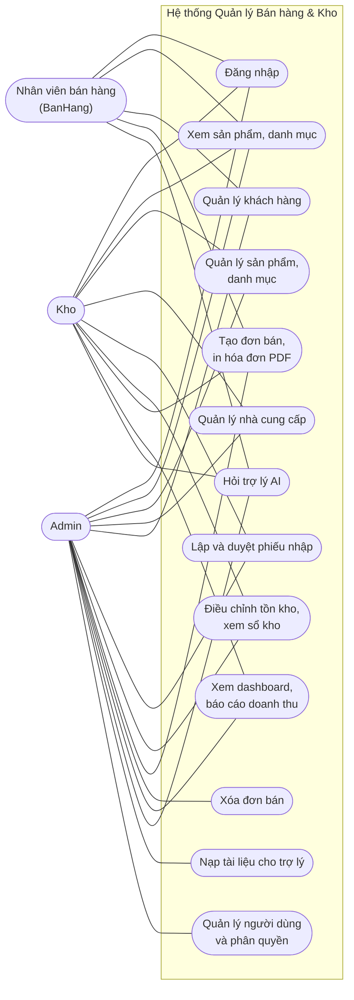
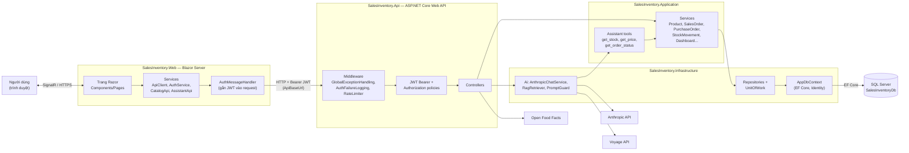
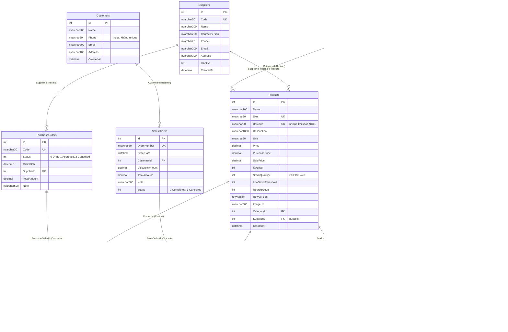
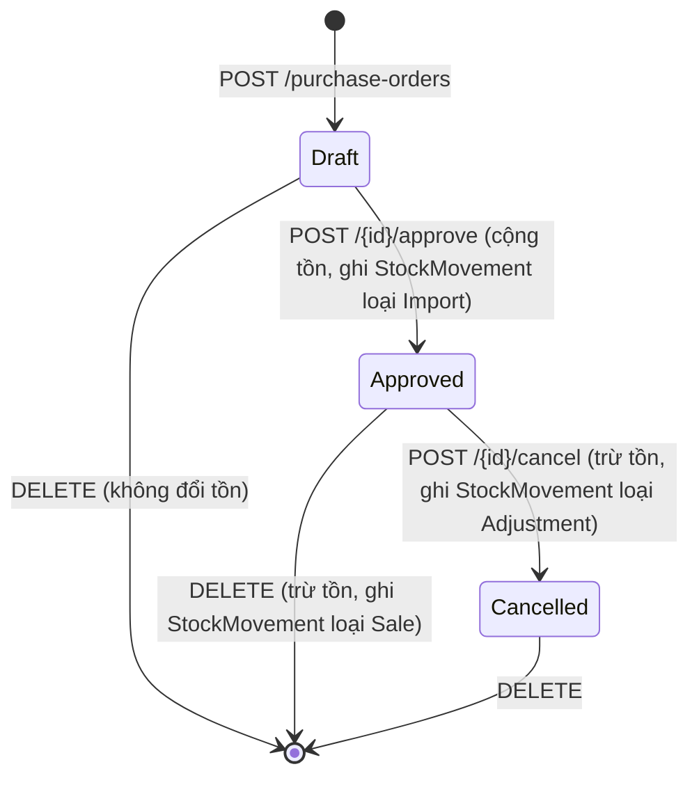
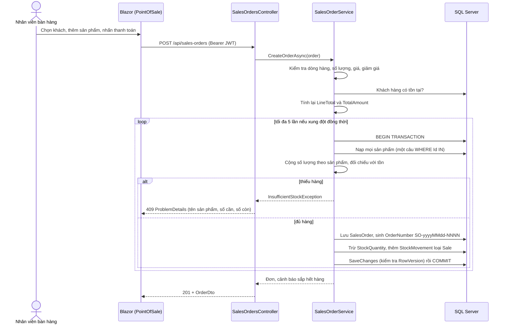
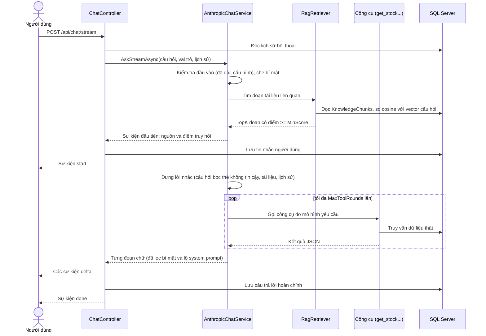
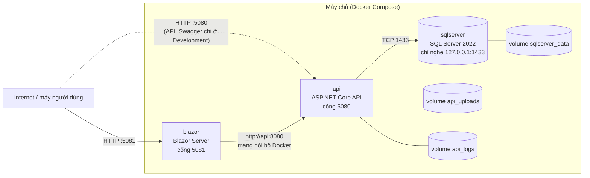

<!-- Bản ghép tự động từ docs/BaoCao/Chuong*.md. Sửa nội dung ở các file chương, không sửa file này. -->

**TRƯỜNG [Tên trường]**  
**KHOA [Tên khoa]**  


**BÁO CÁO ĐỒ ÁN TỐT NGHIỆP**  

**HỆ THỐNG QUẢN LÝ BÁN HÀNG VÀ KHO**  
**ASP.NET Core Web API · Blazor Server · SQL Server · Entity Framework Core**  


**Sinh viên thực hiện: [Họ và tên]**  
**Mã số sinh viên: [MSSV]**  
**Lớp: [Lớp]**  
**Giảng viên hướng dẫn: [Họ tên giảng viên]**  


**[Địa điểm], tháng [tháng] năm 2026**  

---

## MỤC LỤC

- **CHƯƠNG 1. ĐẶT VẤN ĐỀ VÀ MỤC TIÊU**
  - 1.1. Bối cảnh
  - 1.2. Vấn đề cần giải quyết
  - 1.3. Mục tiêu
  - 1.4. Đối tượng và phạm vi
  - 1.5. Phương pháp thực hiện
  - 1.6. Bố cục báo cáo
- **CHƯƠNG 2. KHẢO SÁT VÀ PHÂN TÍCH YÊU CẦU**
  - 2.1. Khảo sát hiện trạng
  - 2.2. Tác nhân và vai trò
  - 2.3. Yêu cầu chức năng
  - 2.4. Yêu cầu phi chức năng
  - 2.5. Ràng buộc và giả định
  - 2.6. Ghi chú về tài liệu yêu cầu ban đầu
- **CHƯƠNG 3. THIẾT KẾ HỆ THỐNG**
  - 3.1. Kiến trúc tổng thể
  - 3.2. Thiết kế cơ sở dữ liệu
  - 3.3. Thiết kế chức năng
  - 3.4. Ghi chú về phạm vi của thiết kế
- **CHƯƠNG 4. CÀI ĐẶT VÀ CÔNG NGHỆ**
  - 4.1. Công nghệ và phiên bản
  - 4.2. Cấu trúc mã nguồn
  - 4.3. Các điểm kỹ thuật chính của nghiệp vụ kho
  - 4.4. Trợ lý AI bán hàng
  - 4.5. Bảo mật và cấu hình
  - 4.6. Giao diện Blazor Server
  - 4.7. Đóng gói
- **CHƯƠNG 5. KIỂM THỬ**
  - 5.1. Chiến lược kiểm thử
  - 5.2. Kết quả chạy kiểm thử
  - 5.3. Các nhóm kiểm thử
  - 5.4. Các điểm chưa được kiểm thử hoặc chưa xác nhận
- **CHƯƠNG 6. TRIỂN KHAI**
  - 6.1. Mô hình triển khai
  - 6.2. Yêu cầu máy chủ
  - 6.3. Cấu hình bằng biến môi trường
  - 6.4. Các bước triển khai
  - 6.5. Migration cơ sở dữ liệu
  - 6.6. Các điểm bảo mật khi triển khai
  - 6.7. Những gì đã và chưa được kiểm chứng
  - 6.8. Sự cố thường gặp
  - 6.9. Cập nhật, sao lưu và gỡ
- **CHƯƠNG 7. KẾT QUẢ ĐẠT ĐƯỢC**
  - 7.1. Đối chiếu với mục tiêu
  - 7.2. Kết quả kiểm thử
  - 7.3. Kết quả về hiệu năng truy vấn
  - 7.4. Minh họa hệ thống
  - 7.5. Kịch bản minh chứng nghiệp vụ
  - 7.6. Đánh giá chung
- **CHƯƠNG 8. HẠN CHẾ VÀ HƯỚNG PHÁT TRIỂN**
  - 8.1. Hạn chế về toàn vẹn dữ liệu và nghiệp vụ
  - 8.2. Hạn chế về giao diện
  - 8.3. Hạn chế về bảo mật
  - 8.4. Hạn chế của trợ lý AI
  - 8.5. Hạn chế về vận hành và hiệu năng
  - 8.6. Hạn chế về kiểm thử và tài liệu
  - 8.7. Các lỗi tìm thấy khi rà soát báo cáo và đã sửa
  - 8.8. Hướng phát triển (đề xuất, chưa cài đặt)
  - 8.9. Nhận xét chung
- **CHƯƠNG 9. KẾT LUẬN**
  - 9.1. Kết quả chính
  - 9.2. Bài học
  - 9.3. Hạn chế
  - 9.4. Hướng phát triển
- **CHƯƠNG 10. TÀI LIỆU THAM KHẢO**
  - Nền tảng và khung làm việc
  - Xác thực và bảo mật
  - Trợ lý AI
  - Thư viện và công cụ
  - Tài liệu của dự án

---

# CHƯƠNG 1. ĐẶT VẤN ĐỀ VÀ MỤC TIÊU

## 1.1. Bối cảnh

Một cửa hàng bán lẻ nhỏ thường phải theo dõi cùng lúc ba việc: hàng nhập từ nhà cung cấp nào, hàng đã bán cho ai, và trong kho hiện còn bao nhiêu. Khi các thông tin này nằm rải rác ở sổ tay, bảng tính hoặc trí nhớ của nhân viên, số lượng tồn kho dễ sai lệch và rất khó truy ra nguyên nhân của sự sai lệch.

Đồ án xây dựng **Hệ thống Quản lý Bán hàng và Kho**: một ứng dụng web cho phép quản lý danh mục sản phẩm, nhà cung cấp và khách hàng, lập phiếu nhập hàng, bán hàng tại quầy, theo dõi tồn kho, xem báo cáo doanh thu và hỏi đáp nhanh với một trợ lý ứng dụng trí tuệ nhân tạo.

## 1.2. Vấn đề cần giải quyết

Từ bối cảnh trên, đồ án tập trung vào các vấn đề sau:

1. **Tồn kho sai lệch.** Nếu số tồn chỉ là một con số được sửa tay thì không biết nó tăng hoặc giảm vì lý do gì. Hệ thống cần ghi lại từng biến động (nhập, bán, điều chỉnh) kèm chứng từ nguồn.
2. **Bán vượt tồn khi nhiều người thao tác đồng thời.** Hai nhân viên cùng bán sản phẩm cuối cùng thì cả hai đơn có thể cùng được chấp nhận và tồn kho thành số âm. Đây là bài toán tranh chấp đồng thời, và là điểm kỹ thuật chính của đồ án.
3. **Phân quyền theo vai trò.** Nhân viên bán hàng, nhân viên kho và quản trị viên cần các quyền khác nhau; số liệu như doanh thu không nên mở cho mọi người.
4. **Hỗ trợ tra cứu nhanh.** Nhân viên thường phải trả lời khách các câu hỏi lặp lại (còn hàng không, giá bao nhiêu, đơn đã xong chưa, chính sách đổi trả). Một trợ lý có thể tra cứu dữ liệu thật giúp việc này, với điều kiện không lộ dữ liệu nhạy cảm và không bịa số liệu.

## 1.3. Mục tiêu

### 1.3.1. Mục tiêu chung

Xây dựng một hệ thống quản lý bán hàng và kho chạy được, có kiểm thử tự động và có thể triển khai bằng container.

### 1.3.2. Mục tiêu cụ thể

| # | Mục tiêu | Cách kiểm chứng |
|---|---|---|
| M1 | Quản lý sản phẩm, danh mục, nhà cung cấp, khách hàng | Các API tương ứng và kiểm thử API (Chương 3, 5) |
| M2 | Lập phiếu nhập (nháp, duyệt, hủy) làm tăng tồn kho; tạo đơn bán làm giảm tồn kho | Kiểm thử nghiệp vụ kho (Chương 5) |
| M3 | Ghi sổ kho cho các biến động nhập, bán, điều chỉnh | Bảng `StockMovements` (Chương 3, 4) |
| M4 | Tồn kho không bao giờ âm kể cả khi nhiều đơn bán đồng thời | Kiểm thử đồng thời trên SQL Server thật (Chương 5) |
| M5 | Phân quyền ba vai trò `Admin`, `Kho`, `BanHang` trên JWT | Kiểm thử phân quyền (Chương 5) |
| M6 | Dashboard, báo cáo doanh thu theo ngày, tháng, quý; xuất hóa đơn và báo cáo ra PDF, Excel | Chương 3, 4 |
| M7 | Trợ lý AI tra cứu tồn, giá, đơn và chính sách cửa hàng, có giới hạn chi phí và chống lộ bí mật | Chương 4, 5 |
| M8 | Triển khai được bằng Docker Compose | Chương 6 |

Mục M1 đến M8 là mục tiêu đặt ra từ đầu; mức độ đạt được của từng mục, kể cả những chỗ chưa đạt, được trình bày ở Chương 7 và Chương 8.

## 1.4. Đối tượng và phạm vi

**Đối tượng sử dụng:** cửa hàng bán lẻ nhỏ với ba nhóm người dùng: quản trị viên (`Admin`), nhân viên kho (`Kho`) và nhân viên bán hàng (`BanHang`).

**Trong phạm vi:** sản phẩm, danh mục, nhà cung cấp, khách hàng, đơn nhập, đơn bán, tồn kho và sổ kho, báo cáo doanh thu, trợ lý AI, xác thực và phân quyền, ghi log, đóng gói bằng Docker.

**Ngoài phạm vi (không có trong hệ thống):** thanh toán trực tuyến, công nợ, thuế, nhiều kho, hủy đơn bán, ứng dụng di động. Một số chức năng đã có ở API nhưng chưa có trên giao diện; chi tiết ở Chương 8.

## 1.5. Phương pháp thực hiện

- **Kiến trúc phân lớp** (Domain, Application, Infrastructure, Api) kết hợp giao diện Blazor Server riêng gọi API từ phía máy chủ.
- **Code First** với EF Core: lược đồ cơ sở dữ liệu sinh ra từ các entity qua migration.
- **Kiểm thử tự động** gồm kiểm thử đơn vị và kiểm thử tích hợp. Các kiểm thử về tranh chấp đồng thời chạy trên SQL Server thật trong container, vì các bộ cung cấp dữ liệu trong bộ nhớ không mô phỏng được `rowversion` và khóa dòng.
- **Cấu hình theo môi trường:** bí mật chỉ đi qua biến môi trường ở Production.

### Công cụ AI hỗ trợ lập trình

Mã nguồn của đồ án được viết với sự hỗ trợ của công cụ AI lập trình Claude Code (Anthropic). Lịch sử Git ghi rõ điều này: 62 trên 63 commit đầu tiên của kho mã (trước các commit hoàn thiện báo cáo) có dòng `Co-Authored-By: Claude`. `[điền: phần việc do sinh viên tự quyết định và thực hiện (yêu cầu, kiến trúc, thiết kế dữ liệu, rà soát và sửa mã, kiểm thử...); chỉ ghi những gì đúng sự thật]`. Báo cáo này cũng được soạn với sự hỗ trợ của công cụ đó, và mọi khẳng định về hệ thống đã được đối chiếu với mã nguồn; những chỗ chưa kiểm chứng được ghi rõ là "chưa chạy thử".

## 1.6. Bố cục báo cáo

- **Chương 1** nêu vấn đề, mục tiêu và phạm vi.
- **Chương 2** phân tích yêu cầu chức năng và phi chức năng.
- **Chương 3** trình bày thiết kế: kiến trúc, cơ sở dữ liệu, chức năng và API.
- **Chương 4** mô tả cài đặt và công nghệ.
- **Chương 5** trình bày kiểm thử và kết quả.
- **Chương 6** trình bày triển khai.
- **Chương 7** tổng hợp kết quả đạt được.
- **Chương 8** nêu hạn chế và hướng phát triển.
- **Chương 9** là kết luận và **Chương 10** là tài liệu tham khảo.

---

# CHƯƠNG 2. KHẢO SÁT VÀ PHÂN TÍCH YÊU CẦU

## 2.1. Khảo sát hiện trạng

`[điền: mô tả khảo sát thực tế đã làm, ví dụ cửa hàng được khảo sát, cách thu thập (phỏng vấn, quan sát, xem sổ sách), thời gian và kết quả. Nếu đồ án không có khảo sát thực địa, hãy ghi rõ như vậy thay vì mô tả một cuộc khảo sát không có.]`

Trong trường hợp không có khảo sát thực địa, yêu cầu của hệ thống được xác định từ phân tích nghiệp vụ bán lẻ phổ biến, gồm ba luồng chính:

1. **Nhập hàng:** nhà cung cấp giao hàng, cửa hàng đối chiếu rồi ghi nhận vào kho.
2. **Bán hàng:** nhân viên chọn sản phẩm cho khách, thu tiền, trừ hàng khỏi kho.
3. **Kiểm kê và điều chỉnh:** đếm hàng thực tế, sửa số tồn khi có sai lệch, và phải ghi được lý do.

Điểm yếu thường gặp của cách làm thủ công là số tồn chỉ có một nơi ghi và không có lịch sử thay đổi, nên khi lệch thì không truy ra được nguyên nhân (xem Chương 1, mục 1.2).

## 2.2. Tác nhân và vai trò

| Tác nhân | Vai trò hệ thống | Công việc chính |
|---|---|---|
| Quản trị viên | `Admin` | Toàn quyền; quản lý tài khoản và vai trò; nạp tài liệu cho trợ lý; xóa đơn bán |
| Nhân viên kho | `Kho` | Sản phẩm, danh mục, nhà cung cấp, đơn nhập, điều chỉnh tồn kho; xem dashboard và báo cáo |
| Nhân viên bán hàng | `BanHang` | Khách hàng, đơn bán, hóa đơn |
| Cả ba vai trò | | Hỏi trợ lý AI; xem sản phẩm và danh mục; tạo đơn bán (theo `SalesOrdersController`) |

Ma trận quyền chi tiết nằm ở Chương 3, mục 3.3.8.



*Hình 2.1. Sơ đồ use case tổng quát. Quyền lấy từ các thuộc tính `[Authorize]` trong `Api/Controllers`. Một số use case chỉ dùng được qua API chứ chưa có trên giao diện (xem Chương 8).*

## 2.3. Yêu cầu chức năng

Cột "Mức cài đặt" ghi nơi chức năng dùng được: **API** (có endpoint, có kiểm thử) hoặc **Giao diện** (có thao tác trên Blazor). Căn cứ là mã nguồn hiện tại.

| Mã | Yêu cầu | Mức cài đặt |
|---|---|---|
| FR-01 | Đăng nhập bằng email và mật khẩu, nhận JWT; tài khoản bị khóa thì bị từ chối | API, Giao diện |
| FR-02 | Phân quyền theo vai trò `Admin`, `Kho`, `BanHang`; sai quyền trả 403, chưa đăng nhập trả 401 | API; giao diện ẩn mục menu theo vai trò |
| FR-03 | Admin tạo tài khoản, đặt vai trò, khóa và mở khóa, đặt lại mật khẩu | API |
| FR-04 | Quản lý sản phẩm: SKU và barcode duy nhất, giá nhập và giá bán, ngưỡng tồn, đơn vị, danh mục, nhà cung cấp, ảnh | API; giao diện có danh sách, tạo, sửa, xóa (6 trường) |
| FR-05 | Tìm kiếm, lọc theo danh mục và giá, sắp xếp, phân trang sản phẩm; xem sản phẩm sắp hết và ngừng kinh doanh | API; giao diện có lọc, sắp xếp, phân trang |
| FR-06 | Quản lý danh mục, nhà cung cấp (mã duy nhất, xóa mềm), khách hàng (không xóa khách đã có đơn) | API |
| FR-07 | Lập phiếu nhập ở trạng thái nháp (không đổi tồn); duyệt thì cộng tồn và ghi sổ kho; hủy phiếu đã duyệt thì trừ lại tồn | API; giao diện chỉ lập phiếu và duyệt ngay |
| FR-08 | Tạo đơn bán: kiểm tra đủ tồn cho cả đơn, trừ kho, ghi sổ kho trong một giao dịch; thiếu hàng trả 409 nêu rõ sản phẩm | API; giao diện có quầy bán hàng `/pos` |
| FR-09 | Server tự tính tiền của dòng hàng và đơn; không tin số tiền từ máy khách | API |
| FR-10 | Điều chỉnh tồn kho theo độ lệch hoặc đặt về số kiểm kê, bắt buộc có lý do; ghi sổ kho | API |
| FR-11 | Xem sổ kho của một sản phẩm | API |
| FR-12 | Dashboard: doanh thu, số đơn, giá trị đơn trung bình, so với kỳ trước, giá trị tồn kho, số sản phẩm sắp hết | API; giao diện `/dashboard` |
| FR-13 | Báo cáo doanh thu theo ngày, tháng, quý, so sánh cùng kỳ năm trước | API; giao diện `/reports/revenue` |
| FR-14 | Xuất hóa đơn bán hàng PDF; xuất báo cáo doanh thu PDF và Excel | API |
| FR-15 | Trợ lý AI: tra cứu tồn kho, giá bán, trạng thái đơn bằng công cụ; trả lời chính sách từ tài liệu cửa hàng kèm nguồn; lưu lịch sử hội thoại | API; giao diện `/assistant` |
| FR-16 | Ảnh sản phẩm: tải lên, từ URL, từ barcode (Open Food Facts) | API |

## 2.4. Yêu cầu phi chức năng

| Mã | Yêu cầu | Cách đáp ứng và kiểm chứng |
|---|---|---|
| NFR-01 | **Toàn vẹn tồn kho:** tồn không âm | Kiểm tra trong service, `RowVersion`, ràng buộc CHECK; test đồng thời trên SQL Server thật (Chương 4, 5) |
| NFR-02 | **Truy vết biến động kho** | Bảng `StockMovements` cho nhập, bán, điều chỉnh (chưa phủ đường sửa sản phẩm, xem Chương 8) |
| NFR-03 | **Xác thực và phân quyền** | JWT, ba vai trò, kiểm thử ma trận quyền |
| NFR-04 | **Bảo vệ bí mật** | Bí mật chỉ từ biến môi trường ở Production; che bí mật trong log và trong nội dung gửi tới mô hình AI |
| NFR-05 | **Kiểm soát chi phí trợ lý AI** | Giới hạn token, độ dài câu hỏi, số vòng công cụ, tần suất mỗi người dùng; ghi chi phí ước tính vào log |
| NFR-06 | **Hiệu năng truy vấn** | Giảm số câu SQL và lượng cột đọc (đo trên dữ liệu ít dòng, xem Chương 4, 5); chưa đo dưới tải |
| NFR-07 | **Khả năng triển khai** | Docker Compose ba dịch vụ; cấu hình bằng biến môi trường |
| NFR-08 | **Khả năng kiểm thử** | Tầng nghiệp vụ phụ thuộc interface; kiểm thử đơn vị và tích hợp tự động |
| NFR-09 | **Ghi log có cấu trúc** | Serilog ra console và file theo ngày; theo dõi 401, 403 |

## 2.5. Ràng buộc và giả định

- Một cửa hàng, một kho; tồn kho là số nguyên.
- Mỗi đơn bán phải có khách hàng.
- Trợ lý AI cần khóa API của Anthropic và Voyage; thiếu khóa thì phần còn lại của hệ thống vẫn chạy.
- Hệ thống giả định chạy một bản API duy nhất (bộ đếm giới hạn tần suất và theo dõi lỗi xác thực nằm trong bộ nhớ).
- Triển khai thật cần HTTPS qua một reverse proxy; Docker Compose của dự án không kèm TLS.

## 2.6. Ghi chú về tài liệu yêu cầu ban đầu

Thư mục `docs/` có `SRS.md` và `BACKLOG.md` soạn từ đầu dự án. Hai tài liệu này mô tả một số tính năng chưa được cài đặt (khóa tài khoản tạm sau nhiều lần đăng nhập sai, refresh token, thuế VAT, nhật ký kiểm toán, xóa mềm người dùng), và dùng tên vai trò khác với mã (`ADMIN`, `WAREHOUSE`, `SALES`). Báo cáo này chỉ dùng danh sách yêu cầu ở mục 2.3, đã đối chiếu với mã nguồn.

---

# CHƯƠNG 3. THIẾT KẾ HỆ THỐNG

> **Quy ước đối chiếu.** Mọi tên lớp, tên file và route trong chương này lấy từ mã nguồn của nhánh `feat/stock-ledger-and-race-safety`. Đường dẫn tính từ thư mục gốc của solution.

## 3.1. Kiến trúc tổng thể

### 3.1.1. Mô hình triển khai logic

Hệ thống gồm ba thành phần chạy độc lập, kết nối với nhau qua HTTP và TCP:

1. **Giao diện Blazor Server** (`src/SalesInventory.Web`). Các trang Razor chạy trên máy chủ ASP.NET Core. Trình duyệt giữ kết nối SignalR tới máy chủ này. Blazor **gọi API từ phía máy chủ**, không gọi từ trình duyệt. Vì vậy cấu hình CORS của API không bắt buộc (xem `CLAUDE.md`, mục `Cors__AllowedOrigins__0`).
2. **Web API** (`src/SalesInventory.Api`). Gồm các controller REST, xác thực JWT, phân quyền theo vai trò, middleware xử lý lỗi và ghi log. Nhận request từ Blazor và từ Swagger (chỉ ở môi trường Development).
3. **SQL Server**. API truy cập qua EF Core (`AppDbContext`). Chuỗi kết nối lấy từ biến môi trường hoặc user-secrets, không nằm trong file cấu hình.

Ngoài ra API còn gọi ba dịch vụ bên ngoài:

| Dịch vụ | Dùng để | Lớp cài đặt |
|---|---|---|
| Anthropic Messages API | Trợ lý AI trả lời, gọi công cụ | `Infrastructure/Ai/AnthropicChatService.cs` |
| Voyage (embeddings) | Tạo vector cho RAG | `Infrastructure/Ai/HttpEmbeddingService.cs` |
| Open Food Facts | Lấy ảnh sản phẩm theo barcode | `Infrastructure/Storage/OpenFoodFactsImageLookup.cs` |



*Hình 3.1. Kiến trúc tổng thể của hệ thống.*

### 3.1.2. Phân lớp trong solution

Solution theo hướng Clean Architecture, gồm bốn project backend và một project giao diện.

| Project | Vai trò | Thành phần tiêu biểu (đối chiếu) |
|---|---|---|
| `SalesInventory.Domain` | Entity và enum, không phụ thuộc project nào | `Entities/Product.cs`, `Entities/SalesOrder.cs`, `Enums/StockMovementType.cs` |
| `SalesInventory.Application` | Nghiệp vụ, DTO, validator, báo cáo PDF/Excel, công cụ của trợ lý | `Services/SalesOrderService.cs`, `Services/PurchaseOrderService.cs`, `Services/InvoicePdfService.cs`, `Assistant/Tools/*.cs` |
| `SalesInventory.Infrastructure` | EF Core, Identity, repository, client AI, lưu file | `Persistence/AppDbContext.cs`, `Persistence/UnitOfWork.cs`, `Repositories/*.cs`, `Ai/*.cs` |
| `SalesInventory.Api` | Controller, middleware, hardening, logging | `Controllers/*.cs`, `Program.cs`, `Hardening/`, `Middleware/` |
| `SalesInventory.Web` | Giao diện Blazor Server | `Components/Pages/*.razor`, `Services/ApiClient.cs` |

Các mẫu thiết kế có trong code:

- **Repository + Unit of Work.** Interface nằm ở `Application/Interfaces/` (`IRepository<T>`, `IProductRepository`, `ISalesOrderRepository`, `IUnitOfWork`...), cài đặt ở `Infrastructure/Repositories/`. `IUnitOfWork.BeginTransactionAsync()` cho phép các service gom nhiều thay đổi vào một giao dịch.
- **Dependency Injection.** Mỗi lớp có `DependencyInjection.cs` riêng: `AddApplication()` và `AddInfrastructure()`.
- **Options pattern.** `JwtSettings`, `AnthropicOptions`, `AiSafetyOptions` (kiểm tra khi khởi động bằng `AiSafetyOptionsValidator`), `KnowledgeOptions`, `InventorySettings`, `ShopSettings`.
- **DTO + AutoMapper + FluentValidation.** Thư mục `Application/Dtos`, `Application/Mapping/*Profile.cs`, `Application/Validators/`.

### 3.1.3. Xác thực và phân quyền

Xác thực dùng ASP.NET Core Identity (`ApplicationUser` kế thừa `IdentityUser`, thêm `FullName`) kết hợp JWT Bearer. Cấu hình ở `Program.cs` và `Infrastructure/Identity/TokenService.cs`. Token có thời hạn theo `Jwt:ExpiryMinutes` (60 phút trong `appsettings.json`). Hệ thống **chỉ có access token**, không có refresh token.

Ba vai trò nằm trong `Infrastructure/Identity/AppRoles.cs`: `Admin`, `Kho`, `BanHang`. Ba policy nằm trong `AuthPolicies.cs` và được đăng ký trong `Program.cs`:

| Policy | Vai trò được phép |
|---|---|
| `AdminOnly` | `Admin` |
| `CanManageInventory` | `Admin`, `Kho` |
| `SalesAccess` | `Admin`, `BanHang` |

> **Lưu ý đối chiếu.** `SalesAccess` được đăng ký nhưng không có controller nào dùng (`SalesOrdersController` và `CustomersController` dùng `[Authorize(Roles = ...)]` trực tiếp). Hai cách khai báo cho cùng một kết quả: trả 401 khi không có token và 403 khi sai vai trò.

Phía Blazor, token được giữ trong `ProtectedSessionStorage` (`Web/Services/TokenStore.cs`). `JwtAuthenticationStateProvider` đọc claims từ token. `AuthMessageHandler` gắn `Authorization: Bearer` vào mọi request tới API. Menu ẩn hoặc hiện theo vai trò trong `Components/Layout/NavMenu.razor`.

### 3.1.4. Pipeline xử lý một request

Thứ tự trong `Program.cs` (từ ngoài vào trong): hardening → ghi log request (Serilog) → `GlobalExceptionHandlingMiddleware` → Swagger (chỉ Development) → HSTS → chuyển hướng HTTPS → file tĩnh (`wwwroot`, chứa ảnh sản phẩm) → CORS (chỉ khi có cấu hình) → `AuthFailureLoggingMiddleware` → xác thực → phân quyền → rate limiter → controller.

---

## 3.2. Thiết kế cơ sở dữ liệu

### 3.2.1. Tổng quan

- Hệ quản trị: SQL Server. Lược đồ do EF Core Code First quản lý. Model khai báo trong `Infrastructure/Persistence/AppDbContext.cs`, kế thừa `IdentityDbContext<ApplicationUser>`.
- Lịch sử lược đồ: 29 migration trong `Infrastructure/Persistence/Migrations/`, từ `20260917125730_AddProductsTable` đến `20261007085614_AddChatConversations`. Ảnh chụp mô hình hiện tại: `AppDbContextModelSnapshot.cs`.
- Có 12 bảng nghiệp vụ và AI (kèm bảng Identity). Các bảng được tạo bằng migration và đặt tên theo `ToTable(...)` trong snapshot.

| Nhóm | Bảng |
|---|---|
| Danh mục dữ liệu chủ | `Categories`, `Products`, `Suppliers`, `Customers` |
| Nhập hàng | `PurchaseOrders`, `PurchaseOrderItems` |
| Bán hàng | `SalesOrders`, `SalesOrderItems` |
| Kho | `StockMovements` |
| Trợ lý AI | `Conversations`, `ChatMessages`, `KnowledgeChunks` |
| Identity | `AspNetUsers`, `AspNetRoles`, `AspNetUserRoles`, `AspNetUserClaims`, `AspNetRoleClaims`, `AspNetUserLogins`, `AspNetUserTokens` |

### 3.2.2. Sơ đồ quan hệ thực thể (ERD)



*Hình 3.2. ERD các bảng nghiệp vụ (nguồn: `Domain/Entities/*.cs` và `AppDbContext.OnModelCreating`). `KnowledgeChunks` đứng riêng, không có khóa ngoại. Các bảng Identity không vẽ để giữ sơ đồ gọn.*

### 3.2.3. Mô tả từng bảng

Kiểu dữ liệu cột ghi theo `MaxLength` và `HasColumnType` trong entity và `AppDbContext`. Kiểu SQL đầy đủ của từng cột nằm trong `AppDbContextModelSnapshot.cs`.

#### `Categories` (`Domain/Entities/Category.cs`)

| Cột | Ràng buộc |
|---|---|
| `Id` | PK |
| `Name` | Bắt buộc, tối đa 200 ký tự |
| `Description` | Tối đa 1000 ký tự |

Dữ liệu mẫu: 5 danh mục (Đồ điện tử, Văn phòng phẩm, Gia dụng, Thời trang, Thực phẩm), tạo bằng `HasData`. Tên danh mục **không có unique index** ở mức CSDL, và `CategoryService` chỉ kiểm tra tên không được rỗng (`IsNullOrWhiteSpace`), **không kiểm tra trùng tên**. Hai danh mục cùng tên là hợp lệ trong hệ thống hiện tại.

#### `Suppliers` (`Domain/Entities/Supplier.cs`)

| Cột | Ràng buộc |
|---|---|
| `Id` | PK |
| `Code` | Bắt buộc, tối đa 50, **unique index** |
| `Name` | Bắt buộc, tối đa 200 |
| `ContactPerson`, `Phone`, `Email`, `Address` | Tùy chọn, độ dài 200, 20, 200, 300 |
| `IsActive` | Mặc định `true`. Xóa nhà cung cấp là đặt `false` (`SupplierService.DeleteSupplierAsync`) |
| `CreatedAt` | Thời điểm tạo |

Có một nhà cung cấp mẫu `SUP-001` ("Nhà cung cấp mặc định") để các sản phẩm mẫu có `SupplierId` hợp lệ.

#### `Customers` (`Domain/Entities/Customer.cs`)

| Cột | Ràng buộc |
|---|---|
| `Id` | PK |
| `Name` | Bắt buộc, tối đa 200 |
| `Phone` | Tối đa 20, index thường (migration `AddCustomerPhoneIndex`), **không unique** |
| `Email`, `Address` | Tối đa 200 và 400 |
| `CreatedAt` | Mặc định `GETUTCDATE()` |

Không có trường loại khách (khách lẻ, khách sỉ...). Một đơn bán luôn gắn với một khách hàng (`SalesOrder.CustomerId` bắt buộc).

#### `Products` (`Domain/Entities/Product.cs`)

| Cột | Ràng buộc / ý nghĩa |
|---|---|
| `Id` | PK |
| `Name` | Bắt buộc, tối đa 200, có index |
| `Sku` | Bắt buộc, tối đa 50, **unique index** |
| `Barcode` | Tối đa 50, **unique index** (chỉ áp dụng với giá trị khác NULL) |
| `Unit` | Bắt buộc, mặc định `"cái"` |
| `PurchasePrice`, `SalePrice` | `decimal(18,2)`, mặc định 0 |
| `Price` | `decimal(18,2)`. Cột cũ (*legacy*) giữ song song với `SalePrice`: `ProductProfile` gán `Price = SalePrice` khi ánh xạ DTO sang entity (chú thích trong code: "legacy Price mirrors SalePrice"), và `ProductService` kiểm tra `Price > 0` |
| `StockQuantity` | Tồn hiện tại. Có **CHECK `CK_Products_StockQuantity_NonNegative`** (`[StockQuantity] >= 0`) |
| `LowStockThreshold` | Ngưỡng cảnh báo sắp hết, mặc định 5 |
| `ReorderLevel` | Mức đặt hàng lại, mặc định 0 |
| `RowVersion` | `[Timestamp]`. Cơ chế khóa lạc quan khi nhiều người cập nhật cùng một sản phẩm |
| `IsActive` | Cờ ngừng kinh doanh, mặc định `true` |
| `ImageUrl` | Tối đa 500, đường dẫn ảnh |
| `CategoryId` | FK → `Categories`, `Restrict` |
| `SupplierId` | FK → `Suppliers`, **nullable**, `Restrict` |
| `CreatedAt` | Thời điểm tạo |

Các index bổ sung: `CategoryId`, `Name`, `SalePrice`, và `StockQuantity` (kèm cột bao phủ `IsActive`, `LowStockThreshold`, `PurchasePrice`, `Name`) để dashboard đọc index hẹp thay vì quét cả bảng. Có 8 sản phẩm mẫu.

#### `PurchaseOrders` và `PurchaseOrderItems` (đơn nhập)

`PurchaseOrder` (`Domain/Entities/PurchaseOrder.cs`):

| Cột | Ràng buộc |
|---|---|
| `Id` | PK |
| `Code` | Bắt buộc, tối đa 30, **unique index**. Dạng `PO-yyyyMMdd-NNN` (`PurchaseOrderService.GenerateCodeAsync`) |
| `Status` | Enum `PurchaseOrderStatus`: `Draft = 0`, `Approved = 1`, `Cancelled = 2` |
| `OrderDate` | Bắt buộc, có index ghép `(OrderDate, Id)` |
| `SupplierId` | FK → `Suppliers`, `Restrict` |
| `TotalAmount` | `decimal(18,2)`, do server tính |
| `Note` | Tối đa 500 |

`PurchaseOrderItem` (`Domain/Entities/PurchaseOrderItem.cs`): `Id` (PK), `PurchaseOrderId` (FK, **Cascade**), `ProductId` (FK, `Restrict`), `Quantity`, `UnitPrice`, `LineTotal` (hai cột tiền `decimal(18,2)`).

#### `SalesOrders` và `SalesOrderItems` (đơn bán)

`SalesOrder` (`Domain/Entities/SalesOrder.cs`):

| Cột | Ràng buộc |
|---|---|
| `Id` | PK |
| `OrderNumber` | Bắt buộc, tối đa 30, **unique index**. Dạng `SO-yyyyMMdd-NNNN` (`SalesOrderService.GenerateOrderNumberAsync`) |
| `OrderDate` | Bắt buộc, index `(OrderDate, Id)` và `(Status, OrderDate)` kèm `TotalAmount` |
| `CustomerId` | FK → `Customers`, `Restrict` |
| `DiscountAmount` | `decimal(18,2)`, mặc định 0 |
| `TotalAmount` | `decimal(18,2)` = tổng `LineTotal` − `DiscountAmount` |
| `Status` | Enum `SalesOrderStatus`: `Completed = 0`, `Cancelled = 1` (lưu kiểu `int`) |
| `Note` | Tối đa 500 |

`SalesOrderItem` (`Domain/Entities/SalesOrderItem.cs`): `Id` (PK), `SalesOrderId` (FK, **Cascade**), `ProductId` (FK, `Restrict`), `Quantity`, `UnitPrice`, `LineTotal`. Có index trên `ProductId` (kèm `SalesOrderId`, `Quantity`, `LineTotal`) phục vụ báo cáo sản phẩm bán chạy.

#### `StockMovements` (sổ kho, `Domain/Entities/StockMovement.cs`)

Các lần nhập (duyệt phiếu), bán, điều chỉnh tay và đảo phiếu nhập đều sinh một dòng, nên các biến động đó truy vết được. **Ngoại lệ:** tồn đầu kỳ khi tạo sản phẩm và giá trị `Tồn kho` khi sửa sản phẩm (`PUT /api/products/{id}`) được ghi thẳng vào `Products.StockQuantity` mà không sinh dòng sổ kho (xem Chương 8).

| Cột | Ý nghĩa |
|---|---|
| `Id` | PK |
| `ProductId` | FK → `Products`, `Restrict` |
| `MovementType` | Enum `StockMovementType`: `Import = 0`, `Sale = 1`, `Adjustment = 2` |
| `Quantity` | Số lượng **có dấu** (nhập là dương, xuất là âm) |
| `StockAfter` | Tồn của sản phẩm ngay sau lần thay đổi này |
| `Reference` | Mã chứng từ hiển thị (ví dụ mã đơn), tối đa 50 |
| `RefType`, `RefId` | Loại và Id chứng từ nguồn: `"PurchaseOrder"`, `"SalesOrder"` hoặc `"ManualAdjustment"` (với điều chỉnh tay, `RefId = 0`) |
| `CreatedAt`, `Note` | Thời điểm và ghi chú (lý do) |

Index: `(ProductId, CreatedAt, Id)` cho "thẻ kho một sản phẩm", và `(RefType, RefId)` để tra theo chứng từ.

> **Lưu ý đối chiếu.** Khi hủy phiếu nhập đã duyệt, service ghi dòng loại `Adjustment`. Khi **xóa** phiếu nhập đã duyệt, service ghi dòng loại `Sale` (`PurchaseOrderService.DeletePurchaseOrderAsync` gọi `ReverseStockAsync(existing, StockMovementType.Sale, ...)`). Hai cách gán loại khác nhau; nên giải thích hoặc thống nhất trước khi bảo vệ.

#### Nhóm bảng trợ lý AI

| Bảng | Entity | Mô tả |
|---|---|---|
| `Conversations` | `Domain/Entities/Conversation.cs` | `Id` kiểu `Guid`. `UserId` (tối đa 450) lưu Id người dùng Identity **dưới dạng chuỗi, không có khóa ngoại**. `Title`, `CreatedAt`, `UpdatedAt`. Index `(UserId, UpdatedAt)` |
| `ChatMessages` | `Domain/Entities/ChatMessage.cs` | `Id`, `ConversationId` (FK, **Cascade**), `Role` (tối đa 20), `Content`, `CreatedAt`. Index `(ConversationId, Id)` |
| `KnowledgeChunks` | `Domain/Entities/KnowledgeChunk.cs` | `SourceTitle`, `Content` (đoạn tài liệu), `Embedding` (`byte[]`, vector từ Voyage), `CreatedAt`. Index theo `SourceTitle` |

Vector được lưu dạng `varbinary` và so khớp bằng cosine similarity trong ứng dụng (`Infrastructure/Ai/VectorMath.cs`, `RagRetriever.cs`), không dùng kiểu vector gốc của SQL Server.

#### Nhóm bảng Identity

`AppDbContext` kế thừa `IdentityDbContext<ApplicationUser>` nên có các bảng `AspNetUsers`, `AspNetRoles`, `AspNetUserRoles`... Bảng `AspNetUsers` có thêm cột `FullName` (migration `AddFullNameToApplicationUser`). Ba vai trò được tạo lúc khởi động bởi `RoleSeeder.SeedRolesAsync`. Tài khoản Admin đầu tiên chỉ tạo khi cấu hình `SeedAdmin:Email` và `SeedAdmin:Password` (`RoleSeeder.SeedAdminAsync`).

### 3.2.4. Tổng hợp quan hệ và ràng buộc

| Quan hệ (cha → con) | Khóa ngoại | Khi xóa cha |
|---|---|---|
| `Categories` → `Products` | `Products.CategoryId` | Restrict |
| `Suppliers` → `Products` | `Products.SupplierId` (nullable) | Restrict |
| `Suppliers` → `PurchaseOrders` | `PurchaseOrders.SupplierId` | Restrict |
| `Customers` → `SalesOrders` | `SalesOrders.CustomerId` | Restrict |
| `PurchaseOrders` → `PurchaseOrderItems` | `PurchaseOrderItems.PurchaseOrderId` | **Cascade** |
| `SalesOrders` → `SalesOrderItems` | `SalesOrderItems.SalesOrderId` | **Cascade** |
| `Products` → `PurchaseOrderItems`, `SalesOrderItems`, `StockMovements` | `ProductId` | Restrict |
| `Conversations` → `ChatMessages` | `ChatMessages.ConversationId` | **Cascade** |

Các ràng buộc toàn vẹn dữ liệu ở mức CSDL: unique (`Products.Sku`, `Products.Barcode`, `Suppliers.Code`, `SalesOrders.OrderNumber`, `PurchaseOrders.Code`), CHECK tồn kho không âm, `RowVersion` trên `Products`. Ràng buộc `Restrict` khiến SQL Server từ chối xóa một sản phẩm đã có chứng từ hoặc dòng sổ kho. Trước đây `DeleteProductAsync` không kiểm tra điều này nên khóa ngoại làm việc xóa thất bại và API không trả thông báo nghiệp vụ (đã có test tái hiện, xem Chương 5). Nay `ProductService.DeleteProductAsync` gọi `IProductRepository.HasDocumentsAsync` (ba truy vấn `EXISTS` trên `PurchaseOrderItems`, `SalesOrderItems`, `StockMovements`) và ném `ConflictException`, nên API trả **HTTP 409** kèm gợi ý chuyển sản phẩm sang ngừng kinh doanh (`IsActive = false`). Khóa ngoại `Restrict` vẫn là lớp chặn cuối cùng.

---

## 3.3. Thiết kế chức năng

### 3.3.1. Quy ước chung của API

- Mọi route bắt đầu bằng `api/`. Ký hiệu `[controller]` trong code được thay bằng tên controller viết thường (ví dụ `ProductsController` → `api/products`).
- Lỗi trả theo chuẩn **ProblemDetails** (`GlobalExceptionHandlingMiddleware`): 400 (dữ liệu sai), 401 (chưa đăng nhập), 403 (sai vai trò), 404 (không tìm thấy), 409 (xung đột nghiệp vụ như thiếu tồn kho hoặc sai trạng thái), 429 (vượt giới hạn gọi trợ lý), 503 (chưa cấu hình khóa AI).
- Danh sách đơn nhập và đơn bán nhận `page` và `pageSize` tùy chọn. Tổng số đơn nằm ở header `X-Total-Count` (có khi truyền `page`).
- Ba vai trò: `Admin`, `Kho`, `BanHang`. Cột "Quyền" bên dưới lấy từ thuộc tính `[Authorize]` ở mức controller và action.

### 3.3.2. Nền tảng: xác thực và người dùng

| Route | Phương thức | Quyền | Controller / ghi chú |
|---|---|---|---|
| `api/auth/login` | POST | Công khai | `AuthController`. Từ chối nếu tài khoản bị khóa |
| `api/auth/register` | POST | Công khai | `AuthController.Register`. Người lạ chỉ tạo được tài khoản vai trò mặc định `BanHang` (`DefaultRole`); chọn `Admin` hoặc `Kho` trả 403 trừ khi người gọi là `Admin` đã đăng nhập. Xem ghi chú bên dưới bảng |
| `api/auth/me` | GET | Đã đăng nhập | `AuthController` |
| `api/auth/assign-role` | POST | `Admin` | `AuthController` |
| `api/admin/users` | GET, POST | `Admin` | `UserAdminController` |
| `api/admin/users/{id}` | GET | `Admin` | `UserAdminController` |
| `api/admin/users/{id}/roles` | PUT | `Admin` | Đặt lại tập vai trò |
| `api/admin/users/{id}/lock`, `.../unlock` | POST | `Admin` | Khóa và mở khóa tài khoản |
| `api/admin/users/{id}/reset-password` | POST | `Admin` | Đặt lại mật khẩu |
| `api/admin/employees` | POST | `Admin` (policy `AdminOnly`) | `AdminEmployeesController`, tạo nhân viên |
| `api/users`, `api/users/{id}/roles` | GET, POST, DELETE | `Admin` | `UsersController`. Liệt kê người dùng, gán và gỡ vai trò. Chồng lấn một phần với `UserAdminController` (liệt kê, đặt vai trò) nhưng đơn giản hơn (không có khóa, đặt lại mật khẩu), nhiều khả năng là bản có trước. Giữ cả hai trong báo cáo và nói rõ có chồng lấn |
| `api/health`, `api/health/db` | GET | Công khai | `HealthController` |

> Giao diện Blazor **chưa có trang quản lý người dùng**. Các endpoint `api/admin/users` chỉ dùng qua Swagger hoặc client khác.

> **Ghi chú bảo mật.** Trước đây `POST /api/auth/register` không yêu cầu đăng nhập và nhận vai trò từ body, nên bất kỳ ai cũng tự tạo được tài khoản `Admin` (lỗi này đã được test tái hiện và sửa, xem Chương 5, `RegistrationSecurityTests`). Nay `AuthController.Register` chỉ cấp vai trò `BanHang` cho người lạ; vai trò khác cần token `Admin`. Tài khoản nhân viên thường được tạo bằng `POST /api/admin/users`. Đăng ký công khai vẫn tồn tại và vẫn tạo được tài khoản `BanHang`, đây là một lựa chọn thiết kế nên nêu ở Chương 8 nếu cửa hàng không muốn mở đăng ký.

### 3.3.3. Module Quản lý sản phẩm (kèm danh mục, nhà cung cấp, khách hàng)

Service chính: `ProductService`, `CategoryService`, `SupplierService`, `CustomerService` (thư mục `Application/Services`). Giao diện: chỉ sản phẩm có trang đầy đủ (`Pages/Products.razor`: danh sách, sửa, xóa; `Products/CreateProduct.razor`, `Products/EditProduct.razor`: form 6 trường). `Categories.razor`, `Suppliers.razor`, `Customers.razor` hiện **chỉ có tiêu đề, chưa có chức năng**; danh mục, nhà cung cấp và khách hàng quản lý qua API, riêng khách hàng còn thêm nhanh được từ quầy bán hàng (`/pos`).

**Sản phẩm** (`ProductsController`, route gốc `api/products`; mặc định `[Authorize]`, tức mọi người dùng đã đăng nhập đọc được):

| Route | Phương thức | Quyền | Chức năng |
|---|---|---|---|
| `api/products` | GET | Đã đăng nhập | Danh sách có lọc: `keyword`, `categoryId`, `minPrice`, `maxPrice`, `inStockOnly`, sắp xếp, phân trang (`ProductQueryParameters`, mặc định 20 dòng, tối đa 100) |
| `api/products/search` | GET | Đã đăng nhập | Tìm kiếm với `page`, `pageSize`, `search`, `categoryId`, `sortBy`, `sortDir` |
| `api/products/by-category/{categoryId}` | GET | Đã đăng nhập | Theo danh mục |
| `api/products/by-sku/{sku}` | GET | Đã đăng nhập | Tra theo SKU |
| `api/products/inactive` | GET | Đã đăng nhập | Sản phẩm ngừng kinh doanh |
| `api/products/low-stock` | GET | Đã đăng nhập | Sản phẩm sắp hết (`includeInactive`) |
| `api/products/{id}` | GET | Đã đăng nhập | Chi tiết |
| `api/products` | POST | `Admin`, `Kho` | Tạo. Kiểm tra trùng SKU, barcode (`DuplicateSkuException`, `DuplicateBarcodeException`) |
| `api/products/{id}` | PUT | `Admin`, `Kho` | Cập nhật |
| `api/products/{id}` | DELETE | `Admin`, `Kho` | Xóa (xóa cứng, `ProductService.DeleteProductAsync`) |
| `api/products/{id}/image` | POST | `Admin`, `Kho` | Tải ảnh lên (`IFormFile`). Quy tắc ở `ProductImageRules`, lưu qua `LocalFileStorage` |
| `api/products/{id}/image-from-url` | POST | `Admin`, `Kho` | Tải ảnh từ URL, qua `SafeImageDownloader` (chống SSRF) |
| `api/products/{id}/image-from-barcode` | POST | `Admin`, `Kho` | Lấy ảnh theo barcode từ Open Food Facts |

Các endpoint kho gắn với sản phẩm (`adjust-stock`, `set-stock`, `movements`) nằm ở mục 3.3.4.

**Danh mục** (`CategoriesController`, `api/categories`, mặc định `[Authorize]`):

| Route | Phương thức | Quyền |
|---|---|---|
| `api/categories`, `api/categories/{id}` | GET | Đã đăng nhập |
| `api/categories` | POST | `Admin`, `Kho` |
| `api/categories/{id}` | PUT, DELETE | `Admin`, `Kho` |

**Nhà cung cấp** (`SuppliersController`, `api/suppliers`, cả controller chỉ cho `Admin`, `Kho`):

| Route | Phương thức | Chức năng |
|---|---|---|
| `api/suppliers` | GET, POST | Danh sách, tạo |
| `api/suppliers/active` | GET | Chỉ nhà cung cấp còn hoạt động |
| `api/suppliers/{id}` | GET, PUT, DELETE | Xem, sửa, xóa (đặt `IsActive = false`) |

**Khách hàng** (`CustomersController`, `api/customers`, cả controller chỉ cho `Admin`, `BanHang`):

| Route | Phương thức | Chức năng |
|---|---|---|
| `api/customers` | GET, POST | Danh sách, tạo |
| `api/customers/{id}` | GET, PUT, DELETE | Xem, sửa, xóa. Xóa bị chặn (409) nếu khách đã có đơn (`CustomerService.DeleteCustomerAsync`) |
| `api/customers/{id}/orders` | GET | Lịch sử đơn của khách |

### 3.3.4. Module Nhập kho (đơn nhập và sổ kho)

Service: `PurchaseOrderService`, `StockMovementService`. Giao diện: `Pages/Purchases/CreatePurchase.razor` (`/purchases/create`) cho phép lập phiếu và chọn "Duyệt phiếu ngay" (mặc định đã chọn). `Pages/Purchases.razor` (`/purchases`) chỉ có tiêu đề và nút "Lập phiếu nhập": **giao diện chưa có danh sách phiếu, xem chi tiết, duyệt hay hủy riêng lẻ**; các thao tác đó chỉ có qua API.

**Đơn nhập** (`PurchaseOrdersController`, `api/purchase-orders`, policy `CanManageInventory`: `Admin`, `Kho`):

| Route | Phương thức | Chức năng |
|---|---|---|
| `api/purchase-orders` | GET | Danh sách (`page`, `pageSize`, header `X-Total-Count`) |
| `api/purchase-orders/{id}` | GET | Chi tiết |
| `api/purchase-orders` | POST | Tạo phiếu ở trạng thái `Draft`. **Không đổi tồn kho** |
| `api/purchase-orders/{id}/approve` | POST | Duyệt: cộng tồn, ghi sổ kho |
| `api/purchase-orders/{id}/cancel` | POST | Hủy phiếu đã duyệt: trừ lại tồn |
| `api/purchase-orders/{id}` | DELETE | Xóa phiếu; nếu đã duyệt thì trừ lại tồn |

Vòng đời trạng thái (từ `PurchaseOrderService`):



*Hình 3.3. Trạng thái đơn nhập. Duyệt chỉ áp dụng cho `Draft` và hủy chỉ áp dụng cho `Approved`, nếu sai trạng thái service ném `ConflictException` (HTTP 409).*

Quy tắc nghiệp vụ chính (`PurchaseOrderService.cs`):

- Tạo phiếu: phải có ít nhất một dòng, mọi `Quantity > 0`, nhà cung cấp và mọi sản phẩm phải tồn tại. `LineTotal` và `TotalAmount` **tính lại ở server**, không tin số liệu client gửi.
- Duyệt phiếu: mở một giao dịch (`IUnitOfWork.BeginTransactionAsync`), kiểm tra tồn sau khi cộng không vượt `int.MaxValue` (tính bằng `long`), cộng tồn, ghi một dòng `StockMovement` cho mỗi dòng hàng, đổi trạng thái. Tất cả cùng thành công hoặc cùng hoàn tác.
- Hủy hoặc xóa phiếu đã duyệt: `ReverseStockAsync` từ chối (`BusinessRuleException`) nếu tồn hiện tại nhỏ hơn số cần trừ lại, vì một phần hàng có thể đã bán.

**Tồn kho và sổ kho** (route nằm ở hai controller):

| Route | Phương thức | Quyền | Chức năng |
|---|---|---|---|
| `api/products/{id}/movements` | GET | `Admin`, `Kho` | Sổ kho của một sản phẩm |
| `api/stock-movements?productId=` | GET | `Admin`, `Kho` | Sổ kho theo sản phẩm (`StockMovementsController`, tham số `productId`) |
| `api/products/{id}/adjust-stock` | POST | `Admin`, `Kho` | Điều chỉnh theo độ lệch (`delta`) và lý do |
| `api/products/{id}/set-stock` | POST | `Admin`, `Kho` | Đặt tồn về một số cụ thể và lý do |

`StockMovementService.ApplyAsync`: yêu cầu có lý do, tính theo tồn hiện tại, từ chối nếu kết quả âm (409) hoặc không có thay đổi, ghi `StockMovement` loại `Adjustment` với `RefType = "ManualAdjustment"`, và dựa vào `Product.RowVersion` để báo xung đột khi hai người sửa cùng lúc.

### 3.3.5. Module Bán hàng

Service: `SalesOrderService`, `InvoicePdfService`. Giao diện: `Pages/Sales/PointOfSale.razor` (`/pos`, màn hình bán hàng, hiện thông báo mã đơn và cảnh báo sắp hết hàng), `Shared/CartTable.razor`. `Pages/Sales.razor` (`/sales`) chỉ có tiêu đề và nút "Mở quầy bán hàng": **giao diện chưa có danh sách đơn, chi tiết đơn hay nút tải hóa đơn PDF** (`GET /api/sales-orders/{id}/invoice-pdf` chỉ dùng qua API).

**Đơn bán** (`SalesOrdersController`, `api/sales-orders`, cho `Admin`, `BanHang`, `Kho`):

| Route | Phương thức | Quyền | Chức năng |
|---|---|---|---|
| `api/sales-orders` | GET | 3 vai trò | Danh sách (`page`, `pageSize`, header `X-Total-Count`) |
| `api/sales-orders/{id}` | GET | 3 vai trò | Chi tiết |
| `api/sales-orders/{id}/invoice-pdf` | GET | 3 vai trò | Hóa đơn PDF (`InvoicePdfService`, QuestPDF) |
| `api/sales-orders` | POST | 3 vai trò | Tạo đơn: trừ tồn và ghi sổ kho |
| `api/sales-orders/{id}` | DELETE | `Admin` | Xóa đơn (xóa cứng) |

Luồng tạo đơn (`SalesOrderService.CreateOrderAsync` và `PlaceOrderAsync`):



*Hình 3.4. Tạo đơn bán. Nếu hai đơn cùng bán một sản phẩm, đơn thua trên `RowVersion` bị hoàn tác và chạy lại với tồn mới, cuối cùng hoặc thành công hoặc thiếu hàng (409), nên tồn không thể âm.*

Quy tắc khác:

- Server tự tính `LineTotal` (làm tròn 2 chữ số) và `TotalAmount`. Từ chối nếu giảm giá lớn hơn tổng hàng.
- Sau khi bán, sản phẩm có tồn ≤ `LowStockThreshold` được liệt kê trong cảnh báo của kết quả trả về (`CreateSalesOrderResult`).
- `SalesOrderStatus.Cancelled` có trong enum và được báo cáo/dashboard lọc ra, nhưng **chưa có endpoint nào đổi đơn sang trạng thái này**. Tìm `SalesOrderStatus.Cancelled` trong `src` chỉ thấy chỗ đọc (`GetOrderStatusTool`, các truy vấn lọc của `DashboardRepository`), không có chỗ gán.
- `DeleteOrderAsync` xóa đơn và các dòng (cascade), **không hoàn tồn và không ghi sổ kho**. Đây là hạn chế cần nêu ở Chương 8.

### 3.3.6. Module Báo cáo

Service: `DashboardService`, `RevenueExcelService`, `RevenuePdfService`; truy vấn tổng hợp ở `Infrastructure/Repositories/DashboardRepository.cs` (chỉ tính đơn `Completed`). Giao diện: `Pages/Dashboard.razor` (`/dashboard`), `Pages/RevenueReport.razor` (`/reports/revenue`). `Pages/Reports.razor` (`/reports`) hiện **chỉ là trang rỗng** (6 dòng).

**Bảng điều khiển** (`DashboardController`, `api/dashboard`, policy `CanManageInventory`):

| Route | Phương thức | Chức năng |
|---|---|---|
| `api/dashboard/summary?from=&to=` | GET | KPI: `TotalRevenue`, `OrderCount`, `AverageOrderValue`, `PreviousPeriodRevenue`, `RevenueChangePercent`, `InventoryValue`, `LowStockCount` (`DashboardSummaryDto`) |
| `api/dashboard/low-stock-items?limit=10` | GET | Danh sách sản phẩm sắp hết |
| `api/dashboard/inventory-summary` | GET | `TotalProducts`, `ActiveProducts`, `LowStockProducts`, `InventoryValue` |

**Báo cáo doanh thu** (`ReportsController`, `api/reports`, policy `CanManageInventory`):

| Route | Phương thức | Chức năng |
|---|---|---|
| `api/reports/revenue` | GET | Doanh thu theo kỳ: `from`, `to`, `groupBy` (`Day`, `Month`, `Quarter`, mặc định `Month`), `compare` (so với cùng kỳ năm trước) |
| `api/reports/revenue/excel` | GET | Xuất Excel (`from`, `to`) |
| `api/reports/revenue/pdf` | GET | Xuất PDF (`from`, `to`) |

Báo cáo Excel và PDF gồm doanh thu theo ngày và sản phẩm bán chạy (`RevenueExcelService.Generate(days, topProducts)`). Trang `/reports/revenue` hiển thị báo cáo trên màn hình; **giao diện chưa có nút tải Excel hay PDF** (không có lời gọi tới `api/reports/revenue/excel` hoặc `/pdf` trong `SalesInventory.Web`), hai định dạng này chỉ dùng qua API.

> **Lưu ý đối chiếu.** `BanHang` **không** truy cập được dashboard và báo cáo, vì các controller này dùng policy `CanManageInventory` (`Admin`, `Kho`). Menu Blazor đã ẩn các mục này với `BanHang` (`NavMenu.razor`).

### 3.3.7. Module Trợ lý AI

Thành phần chính: `AssistantController`, `ChatController` (API); `AnthropicChatService`, `RagRetriever`, `DocumentIngestionService`, `PromptGuard`, `ConversationStore` (Infrastructure); `AssistantToolRegistry` và ba công cụ (Application). Giao diện: `Pages/Assistant.razor` (`/assistant` và `/assistant/{ConversationId}`), `Shared/ChatBox.razor`.

| Route | Phương thức | Quyền | Chức năng |
|---|---|---|---|
| `api/assistant/ask` | POST | `Admin`, `BanHang`, `Kho` | Hỏi một lần, trả JSON (`AskRequestDto` → `AskResponseDto`) |
| `api/assistant/ask/stream` | POST | `Admin`, `BanHang`, `Kho` | Như `ask` nhưng trả luồng Server-Sent Events (`start`, `delta`, `done`, `error`) |
| `api/assistant/knowledge/ingest` | POST | `Admin` | Nạp lại tài liệu chính sách vào `KnowledgeChunks` (thư mục `Knowledge/*.md`) |
| `api/chat/stream` | POST | 3 vai trò | Hội thoại có lưu lịch sử, trả SSE; nhận `message` và `conversationId` tùy chọn |
| `api/chat` | GET | 3 vai trò | Danh sách hội thoại của người đang đăng nhập |
| `api/chat/{conversationId}` | GET | 3 vai trò | Tin nhắn của một hội thoại (hội thoại của người khác trả 404) |

Ba endpoint `ask`, `ask/stream`, `chat/stream` dùng chung chính sách giới hạn tốc độ (`RateLimitingExtensions.AssistantPolicy`, mặc định 10 lượt mỗi 60 giây cho mỗi người dùng).

**Công cụ (function calling)**, đăng ký trong `Application/DependencyInjection.cs`, cùng cho cả 3 vai trò:

| Công cụ | Lớp | Trả về | Không trả |
|---|---|---|---|
| `get_stock` | `Assistant/Tools/GetStockTool.cs` | Tồn, đơn vị, tình trạng (hết hàng, sắp hết, còn hàng) | — |
| `get_price` | `GetPriceTool.cs` | Giá bán hiện tại | Giá nhập |
| `get_order_status` | `GetOrderStatusTool.cs` | Trạng thái, ngày, tổng tiền, số dòng của đơn theo mã | Thông tin khách, chi tiết dòng hàng |

Luồng xử lý một câu hỏi:




*Hình 3.5. Luồng một lượt hội thoại. Chi tiết cài đặt và các lớp an toàn (chống prompt injection, giới hạn token, chọn model theo độ dài câu hỏi) trình bày ở Chương 4.*

Ghi chú đối chiếu cho module này:

- Tham số: `Knowledge:ChunkSize = 500`, `ChunkOverlap = 100`, `TopK = 3`, `MinScore = 0.3`; `AiSafety:MaxToolRounds = 4` (`appsettings.json`).
- Tài liệu tri thức hiện có hai file: `chinh-sach-bao-hanh.md` và `chinh-sach-doi-tra.md` trong `src/SalesInventory.Api/Knowledge/`.
- Trong code, công cụ chỉ **đọc** dữ liệu. Trợ lý không tạo hay sửa đơn.
- Thứ tự trong `ChatController.Stream` đã được đối chiếu với mã: đọc lịch sử, `AskStreamAsync` kiểm tra đầu vào và truy hồi tài liệu rồi phát sự kiện đầu tiên, controller lưu tin nhắn người dùng trước khi gọi mô hình, và lưu câu trả lời hoàn chỉnh trước khi gửi sự kiện `done`; nếu máy khách hủy giữa chừng thì phần đã stream được giữ làm câu trả lời ngắn hơn.

### 3.3.8. Ma trận quyền theo vai trò

| Chức năng | `Admin` | `Kho` | `BanHang` |
|---|:-:|:-:|:-:|
| Xem sản phẩm, danh mục | ✔ | ✔ | ✔ |
| Thêm/sửa/xóa sản phẩm, danh mục, điều chỉnh kho | ✔ | ✔ | ✘ |
| Nhà cung cấp | ✔ | ✔ | ✘ |
| Khách hàng | ✔ | ✘ | ✔ |
| Đơn nhập (tạo, duyệt, hủy, xóa) | ✔ | ✔ | ✘ |
| Đơn bán: xem, tạo, in hóa đơn | ✔ | ✔ | ✔ |
| Đơn bán: xóa | ✔ | ✘ | ✘ |
| Dashboard, báo cáo doanh thu | ✔ | ✔ | ✘ |
| Trợ lý AI | ✔ | ✔ | ✔ |
| Nạp tài liệu cho trợ lý | ✔ | ✘ | ✘ |
| Quản trị người dùng | ✔ | ✘ | ✘ |

*Bảng 3.x. Nguồn: các thuộc tính `[Authorize]` trong `Api/Controllers/*.cs`. Nên đối chiếu thêm với `tests/SalesInventory.Api.Tests/RoleAccessMatrixTests.cs`.*

Lưu ý: `Kho` tạo được đơn bán qua API (`SalesOrdersController` cho cả 3 vai trò) nhưng không đọc được danh sách khách hàng (`CustomersController` chỉ cho `Admin`, `BanHang`). Quầy bán hàng `PointOfSale.razor` tải khách qua `CatalogApi.GetCustomersAsync` và đơn bán bắt buộc có khách, nên theo mã nguồn, người dùng `Kho` nhiều khả năng không chốt được đơn trên giao diện (suy ra từ mã, chưa chạy thử).

---

## 3.4. Ghi chú về phạm vi của thiết kế

Những điểm sau được suy ra từ mã nguồn và chưa được chạy thử trong một lần diễn tập đầy đủ, nên cần đọc kèm các mục đã nêu:

- Người dùng `Kho` trên quầy bán hàng (mục 3.3.8).
- Hành vi của giao diện khi duyệt phiếu nhập thất bại: thông báo gợi ý duyệt lại từ danh sách phiếu nhập, nhưng giao diện không có danh sách đó (mục 3.3.4).

Các điểm khác từng cần đối chiếu đã được giải quyết bằng cách đọc mã: cột `Price` là cột cũ phản chiếu `SalePrice` (mục 3.2.3); `api/users` chồng lấn một phần với `api/admin/users` (mục 3.3.2); `SalesOrderStatus.Cancelled` chỉ có nơi đọc, không có nơi đặt (mục 3.3.5); tên danh mục không được kiểm tra trùng (mục 3.2.3); đăng ký công khai và xóa sản phẩm đã có chứng từ đã được sửa, có test riêng (Chương 5, mục 5.3.3).

---

# CHƯƠNG 4. CÀI ĐẶT VÀ CÔNG NGHỆ

> **Quy ước đối chiếu.** Phiên bản thư viện lấy từ các file `.csproj`; tên lớp, tên file lấy từ nhánh `feat/stock-ledger-and-race-safety`. Đường dẫn tính từ thư mục gốc của solution. Chương này chỉ mô tả những gì có trong mã nguồn; những điểm chưa làm được nằm ở Chương 8.

## 4.1. Công nghệ và phiên bản

Toàn bộ solution nhắm tới .NET 8 (`net8.0`).

| Mục đích | Công nghệ | Phiên bản | Project dùng |
|---|---|---|---|
| Web API | ASP.NET Core Web API | 8.0 | `SalesInventory.Api` |
| Giao diện | Blazor Server (Razor Components) | 8.0 | `SalesInventory.Web` |
| Biểu đồ | Blazor-ApexCharts | 7.0.0 | `SalesInventory.Web` |
| ORM | Entity Framework Core + provider SQL Server | 8.0.10 | `SalesInventory.Infrastructure` |
| Người dùng, vai trò | ASP.NET Core Identity (EF Core store) | 8.0.10 | `SalesInventory.Infrastructure` |
| Xác thực | JWT Bearer (`Microsoft.AspNetCore.Authentication.JwtBearer`) | 8.0.10 | `SalesInventory.Api` |
| Tạo token | `System.IdentityModel.Tokens.Jwt` | 7.1.2 | `SalesInventory.Infrastructure` |
| Kiểm tra dữ liệu vào | FluentValidation, kèm DataAnnotations trên DTO | 11.11.0 | `SalesInventory.Application` |
| Ánh xạ DTO | AutoMapper | 14.0.0 | `SalesInventory.Application` |
| Xuất PDF | QuestPDF (giấy phép Community, đặt trong `Program.cs`) | 2026.9.1 | `SalesInventory.Application` |
| Xuất Excel | ClosedXML | 0.105.1 | `SalesInventory.Application` |
| Ghi log | Serilog.AspNetCore | 8.0.3 | `SalesInventory.Api` |
| Tài liệu API | Swashbuckle.AspNetCore (Swagger) | 6.6.2 | `SalesInventory.Api` |
| Kiểm thử | xUnit 2.9.2, Moq 4.20.72, Mvc.Testing 8.0.10, Testcontainers.MsSql 4.15.0 | | `tests/*` |
| Đóng gói | Docker (nhiều giai đoạn), Docker Compose | | `docker-compose.yml`, `Dockerfile` |

Hai dịch vụ AI không có thư viện riêng: `AnthropicChatService` và `HttpEmbeddingService` gọi REST trực tiếp bằng `HttpClient`.

> **Cần lưu ý.** Gói `AutoMapper` 14.0.0 bị `dotnet build` cảnh báo `NU1903` (lỗ hổng mức cao đã công bố, `GHSA-rvv3-g6hj-g44x`). Hệ thống chưa nâng cấp gói này; xem Chương 8.

## 4.2. Cấu trúc mã nguồn

```
SalesInventory.sln
├── src/
│   ├── SalesInventory.Domain          Entities/ (12 entity), Enums/ (3 enum)
│   ├── SalesInventory.Application     Services/, Interfaces/, Dtos/, Validators/, Mapping/, Assistant/ (công cụ của trợ lý)
│   ├── SalesInventory.Infrastructure  Persistence/ (AppDbContext, Migrations, UnitOfWork), Repositories/, Identity/, Ai/, Storage/, Security/
│   ├── SalesInventory.Api             Controllers/ (16), Middleware/, Hardening/, Logging/, Security/, RateLimiting/, Knowledge/
│   └── SalesInventory.Web             Components/Pages, Components/Shared, Services/ (ApiClient, AuthService, CatalogApi, AssistantApi)
├── tests/
│   ├── SalesInventory.Tests           Kiểm thử đơn vị (nghiệp vụ kho)
│   └── SalesInventory.Api.Tests       Kiểm thử tích hợp (API, SQL Server thật qua Testcontainers)
├── docs/                              Tài liệu thiết kế và báo cáo
├── docker-compose.yml
└── CLAUDE.md, README-deploy.md, PERFORMANCE.md, AI_ASSISTANT.md
```

Quy tắc phụ thuộc: `Domain` không tham chiếu project nào; `Application` chỉ tham chiếu `Domain`; `Infrastructure` tham chiếu `Application` và `Domain`; `Api` tham chiếu `Application` và `Infrastructure` (theo các `ProjectReference` trong `.csproj`). Lớp `Application` định nghĩa interface (`IProductRepository`, `IUnitOfWork`, `IChatService`...) và `Infrastructure` cài đặt chúng.

## 4.3. Các điểm kỹ thuật chính của nghiệp vụ kho

### 4.3.1. Sổ kho `StockMovement`

Các luồng nghiệp vụ đổi tồn kho (duyệt, hủy, xóa phiếu nhập; bán; điều chỉnh) ghi một dòng vào `StockMovements` cùng giao dịch với việc đổi `Products.StockQuantity`. Hai đường đổi tồn **không** ghi sổ: đặt tồn đầu kỳ khi tạo sản phẩm (`CreateProductAsync`) và ghi đè `StockQuantity` bằng giá trị client gửi khi sửa sản phẩm (`ProductService.UpdateProductAsync`, dòng `existing.StockQuantity = product.StockQuantity`); xem Chương 8. Mỗi dòng lưu số lượng có dấu (`Quantity`), tồn sau khi đổi (`StockAfter`), loại biến động (`StockMovementType`: `Import`, `Sale`, `Adjustment`) và chứng từ nguồn (`RefType`, `RefId`, `Reference`).

| Tình huống | Nơi cài đặt | Dòng sổ kho |
|---|---|---|
| Duyệt phiếu nhập | `PurchaseOrderService.ApprovePurchaseOrderAsync` | `Import`, số dương, `RefType = "PurchaseOrder"` |
| Hủy phiếu nhập đã duyệt | `PurchaseOrderService.CancelPurchaseOrderAsync` | `Adjustment`, số âm |
| Xóa phiếu nhập đã duyệt | `PurchaseOrderService.DeletePurchaseOrderAsync` | `Sale`, số âm (khác với hủy, xem Chương 8) |
| Tạo đơn bán | `SalesOrderService.PlaceOrderAsync` | `Sale`, số âm, `RefType = "SalesOrder"` |
| Điều chỉnh tay hoặc kiểm kê | `StockMovementService.ApplyAsync` | `Adjustment`, `RefType = "ManualAdjustment"`, `RefId = 0`, ghi chú là lý do bắt buộc |

### 4.3.2. Giao dịch và an toàn khi đồng thời

Các thao tác đổi kho chạy trong một giao dịch do `IUnitOfWork.BeginTransactionAsync()` mở (`Infrastructure/Persistence/UnitOfWork.cs`). Có ba lớp bảo vệ để tồn kho không âm:

1. **Kiểm tra trong service.** `SalesOrderService.PlaceOrderAsync` nạp mọi sản phẩm của đơn bằng một truy vấn (`GetByIdsAsync`), cộng số lượng các dòng cùng sản phẩm rồi so với tồn. Thiếu hàng thì ném `InsufficientStockException`, middleware trả HTTP 409 kèm tên sản phẩm, số cần và số còn.
2. **Khóa lạc quan.** `Product.RowVersion` có `[Timestamp]` (`Domain/Entities/Product.cs`). Hai giao dịch cùng sửa một sản phẩm thì giao dịch thua bị `DbUpdateConcurrencyException`. `SalesOrderRepository.SaveChangesAsync` đổi lỗi này, lỗi trùng khóa (SQL Server mã 2601, 2627) và lỗi nạn nhân deadlock (1205) thành một ngoại lệ chung `ConcurrencyConflictException`.
3. **Ràng buộc ở CSDL.** `CK_Products_StockQuantity_NonNegative` (`[StockQuantity] >= 0`) trong `AppDbContext`, chặn tồn âm dù mã ứng dụng có sót.

Khi gặp `ConcurrencyConflictException`, `CreateOrderAsync` hoàn tác toàn bộ, xóa trạng thái theo dõi của EF (`ResetTracking`), đặt lại các khóa sinh tự động rồi chạy lại, tối đa 5 lần (`MaxPlaceAttempts = 5`), chờ ngẫu nhiên ngắn giữa các lần:

```csharp
// SalesOrderService.cs (rút gọn)
for (var attempt = 1; ; attempt++)
{
    try { return await PlaceOrderAsync(order, items); }
    catch (ConcurrencyConflictException ex) when (attempt < MaxPlaceAttempts)
    {
        _unitOfWork.ResetTracking();
        // ... đặt lại Id và các navigation của đơn và các dòng ...
        await Task.Delay(Random.Shared.Next(10, 40) * attempt);
    }
}
```

Lần thử cuối vẫn thua thì ngoại lệ được ném ra ngoài và middleware ánh xạ thành HTTP 409 (`GlobalExceptionHandlingMiddleware`, nhánh `ConcurrencyConflictException`). Duyệt phiếu nhập kiểm tra thêm việc cộng tồn không vượt `int.MaxValue` (tính bằng `long`) trước khi đổi, và hủy hoặc xóa phiếu đã duyệt bị từ chối nếu một phần hàng đã bán (`ReverseStockAsync`).

### 4.3.3. Không tin dữ liệu tiền từ máy khách

Server tính lại `LineTotal` và `TotalAmount` cho cả đơn bán lẫn phiếu nhập, nên số tiền client gửi bị bỏ qua. Đơn bán làm tròn `LineTotal` đến 2 chữ số (`MidpointRounding.AwayFromZero`), từ chối giảm giá âm hoặc vượt tổng hàng, và từ chối đơn không có dòng hàng hoặc số lượng không dương.

### 4.3.4. Sinh mã chứng từ

Mã đơn bán có dạng `SO-yyyyMMdd-NNNN` (`SalesOrderService.GenerateOrderNumberAsync`), mã phiếu nhập `PO-yyyyMMdd-NNN` (`PurchaseOrderService.GenerateCodeAsync`). Số thứ tự là số lớn nhất đã dùng với tiền tố của ngày đó cộng một. Ngày tính theo giờ UTC. Chỉ mục duy nhất trên `OrderNumber` và `Code` là lớp bảo vệ cuối cùng khi hai request sinh cùng một số; với đơn bán, lỗi trùng khóa nằm trong nhóm lỗi được thử lại.

### 4.3.5. Truy vấn và chỉ mục

`PERFORMANCE.md` ghi các số đo bằng cách đếm sự kiện `CommandExecuted` của EF Core trên dữ liệu thật nhưng chỉ có vài dòng (tài liệu nêu rõ thời gian chạy trên bảng nhỏ không có ý nghĩa):

| Tình huống | Trước | Sau |
|---|---|---|
| Nạp sản phẩm khi tạo đơn bán, 8 dòng hàng khác nhau | 8 câu SQL | 1 câu (`WHERE Id IN (...)`) |
| Kiểm tra sản phẩm tồn tại khi tạo phiếu nhập, N sản phẩm | N câu | 1 câu |
| Kiểm tra trùng SKU, barcode, mã nhà cung cấp | 1 câu tải toàn bộ bảng | 1 câu `EXISTS` |
| Chi tiết đơn #4 | 32 cột | 18 cột (chỉ chiếu cột cần) |

Danh sách đơn bán và đơn nhập được chiếu thẳng sang DTO, không theo dõi (`AsNoTracking`). Các chỉ mục được thêm bằng migration `AddPerformanceIndexes`, `AddDashboardIndexes`, `AddCustomerPhoneIndex`, ví dụ chỉ mục `(ProductId, CreatedAt, Id)` cho thẻ kho và chỉ mục `(Status, OrderDate)` kèm `TotalAmount` cho dashboard. Số liệu này chỉ chứng minh số câu lệnh và lượng cột đọc, không chứng minh hiệu năng dưới tải.

### 4.3.6. Dashboard và báo cáo

`DashboardRepository` tính doanh thu, số đơn, giá trị đơn trung bình bằng một câu `SUM` và `COUNT` gộp (`GroupBy` trên hằng số), chỉ tính đơn `Completed`. Doanh thu theo kỳ nhóm theo ngày, tháng hoặc quý (`RevenueGroupBy`), có thể so với cùng kỳ năm trước. Giá trị tồn kho tính bằng tổng `StockQuantity × PurchasePrice` trong CSDL.

Báo cáo xuất file nằm ở lớp `Application/Services`:

- `InvoicePdfService`: hóa đơn bán hàng PDF bằng QuestPDF, gồm bảng STT, sản phẩm, số lượng, đơn giá, thành tiền.
- `RevenuePdfService`, `RevenueExcelService`: báo cáo doanh thu theo ngày và sản phẩm bán chạy, bằng QuestPDF và ClosedXML.
- Font mặc định của QuestPDF không có dấu tiếng Việt, nên `InvoiceFonts` nhúng sẵn Noto Sans (Regular, Bold) vào assembly và đăng ký một lần.
- Tiêu đề PDF lấy từ `ShopSettings` (tên cửa hàng, địa chỉ, điện thoại, logo; có thể thêm tên trường và mã sinh viên).

### 4.3.7. Ảnh sản phẩm

Có ba cách đặt ảnh: tải lên, nhập URL, hoặc lấy theo barcode từ Open Food Facts. Mọi ảnh phải qua `ProductImageRules`: đuôi `.jpg`, `.jpeg`, `.png`, `.webp`, loại nội dung tương ứng, tối đa 2 MB, và nội dung thật phải khớp với đuôi (nhận dạng bằng các byte đầu của file, vì đuôi và loại nội dung do client khai báo có thể giả).

Với URL do người dùng nhập, `SafeImageDownloader` chống SSRF theo các quy tắc ghi trong chú thích đầu lớp: chỉ https cổng 443, không có thông tin đăng nhập trong URL; kiểm tra địa chỉ IP **tại thời điểm kết nối** trên địa chỉ thực sự dùng (chống DNS rebinding) và từ chối mọi địa chỉ không phải địa chỉ công cộng; tự theo chuyển hướng tối đa 3 lần, mỗi lần kiểm tra lại; không dùng proxy; có thời gian chờ cứng và giới hạn số byte đọc. Ảnh lưu bằng `LocalFileStorage` dưới `wwwroot/uploads/products` và được phục vụ như file tĩnh.

### 4.3.8. Xử lý lỗi thống nhất

`GlobalExceptionHandlingMiddleware` đổi các ngoại lệ có nghĩa thành `ProblemDetails`:

| Ngoại lệ | Mã HTTP |
|---|---|
| `ValidationException` (FluentValidation), `ChatInputException` | 400 |
| `NotFoundException` | 404 |
| `InsufficientStockException`, `ConcurrencyConflictException`, `DbUpdateConcurrencyException`, `BusinessRuleException`, `ConflictException`, `DuplicateSkuException`, `DuplicateBarcodeException` | 409 |
| `UnprocessableEntityException` | 422 |
| `AssistantUnavailableException` | 503 |
| Ngoại lệ còn lại | 500; ngoài môi trường Development, nội dung chỉ là câu chung, không có chi tiết ngoại lệ |

## 4.4. Trợ lý AI bán hàng

### 4.4.1. Thành phần

| Thành phần | Lớp / file | Vai trò |
|---|---|---|
| Điểm vào | `AssistantController`, `ChatController` | Nhận câu hỏi, trả JSON hoặc luồng SSE; chat có lưu hội thoại |
| Điều phối | `Infrastructure/Ai/AnthropicChatService.cs` | Gọi Anthropic Messages API, chạy vòng lặp công cụ |
| Công cụ | `Application/Assistant/Tools/` (`GetStockTool`, `GetPriceTool`, `GetOrderStatusTool`) và `AssistantToolRegistry` | Đọc dữ liệu thật; lọc theo vai trò |
| RAG | `RagRetriever`, `DocumentIngestionService`, `TextChunker`, `VectorMath`, `HttpEmbeddingService` | Tìm đoạn tài liệu liên quan |
| An toàn | `PromptGuard`, `Security/SecretMasker`, `AiSafetyOptions`, `RateLimitingExtensions` | Che bí mật, giới hạn chi phí và tần suất |
| Lưu hội thoại | `ConversationStore`, bảng `Conversations`, `ChatMessages` | Lịch sử theo từng người dùng |

### 4.4.2. Luồng một câu hỏi

1. **Kiểm tra đầu vào** trước mọi lời gọi ra ngoài: câu hỏi không rỗng, không dài quá `AiSafety:MaxQuestionLength` (2000 ký tự), khóa API và system prompt đã cấu hình. System prompt không được chứa bí mật; nếu thiếu cấu hình, dịch vụ không chạy với luật yếu hơn mà từ chối (503).
2. **Chọn mô hình.** Câu hỏi ngắn (tối đa `ShortQuestionMaxLength` = 80 ký tự) dùng tầng rẻ (`haiku`); câu khác dùng `Anthropic:ModelTier` (`sonnet`). Mã mô hình cụ thể chỉ nằm trong cấu hình (`Anthropic:Models`). Cài đặt `effort` được thêm vào yêu cầu với các tầng hỗ trợ, và bỏ qua với tầng Haiku vì API từ chối.
3. **Lấy tài liệu (RAG)**, nếu có cấu hình embeddings: nhúng câu hỏi bằng Voyage, so với mọi đoạn trong `KnowledgeChunks`, giữ tối đa `TopK` = 3 đoạn có điểm cosine ≥ `MinScore` = 0,3. Lấy tài liệu là "cố gắng hết sức": lỗi nhà cung cấp thì trợ lý vẫn trả lời bằng công cụ.
4. **Dựng lời nhắc.** System prompt (có tên cửa hàng) nằm ở trường `system` riêng và không bao giờ bị ghép thêm. Câu hỏi luôn bọc trong thẻ `<question trust="untrusted">`, được thoát XML để không đóng thẻ giả; đoạn tài liệu nằm trong thẻ riêng và cũng được thoát và lọc bí mật. Lịch sử (tối đa `MaxHistoryMessages` = 20 tin) đi theo cùng quy tắc.
5. **Vòng lặp công cụ.** Khi mô hình yêu cầu công cụ (`tool_use`), dịch vụ chỉ chạy công cụ mà vai trò người gọi được phép, từng công cụ một (chúng dùng chung một `DbContext`), cắt kết quả quá 4000 ký tự, rồi gửi lại. Quá `MaxToolRounds` = 4 vòng thì dừng và trả một câu thông báo.
6. **Lọc đầu ra.** `PromptGuard` che mọi bí mật cấu hình và các chuỗi trông như bí mật (khóa, JWT, chuỗi kết nối); nếu đầu ra chép lại 120 ký tự liên tiếp của system prompt (`LeakWindow`), cắt và thay bằng câu từ chối. Khi truyền luồng, phần cuối có thể là đầu của một bí mật được giữ lại (`HeldBackLength`) cho tới khi chắc chắn không phải.
7. **Ghi chi phí.** Mỗi lượt ghi một dòng log chỉ gồm số đếm: người dùng (id mờ), tầng mô hình, số token và chi phí ước tính theo bảng giá trong `AiSafety:Pricing`. Không ghi câu hỏi, câu trả lời hay khóa.

### 4.4.3. Công cụ

| Công cụ | Trả về | Cố ý không trả |
|---|---|---|
| `get_stock` | Số tồn, đơn vị, tình trạng (hết hàng, sắp hết, còn hàng), cờ ngừng kinh doanh | |
| `get_price` | Giá bán hiện tại (có dạng chuỗi đã định dạng VND) | Giá nhập |
| `get_order_status` | Mã đơn, trạng thái, ngày, tổng tiền, số dòng | Thông tin khách, chi tiết dòng hàng |

Tham số của công cụ do mô hình sinh ra nên được coi là dữ liệu không tin cậy: `get_order_status` chỉ chấp nhận chữ, số và dấu `-`, tối đa 30 ký tự, trước khi truy vấn CSDL. Công cụ chỉ **đọc** dữ liệu. Trợ lý không tạo, sửa hay xóa dữ liệu nào.

### 4.4.4. Các giới hạn cấu hình (`appsettings.json`, mục `AiSafety`)

| Tham số | Giá trị | Ý nghĩa |
|---|---|---|
| `MaxTokens` | 1024 | Trần độ dài một câu trả lời |
| `MaxQuestionLength` | 2000 | Câu hỏi dài hơn bị từ chối trước khi gọi ra ngoài |
| `MaxHistoryMessages` | 20 | Số tin cũ đưa vào làm ngữ cảnh |
| `MaxToolRounds` | 4 | Số vòng công cụ tối đa |
| `RateLimit` | 10 lượt mỗi 60 giây mỗi người dùng, thuật toán `FixedWindow` | Dùng chung cho ba endpoint AI; vượt thì HTTP 429 kèm `Retry-After` |

Các giá trị được kiểm tra khi khởi động (`AiSafetyOptionsValidator`); giá trị sai làm ứng dụng không khởi động thay vì âm thầm nới lỏng giới hạn. Bộ đếm tần suất đặt theo mã người dùng, lấy từ claim của token.

## 4.5. Bảo mật và cấu hình

### 4.5.1. Xác thực và phân quyền

- **Mật khẩu** (`Infrastructure/DependencyInjection.cs`): tối thiểu 8 ký tự, bắt buộc có chữ hoa và chữ số; Identity băm mật khẩu.
- **JWT**: ký HMAC-SHA256, hết hạn theo `Jwt:ExpiryMinutes` (60). Khi kiểm tra bắt buộc đúng `Issuer`, `Audience`, thời hạn và chữ ký, `ClockSkew = 0`. Khóa phải từ 32 byte; nếu không API từ chối khởi động (`Program.cs`).
- **Phân quyền**: ba vai trò và ba policy (xem Chương 3, mục 3.1.3). Đăng ký công khai (`POST /api/auth/register`) chỉ cấp vai trò `BanHang`; vai trò khác chỉ do `Admin` cấp, thường qua `POST /api/admin/users`.
- **Khóa tài khoản**: do Admin thực hiện (`/api/admin/users/{id}/lock`, `unlock`); đăng nhập bị từ chối khi tài khoản đang bị khóa.

### 4.5.2. Quản lý bí mật

Quy tắc trong `CLAUDE.md`: không commit bí mật; môi trường phát triển dùng `dotnet user-secrets`, Production chỉ dùng biến môi trường. `SecretSettingsGuard` kiểm tra khi khởi động ở Production: API từ chối chạy nếu `Jwt:Key`, `ConnectionStrings:DefaultConnection`, `Anthropic:ApiKey`, `Embeddings:ApiKey` hoặc `SeedAdmin:Password` đến từ một file cấu hình, hoặc thiếu chuỗi kết nối. Một test quét cả các file cấu hình của repo.

`SecretMasker` (`Infrastructure/Security`) tìm mọi giá trị bí mật theo tên khóa cấu hình và theo hình dạng (JWT, chuỗi kết nối), và được dùng ở hai nơi: lọc nội dung gửi tới mô hình AI (`PromptGuard`) và lọc nội dung ghi vào log (các formatter của Serilog).

### 4.5.3. Cứng hóa môi trường Production

`ApiHardeningExtensions` chỉ siết Production, Development giữ nguyên: HSTS một năm, chuyển hướng HTTPS bằng mã 308 (giữ nguyên phương thức và nội dung của POST), trình xử lý lỗi dự phòng chỉ trả câu chung, `ForwardedHeaders` chỉ tin các proxy liệt kê trong `Hardening:TrustedProxies`, CORS theo đúng origin liệt kê (rỗng thì không origin nào được phép; không dùng `AllowCredentials` vì API xác thực bằng header chứ không bằng cookie). Swagger chỉ bật ở Development.

### 4.5.4. Ghi log và giám sát

Serilog ghi ra console và file theo ngày (`logs/salesinventory-.log`, giữ 14 file), với formatter che bí mật (`Logging/ScrubbingFormatters.cs`). Mỗi request có một dòng log (phương thức, đường dẫn, mã trạng thái, thời gian) theo `RequestLogging`, không ghi chuỗi truy vấn hay nội dung request. `AuthFailureLoggingMiddleware` và `AuthFailureTracker` đếm các phản hồi 401 và 403 theo địa chỉ khách trong cửa sổ trượt (mặc định 10 lần trong 5 phút) rồi ghi cảnh báo, và mức lỗi khi vượt ngưỡng; bộ nhớ theo dõi có trần số địa chỉ. **Cơ chế này chỉ ghi nhận và cảnh báo, không chặn** (xem Chương 8).

## 4.6. Giao diện Blazor Server

### 4.6.1. Luồng gọi API và đăng nhập

Trang Razor chạy trên máy chủ. `Program.cs` của project Web đăng ký một `HttpClient` có tên với `BaseAddress = ApiBaseUrl` và gắn `AuthMessageHandler`. Handler đọc JWT từ `TokenStore` (bọc `ProtectedSessionStorage`) để thêm header `Authorization: Bearer`, và xóa token khi API trả 401. `JwtAuthenticationStateProvider` và `JwtParser` đọc claims từ token để `AuthorizeView` và `NavMenu` ẩn hiện chức năng theo vai trò. Token hết hạn thì các trang chuyển về `/login`.

### 4.6.2. Các trang có thật

| Trang | Đường dẫn | Chức năng trên giao diện |
|---|---|---|
| Đăng nhập | `/login` | Đăng nhập, lấy JWT |
| Sản phẩm | `/products`, `/products/new`, `/products/{id}/edit` | Danh sách có lọc, sắp xếp, phân trang, hiện ảnh nhỏ, nút Sửa và Xóa (xóa bị chặn thì báo "đã phát sinh dữ liệu liên quan"); form tạo và sửa chỉ có 6 trường: tên, SKU, danh mục, giá bán, tồn kho, mô tả |
| Nhập hàng | `/purchases/create` | Lập phiếu nhập, tùy chọn duyệt ngay (mặc định đã chọn) |
| Bán hàng | `/pos` | Chọn sản phẩm, giỏ hàng, chọn hoặc thêm nhanh khách, chốt đơn; hiện mã đơn và cảnh báo sắp hết hàng |
| Dashboard | `/dashboard` | KPI và cảnh báo sắp hết hàng |
| Báo cáo doanh thu | `/reports/revenue` | Biểu đồ doanh thu theo ngày, tháng, quý, so sánh cùng kỳ (Blazor-ApexCharts) |
| Trợ lý AI | `/assistant`, `/assistant/{ConversationId}` | Hội thoại có lịch sử, nhận câu trả lời theo luồng (SSE) |

Bảy trang sau chỉ có tiêu đề (và nút điều hướng) mà **chưa có chức năng**: `/` (Tổng quan), `/categories`, `/suppliers`, `/customers`, `/purchases`, `/sales`, `/reports`; trong đó 6 mục (Tổng quan, Danh mục, Nhà cung cấp, Khách hàng, Nhập hàng, Bán hàng) vẫn nằm trong menu `NavMenu`. Khách hàng chỉ thêm được từ quầy bán hàng (`/pos`, nút "Thêm khách hàng mới"). Các chức năng sau chỉ dùng được qua API: quản lý danh mục, nhà cung cấp, khách hàng; danh sách, duyệt, hủy phiếu nhập và đơn bán; hóa đơn PDF; xuất Excel/PDF; sổ kho; quản lý người dùng; các trường sản phẩm ngoài 6 trường trên (giá nhập, barcode, nhà cung cấp, đơn vị, ngưỡng tồn, ảnh). Chi tiết ở Chương 8.

## 4.7. Đóng gói

- **Dockerfile của API** (`src/SalesInventory.Api/Dockerfile`): giai đoạn `build` dùng `dotnet/sdk:8.0`, sao chép file `.csproj` trước để tận dụng bộ đệm `restore`; giai đoạn cuối dùng `dotnet/aspnet:8.0-jammy-chiseled-extra` (ảnh tối giản), chạy bằng người dùng không phải root (UID 1654), `ASPNETCORE_ENVIRONMENT=Production`, nghe cổng 8080.
- **`docker-compose.yml`**: ba dịch vụ `sqlserver` (SQL Server 2022, kiểm tra sức khỏe, cổng 1433 chỉ gắn vào `127.0.0.1`), `api` và `blazor`, đều `restart: unless-stopped`; ba volume `sqlserver_data`, `api_logs`, `api_uploads`. Chuỗi kết nối do compose dựng từ `MSSQL_SA_PASSWORD`; `Database__MigrateOnStartup=true` để migration tự chạy khi khởi động.
- Compose mặc định `ASPNETCORE_ENVIRONMENT=Development` cho API (để có Swagger khi chạy cục bộ); triển khai thật phải đặt `Production` và đặt sau một reverse proxy kết thúc TLS, vì compose không có TLS (`README-deploy.md`).
- Biến môi trường và quy ước cấu hình đầy đủ nằm ở `CLAUDE.md`; hướng dẫn triển khai VPS ở `README-deploy.md` (Chương 6).

---

# CHƯƠNG 5. KIỂM THỬ

> **Nguồn số liệu.** Các con số trong chương lấy từ một lần chạy `dotnet test` toàn solution ngày 07/10/2026, trên nhánh `feat/stock-ledger-and-race-safety`, Docker đang chạy. Cần chạy lại và cập nhật số liệu nếu code hoặc test thay đổi trước khi nộp. Tên lớp test lấy từ thư mục `tests/`.

## 5.1. Chiến lược kiểm thử

Hệ thống có hai project test (xUnit):

| Project | Loại | Phạm vi |
|---|---|---|
| `tests/SalesInventory.Tests` | Kiểm thử đơn vị | Nghiệp vụ kho: nhập, bán, biên giá trị (`Inventory/*Tests.cs`), dùng `InventoryHarness` và `RecordingUnitOfWork` trong `Support/` |
| `tests/SalesInventory.Api.Tests` | Kiểm thử tích hợp | Gọi API qua `CustomWebApplicationFactory` (host thật trong bộ nhớ) và kiểm thử service trên cơ sở dữ liệu |

Cơ sở dữ liệu của các test tích hợp được chọn qua `TestDatabase.cs`. Mặc định dùng SQL Server thật trong container (Testcontainers, cần Docker). Đặt `SALESINVENTORY_TESTS_DB=InMemory` để chạy không cần Docker (theo `CLAUDE.md`). Lý do cần SQL Server thật: các test về tranh chấp đồng thời cần `rowversion`, khóa dòng và giao dịch thật, mà provider InMemory hay SQLite không mô phỏng được (chú thích đầu `Services/SalesOrderConcurrencyTests.cs`). Các test loại này dùng thuộc tính `DockerSqlFact` và tự bị bỏ qua (`Skip`) nếu máy không có Docker.

## 5.2. Kết quả chạy kiểm thử

Lệnh: `dotnet test` tại thư mục gốc của solution.

| Project | Tổng | Đạt | Lỗi | Bỏ qua | Thời gian |
|---|--:|--:|--:|--:|---|
| `SalesInventory.Tests` | 57 | 57 | 0 | 0 | 142 ms |
| `SalesInventory.Api.Tests` | 587 | 586 | 0 | 1 | 1 phút 30 giây |
| **Cộng** | **644** | **643** | **0** | **1** | |

*Bảng 5.1. Kết quả một lần chạy `dotnet test`. Số "tổng" tính cả các ca sinh ra từ `[Theory]`, vì thế lớn hơn số phương thức test.*

Về test bị bỏ qua: đó là `LiveInjectionTests.The_real_model_does_not_hand_over_the_rules_or_any_secret`. Test này gọi mô hình thật của Anthropic nên chỉ chạy khi đặt biến môi trường `SALES_LIVE_ANTHROPIC_KEY` (chú thích trong `InjectionCorpusTests.cs`). Nó không được chạy trong lần này nên **chưa có kết luận nào về hành vi của mô hình thật**.

Vì chỉ có một test bị bỏ qua và các test cần Docker tự bỏ qua khi thiếu Docker, có thể suy ra các test SQL Server thật đã chạy. Đây là suy luận từ số liệu, chưa kiểm tra từng test; nếu cần chắc chắn, chạy `dotnet test --logger "console;verbosity=normal"` và đối chiếu tên các test thuộc `SalesOrderConcurrencyTests` và `RealSqlServerTests`.

Trình biên dịch và NuGet ghi các cảnh báo (không làm test lỗi): gói `AutoMapper` 14.0.0 có lỗ hổng mức cao đã công bố (NU1903), cảnh báo null ở `ChatStreamTests.cs`, và `MsSqlBuilder()` đã lỗi thời trong `TestDatabase.cs`. Cảnh báo về `AutoMapper` nên được nêu ở Chương 8.

## 5.3. Các nhóm kiểm thử

Danh sách dưới đây nêu tên lớp test có trong thư mục `tests/`. Chưa thống kê số ca theo từng nhóm; nếu cần, lấy từ báo cáo `dotnet test` chi tiết.

### 5.3.1. Nghiệp vụ kho và đơn hàng

| Lớp test | Nội dung chính (suy từ tên và chú thích; cần đọc test để mô tả chi tiết) |
|---|---|
| `Inventory/PurchaseOrderStockTests`, `PurchaseOrderBoundaryTests` | Duyệt, hủy phiếu nhập và giá trị biên |
| `Inventory/SalesOrderStockTests`, `StockMovementServiceTests` | Bán hàng trừ kho, điều chỉnh kho |
| `SalesOrdersStockTests`, `SalesOrderHttpTests`, `PurchaseOrdersTests` | Qua HTTP |
| `Services/SalesOrderServiceTests`, `PurchaseOrderServiceTests`, `StockAdjustmentServiceTests`, `LowStockReportTests` | Tầng service |
| `InventoryEndpointsTests`, `DashboardTests` | Điểm cuối kho và dashboard |

### 5.3.2. Đồng thời và toàn vẹn dữ liệu

`Services/SalesOrderConcurrencyTests` và `RealSqlServerTests` kiểm tra trên SQL Server thật. Đây là nhóm chứng minh cơ chế `RowVersion`, giao dịch và vòng thử lại (tối đa 5 lần) trong `SalesOrderService`. Nên đọc từng test để ghi đúng kịch bản (ví dụ số request đồng thời, kết quả mong đợi) trước khi đưa vào báo cáo.

### 5.3.3. Phân quyền và xác thực

`RoleAccessMatrixTests`, `WriteAuthorizationTests`, `ProductsAuthorizationTests`, `PurchaseOrdersAuthorizationTests`, `SuppliersRoleTableTests`, `AuthMeTests`, `UserAdminTests`, `AdminEmployeesTests`, `AdminSeederTests`, `SwaggerSecurityTests`, `EndpointInventoryTests`.

> **Lưu ý.** Một test có thể xác nhận hành vi hiện tại chứ không chứng minh hành vi đó là đúng. Bộ test từng không phát hiện lỗi `POST /api/auth/register` cho người lạ tự chọn vai trò `Admin`: chính `AuthTestHelper` dùng lỗ hổng này để tạo tài khoản Admin và Kho cho hàng chục test. Lỗi được phát hiện khi đọc code. Sau khi sửa, `AuthTestHelper` tạo tài khoản Admin/Kho qua `POST /api/admin/users` bằng một Admin có sẵn (`CustomWebApplicationFactory` đặt `SeedAdmin:*`), và `RegistrationSecurityTests` kiểm tra quy tắc mới.

Hai lớp test thêm sau khi sửa hai lỗi tìm thấy lúc rà soát báo cáo (13 ca, gồm cả các ca sinh từ `[Theory]`):

| Lớp test | Kiểm tra | Lỗi cũ (đã xác nhận khi gỡ bản sửa: 6 ca đỏ) |
|---|---|---|
| `RegistrationSecurityTests` | Người lạ đăng ký `Admin` hoặc `Kho` bị từ chối 403 và không tạo tài khoản; đăng ký không chọn vai trò, hoặc `BanHang`, thành công với đúng một vai trò `BanHang`; vai trò không tồn tại trả 400; `BanHang` đã đăng nhập không tự nâng quyền; `Admin` đăng nhập tạo được tài khoản `Kho` | Người lạ đăng ký được tài khoản `Admin` |
| `ProductDeleteTests` | Xóa sản phẩm chưa có chứng từ trả 204; sản phẩm không tồn tại trả 404; sản phẩm đã nằm trong phiếu nhập, đơn bán, hoặc chỉ có dòng sổ kho trả 409 (`application/problem+json`) và sản phẩm vẫn còn | Xóa sản phẩm có chứng từ làm khóa ngoại thất bại và API không trả 409 (ba ca xóa bị từ chối đều đỏ khi gỡ bản sửa) |

Cách kiểm chứng: gỡ tạm các thay đổi trong `src/` bằng `git stash`, chạy hai lớp test (6 ca đỏ), rồi khôi phục (toàn bộ xanh).

### 5.3.4. Sản phẩm, nhà cung cấp, khách hàng

`ProductsQueryTests`, `ProductsSearchTests`, `ProductsLookupAndUniquenessTests`, `ProductsUpdateKeepsCostPriceTests`, `ProductCreateDtoValidatorTests`, `ProductImageUploadTests`, `ProductImageFromInternetTests`, `SuppliersCodeTests`, `CustomersTests`, `Services/CategoryServiceTests`.

### 5.3.5. Bảo mật và vận hành

`SqlInjectionTests`, `HardeningTests`, `ProductionEnvironmentVariableTests`, `SecurityLoggingTests`, `LoggingTests`, `GlobalExceptionHandlingMiddlewareTests`, `RateLimitTests`.

### 5.3.6. Trợ lý AI

`AssistantTests`, `AssistantToolsTests`, `RagTests`, `RagStreamingTests`, `ChatStreamTests`, `ChatCancelTests`, `StreamingIncrementalTests`, `BlazorChatClientTests`, `CostControlTests`, `AiSafetyConfigTests`, `PromptInjectionTests`, `InjectionCorpusTests`.

**Giới hạn cần nói rõ khi bảo vệ.** Theo chú thích trong `InjectionCorpusTests.cs`, bộ kiểm thử chống prompt injection dùng một **mô hình giả luôn tuân lệnh** (đưa ra system prompt và mọi bí mật khi được hỏi). Vì vậy các test này chứng minh **máy chủ vẫn giữ kín luật và bí mật dù mô hình không từ chối**, chứ không chứng minh Claude từ chối các yêu cầu đó. Phần kiểm tra bằng mô hình thật nằm ở `LiveInjectionTests` và chưa được chạy (mục 5.2).

## 5.4. Các điểm chưa được kiểm thử hoặc chưa xác nhận

Chương này chỉ nên nêu những gì đã kiểm chứng. Các điểm sau chưa được kiểm thử hoặc chưa xác nhận, nên liệt kê trung thực:

- Hành vi của mô hình thật trước prompt injection (test `LiveInjectionTests` bị bỏ qua).
- Kiểm thử giao diện Blazor: trong thư mục `tests/` không có project kiểm thử giao diện. Chỉ có `BlazorChatClientTests` cho client trò chuyện. `BlazorChatClientTests` chạy `AssistantApi` (lớp mà `ChatBox` dùng) với đường xử lý thật của `/api/chat/stream`, nên kiểm tra phần máy khách gọi API chứ không kiểm tra giao diện hiển thị.
- Kiểm thử tải và hiệu năng dưới tải: số liệu trong `PERFORMANCE.md` là số câu SQL trên dữ liệu ít dòng, không phải đo tải.

---

# CHƯƠNG 6. TRIỂN KHAI

> Chương này tóm tắt `README-deploy.md` và `docker-compose.yml`. Theo chính tài liệu đó, các lệnh đã được chạy thử trên **máy phát triển** bằng đúng file `docker-compose.yml`; những chỗ **chưa chạy thử trên một VPS thật** được ghi rõ bên dưới. `[điền: nếu đã triển khai lên VPS thật, bổ sung nhà cung cấp, cấu hình máy chủ và kết quả kiểm tra; nếu chưa, giữ nguyên câu này]`

## 6.1. Mô hình triển khai

Hệ thống chạy thành ba container trong một mạng Docker nội bộ:



*Hình 6.1. Mô hình triển khai (theo `docker-compose.yml`).*

| Dịch vụ | Ảnh nền | Cổng ngoài (mặc định) | Ghi chú |
|---|---|---|---|
| `sqlserver` | `mcr.microsoft.com/mssql/server:2022-latest` | `127.0.0.1:1433` | Có kiểm tra sức khỏe; dữ liệu trong volume `sqlserver_data` |
| `api` | Dựng từ `src/SalesInventory.Api/Dockerfile` (nhiều giai đoạn, ảnh `aspnet:8.0-jammy-chiseled-extra`, chạy bằng người dùng không phải root) | `5080` | Nhật ký ở `api_logs`, ảnh sản phẩm ở `api_uploads` |
| `blazor` | Dựng từ `src/SalesInventory.Web/Dockerfile` | `5081` | Gọi API qua `http://api:8080` |

Cả ba dịch vụ đặt `restart: unless-stopped`, nên tự chạy lại sau khi máy chủ khởi động lại. `api` chờ `sqlserver` khỏe nhưng không dựa vào đó: nếu SQL Server chậm hoặc khởi động lại sau đó, API thoát khi không kết nối được và Docker khởi động lại cho tới khi kết nối được (chú thích trong `docker-compose.yml`).

## 6.2. Yêu cầu máy chủ

| Mục | Yêu cầu |
|---|---|
| Hệ điều hành | Ubuntu 22.04 trở lên |
| Docker | Docker Engine và Compose v2 (`docker compose`) |
| RAM | Tối thiểu 2 GB, nên 4 GB (SQL Server đòi từ 2000 MB; máy "2 GB" thường chỉ có khoảng `1.9Gi` nên có thể không đủ) |
| Swap | 2 GB nếu RAM không quá 2 GB, tránh bị hệ điều hành dừng tiến trình khi build |

## 6.3. Cấu hình bằng biến môi trường

Biến đặt trong file `.env` cạnh `docker-compose.yml` (mẫu `.env.example`); file `.env` **không bao giờ được commit**. Các biến chính:

| Biến | Bắt buộc | Bí mật | Ý nghĩa |
|---|---|---|---|
| `ASPNETCORE_ENVIRONMENT` | Có (đặt `Production`) | Không | Quên đặt thì compose chạy `Development` (bật Swagger, lỗi chi tiết) |
| `MSSQL_SA_PASSWORD` | Có | Có | Mật khẩu tài khoản `sa` của SQL Server |
| `JWT__KEY` | Có | Có | Khóa ký token, từ 32 ký tự ngẫu nhiên trở lên |
| `SEEDADMIN__EMAIL`, `SEEDADMIN__PASSWORD` | Nên có | Mật khẩu: có | Tài khoản Admin đầu tiên, tạo lúc API khởi động nếu có đủ cả hai |
| `ANTHROPIC_API_KEY`, `VOYAGE_API_KEY` | Không | Có | Khóa cho trợ lý và tìm kiếm tài liệu; thiếu thì trợ lý báo lỗi, phần còn lại vẫn chạy |
| `HARDENING__TRUSTEDPROXIES__0` | Khi có reverse proxy | Không | Địa chỉ proxy kết thúc TLS |

Compose tự dựng `ConnectionStrings__DefaultConnection` từ `MSSQL_SA_PASSWORD`, đặt `Database__MigrateOnStartup=true` và `ApiBaseUrl=http://api:8080` cho Blazor. Dấu `__` trong tên biến là cách ASP.NET Core ánh xạ biến môi trường vào cấu hình lồng nhau (`Jwt__Key` thành `Jwt:Key`). Ở Production, API từ chối khởi động nếu một bí mật đến từ file cấu hình (`SecretSettingsGuard`, Chương 4, mục 4.5.2).

## 6.4. Các bước triển khai

1. Cài Docker và Compose, thêm swap nếu máy ít RAM.
2. Lấy mã nguồn: `git clone` nhánh của dự án.
3. Tạo `.env` ngay trên máy chủ với mật khẩu ngẫu nhiên sinh tại chỗ (không chép bí mật qua lại), đặt quyền `chmod 600`.
4. Chạy `docker compose up -d --build`; kiểm tra `docker compose ps` (`sqlserver` ở trạng thái healthy, `api` và `blazor` ở trạng thái Up).
5. Mở cổng cần thiết trên tường lửa và kiểm tra `GET /api/Health/db` (kỳ vọng `{"status":"ok","database":"connected"}`), rồi đăng nhập bằng tài khoản Admin vừa tạo.

## 6.5. Migration cơ sở dữ liệu

Mặc định, API tự áp các migration khi khởi động (`Database__MigrateOnStartup=true`), rồi mới nạp vai trò và Admin; chạy lại trên cơ sở dữ liệu đã migrate là an toàn. Tùy chọn khác: chạy `dotnet ef database update` từ máy phát triển qua một đường hầm SSH tới SQL Server (cổng 1433 không mở ra Internet). `README-deploy.md` ghi lệnh `dotnet ef` đã chạy thử với SQL Server trong container, còn phần SSH tunnel **chưa chạy thử trên VPS thật**.

Cần lưu ý: các migration của dự án chèn cả dữ liệu mẫu (danh mục, nhà cung cấp mặc định, sản phẩm mẫu), nên một cơ sở dữ liệu mới tạo bằng cách này cũng có dữ liệu mẫu (Chương 8, hạn chế 19).

## 6.6. Các điểm bảo mật khi triển khai

- **Cổng 1433 không mở ra Internet:** compose gắn vào `127.0.0.1`; mở ra ngoài là mời dò mật khẩu `sa`.
- **Docker bỏ qua `ufw`** với cổng đã publish: muốn khóa thật, gắn cổng vào localhost trong compose hoặc chặn ở tường lửa của nhà cung cấp VPS.
- **Chưa có TLS trong compose.** Truy cập qua `http://IP` thì mật khẩu và token đi dạng chữ rõ; chỉ nên dùng để thử. Triển khai thật cần tên miền và một reverse proxy (ví dụ Caddy) kết thúc TLS, kèm `HARDENING__TRUSTEDPROXIES__0`, rồi đóng cổng 5080 và 5081.
- **Swagger không có ở Production** (cố ý), nên cần `ASPNETCORE_ENVIRONMENT=Production`.

## 6.7. Những gì đã và chưa được kiểm chứng

| Nội dung | Tình trạng |
|---|---|
| Khởi động từ cơ sở dữ liệu trống, migrate, đăng nhập, tạo và đọc dữ liệu, tự phục hồi khi SQL Server chậm | Đã chạy thử trên máy phát triển, theo `README-deploy.md` |
| Lệnh `dotnet ef database update` tới SQL Server trong container | Đã chạy thử |
| Triển khai trên VPS thật, đường hầm SSH, tường lửa của nhà cung cấp, HTTPS bằng reverse proxy | **Chưa kiểm chứng** theo `README-deploy.md` |

## 6.8. Sự cố thường gặp

| Triệu chứng | Nguyên nhân thường gặp |
|---|---|
| `sqlserver` thoát, log nói cần ít nhất 2000 MB | RAM vật lý dưới 2000 MB |
| Build báo `exit code 137` | Hết RAM khi build; thêm swap |
| `api` khởi động lại liên tục | Thiếu `JWT__KEY`, sai mật khẩu `sa`, hoặc SQL Server chưa sẵn sàng; xem `docker compose logs api` |
| Gọi từ máy khác bị treo nhưng gọi trên chính máy chủ thì chạy | Tường lửa chưa mở cổng 5080, 5081 |

## 6.9. Cập nhật, sao lưu và gỡ

Cập nhật: `git pull` rồi `docker compose up -d --build`; dữ liệu nằm trong volume `sqlserver_data` nên được giữ nguyên. `docker compose down` tắt dịch vụ và giữ dữ liệu; `docker compose down -v` **xóa cả cơ sở dữ liệu** và không dùng trên môi trường thật.

---

# CHƯƠNG 7. KẾT QUẢ ĐẠT ĐƯỢC

## 7.1. Đối chiếu với mục tiêu

Bảng dưới đối chiếu các mục tiêu ở Chương 1 (mục 1.3.2) với kết quả. Ba mức: **Đạt** (có cài đặt và có kiểm chứng), **Một phần** (có cài đặt nhưng thiếu một phần), **Chưa chạy thử** (có cài đặt, chưa kiểm chứng trong điều kiện thật).

| Mục tiêu | Mức | Căn cứ | Phần còn thiếu |
|---|---|---|---|
| M1. Quản lý sản phẩm, danh mục, nhà cung cấp, khách hàng | Một phần | API đầy đủ và có kiểm thử (Chương 3, 5) | Giao diện chỉ hoàn chỉnh cho sản phẩm; các trang danh mục, nhà cung cấp, khách hàng mới có tiêu đề; khách chỉ thêm nhanh được ở quầy bán hàng |
| M2. Phiếu nhập làm tăng tồn, đơn bán làm giảm tồn | Đạt (API) | Kiểm thử nghiệp vụ kho và HTTP (Chương 5) | Giao diện chỉ có lập phiếu nhập (duyệt ngay) và quầy bán hàng; chưa có danh sách, duyệt, hủy riêng lẻ |
| M3. Ghi sổ kho | Một phần | Nhập, bán, điều chỉnh và đảo phiếu nhập đều ghi `StockMovements` | Tồn đầu kỳ khi tạo sản phẩm và việc sửa tồn qua sửa sản phẩm không ghi sổ (Chương 8, hạn chế 1) |
| M4. Tồn kho không âm khi bán đồng thời | Đạt | Test song song trên SQL Server thật; ràng buộc CHECK ở CSDL chặn tồn âm ở mọi đường | |
| M5. Phân quyền ba vai trò trên JWT | Đạt | Kiểm thử ma trận quyền; lỗi cho người lạ tự đăng ký `Admin` đã được sửa và có test | Không có refresh token, không thu hồi token (hạn chế 11) |
| M6. Dashboard, báo cáo doanh thu, xuất PDF và Excel | Một phần | Dashboard và báo cáo hiển thị trên giao diện; hóa đơn và báo cáo xuất file có ở API | Giao diện chưa có nút tải hóa đơn PDF hay báo cáo PDF, Excel |
| M7. Trợ lý AI | Một phần | Công cụ, RAG, giới hạn và lọc bí mật chạy theo thiết kế; kiểm thử với mô hình giả | Chưa kiểm chứng với mô hình thật trong test (test bị bỏ qua); chỉ ba công cụ, chỉ đọc |
| M8. Triển khai bằng Docker Compose | Đạt (máy phát triển), chưa chạy thử (VPS) | `README-deploy.md`, Chương 6 | Chưa triển khai trên VPS thật; chưa có TLS trong compose |

## 7.2. Kết quả kiểm thử

Một lần chạy `dotnet test` toàn solution (Chương 5, bảng 5.1) cho kết quả: **644 test, 643 đạt, 0 lỗi, 1 bỏ qua**. Test bị bỏ qua là test gọi mô hình AI thật, chỉ chạy khi có khóa API. Các test về tranh chấp đồng thời chạy trên SQL Server thật qua Testcontainers.

Hai lỗi được phát hiện khi đối chiếu báo cáo với mã nguồn (người lạ tự đăng ký tài khoản `Admin`; xóa sản phẩm đã có chứng từ không trả thông báo rõ) đã được sửa, mỗi lỗi có test riêng; khi gỡ bản sửa, 6 ca test chuyển sang đỏ (Chương 5, mục 5.3.3; Chương 8, mục 8.7).

> Số liệu này cần chạy lại bằng `dotnet test` ngay trước khi nộp báo cáo.

## 7.3. Kết quả về hiệu năng truy vấn

Theo `PERFORMANCE.md`, đếm sự kiện `CommandExecuted` của EF Core trên cơ sở dữ liệu thật (chỉ có vài dòng dữ liệu):

| Tình huống | Trước | Sau |
|---|---|---|
| Nạp sản phẩm khi tạo đơn bán, 8 dòng hàng khác nhau | 8 câu SQL | 1 câu |
| Kiểm tra sản phẩm tồn tại khi tạo phiếu nhập, N sản phẩm | N câu | 1 câu |
| Kiểm tra trùng SKU, barcode, mã nhà cung cấp | 1 câu tải toàn bộ bảng | 1 câu `EXISTS` |
| Chi tiết đơn bán | 32 cột | 18 cột |

Các số này chỉ chứng minh việc giảm số câu lệnh và lượng cột đọc. Do dữ liệu rất ít, **chưa có kết luận về tốc độ hay khả năng chịu tải**.

## 7.4. Minh họa hệ thống

`[chèn ảnh chụp màn hình thật của hệ thống, mỗi ảnh kèm chú thích "Hình 7.x. ..."; chỉ chụp chức năng đang chạy được]`

| Hình | Màn hình | Địa chỉ | Nội dung nên thể hiện |
|---|---|---|---|
| 7.1 | Đăng nhập | `/login` | Biểu mẫu đăng nhập |
| 7.2 | Danh sách sản phẩm | `/products` | Lọc, sắp xếp, cột Tồn kho |
| 7.3 | Lập phiếu nhập | `/purchases/create` | Chọn nhà cung cấp, thêm dòng, ô "Duyệt phiếu ngay" |
| 7.4 | Quầy bán hàng | `/pos` | Giỏ hàng, chọn khách, thông báo mã đơn |
| 7.5 | Dashboard | `/dashboard` | KPI và cảnh báo sắp hết hàng |
| 7.6 | Báo cáo doanh thu | `/reports/revenue` | Biểu đồ theo tháng, so sánh cùng kỳ |
| 7.7 | Trợ lý AI | `/assistant` | Một câu hỏi tồn kho và một câu hỏi chính sách có dòng "Nguồn" |
| 7.8 | Swagger (môi trường Development) | `/swagger` | Danh sách endpoint, để minh họa các chức năng chưa có trên giao diện |
| 7.9 | Kết quả `dotnet test` | Terminal | Dòng "Passed!" của hai project |

## 7.5. Kịch bản minh chứng nghiệp vụ

Luồng sau minh họa mối liên hệ giữa nhập, bán và tồn kho (thực hiện bằng tài khoản `Admin`, chi tiết ở `docs/DEMO_SCRIPT.md`):

1. Ghi lại số tồn hiện tại của một sản phẩm, gọi là N.
2. Lập phiếu nhập 10 sản phẩm đó và duyệt ngay: tồn thành N + 10.
3. Bán 2 sản phẩm đó tại quầy bán hàng: tồn thành N + 8.
4. Mở báo cáo doanh thu: đơn vừa bán nằm trong doanh thu tháng hiện tại.
5. Hỏi trợ lý AI về tồn kho của sản phẩm: câu trả lời lấy số từ công cụ tra cứu, cho kết quả N + 8.

`[điền: kết quả thực tế khi chạy kịch bản này (số N, mã đơn, ảnh chụp), nếu đã chạy]`

## 7.6. Đánh giá chung

Phần lõi nghiệp vụ (nhập hàng, bán hàng, sổ kho, xử lý đồng thời) và phân quyền đã được cài đặt và kiểm chứng bằng kiểm thử tự động, kể cả trên SQL Server thật. Giao diện, trợ lý AI và triển khai thật đạt ở mức một phần, với các hạn chế đã nêu rõ ở bảng 7.1 và ở Chương 8.

---

# CHƯƠNG 8. HẠN CHẾ VÀ HƯỚNG PHÁT TRIỂN

> **Cách đọc chương này.** Mỗi hạn chế dưới đây được kiểm chứng bằng cách đọc mã nguồn (đường dẫn ghi ở cột "Bằng chứng"); chưa có hạn chế nào được dựng thành bài kiểm thử tái hiện, trừ khi ghi rõ. Mục "Hướng khắc phục" là **đề xuất, chưa cài đặt**. Các hạn chế được xếp theo mức ảnh hưởng đến độ tin cậy của dữ liệu, rồi đến giao diện, bảo mật, trợ lý AI, vận hành và quy trình.

## 8.1. Hạn chế về toàn vẹn dữ liệu và nghiệp vụ

| # | Hạn chế | Bằng chứng | Hướng khắc phục (đề xuất) |
|---|---|---|---|
| 1 | **Sổ kho không đầy đủ.** Tạo sản phẩm kèm tồn đầu kỳ, và sửa sản phẩm với trường tồn kho (`PUT /api/products/{id}`) đặt thẳng `Products.StockQuantity` mà không sinh dòng `StockMovements`. Giá trị tồn và sổ kho vì thế có thể lệch nhau. Ngoài ra form sửa gửi lại giá trị tồn đã đọc lúc mở form; nếu lưu muộn sau khi có đơn bán, giá trị cũ ghi đè tồn mới (suy ra từ code, **chưa chạy thử**; đường sửa này không kiểm tra `RowVersion` của phía client) | `ProductService.cs`, dòng `existing.StockQuantity = product.StockQuantity` trong `UpdateProductAsync`; `UpdateProductDto.Quantity`; `ProductProfile.cs`; không có tham chiếu `StockMovement` trong `ProductService`; trường "Tồn kho" trong `Products/ProductForm.razor` | Bỏ trường tồn khỏi thao tác sửa, chỉ đổi tồn qua `adjust-stock` hoặc `set-stock` (đã ghi sổ); đặt tồn đầu kỳ bằng một dòng `Adjustment` hoặc một phiếu nhập; thêm test so khớp tổng sổ kho với `StockQuantity` |
| 2 | **Chưa có chức năng hủy đơn bán.** `SalesOrderStatus.Cancelled` có trong enum và được truy vấn báo cáo lọc ra, nhưng không có đoạn mã nào đặt trạng thái này. Xóa đơn (`DELETE /api/sales-orders/{id}`, chỉ `Admin`) xóa cứng đơn và dòng hàng, **không hoàn tồn và không ghi sổ kho** | `SalesOrderService.DeleteOrderAsync`; chú thích "stock is not restored" trong `SalesOrdersController` | Thêm thao tác hủy đơn: đổi trạng thái, hoàn tồn và ghi dòng sổ kho trong một giao dịch; bỏ hoặc hạn chế xóa cứng |
| 3 | **Sản phẩm xóa cứng.** Sản phẩm chưa có chứng từ bị xóa hẳn (đã có chứng từ thì bị chặn, HTTP 409, xem mục 8.7). `Product.IsActive` là cờ "ngừng kinh doanh" riêng, không phải xóa mềm | `ProductService.DeleteProductAsync` | Dùng `IsActive = false` làm cách xóa mặc định |
| 4 | **Loại biến động không nhất quán khi đảo phiếu nhập.** Hủy phiếu đã duyệt ghi dòng `Adjustment`, nhưng xóa phiếu đã duyệt ghi dòng `Sale` | `PurchaseOrderService.CancelPurchaseOrderAsync` và `DeletePurchaseOrderAsync` (gọi `ReverseStockAsync` với hai loại khác nhau) | Thêm loại `Reversal` hoặc thống nhất một loại |
| 5 | **Mô hình dữ liệu hẹp.** Một kho duy nhất; tồn kho kiểu `int`; đơn vị tính là chuỗi tự do; đơn bán bắt buộc có khách hàng (chưa có khách lẻ); chưa có thanh toán, công nợ, thuế. Cột `Price` là cột cũ phản chiếu `SalePrice`. Hai danh mục cùng tên đều hợp lệ | `Domain/Entities/*.cs`; `ProductProfile.cs` ("legacy Price mirrors SalePrice"); `CategoryService` chỉ kiểm tra tên không rỗng | Bỏ cột `Price`; thêm khách lẻ mặc định; mở rộng sang nhiều kho khi cần |

## 8.2. Hạn chế về giao diện

| # | Hạn chế | Bằng chứng | Hướng khắc phục (đề xuất) |
|---|---|---|---|
| 6 | **Bảy trang chỉ có tiêu đề, chưa có chức năng:** `/` (Tổng quan), `/categories`, `/suppliers`, `/customers`, `/purchases`, `/sales`, `/reports`. Sáu trong số đó vẫn nằm trên menu (trừ `/reports`) | `Components/Pages/Categories.razor`, `Suppliers.razor`, `Customers.razor`, `Purchases.razor`, `Sales.razor`, `Reports.razor`, `Home.razor` (5 đến 10 dòng mỗi file); `Layout/NavMenu.razor` | Cài các trang quản lý; bỏ mục menu chưa dùng |
| 7 | **Nhiều chức năng của API không có trên giao diện:** quản lý danh mục, nhà cung cấp, khách hàng (khách chỉ thêm nhanh được ở `/pos`); danh sách, chi tiết, duyệt, hủy phiếu nhập và đơn bán; tải hóa đơn PDF; xuất Excel hoặc PDF; xem sổ kho; quản lý người dùng; tải ảnh sản phẩm | `SalesInventory.Web` không có lời gọi tới các route tương ứng; xem Chương 4, mục 4.6.2 | Bổ sung theo mức ưu tiên: danh sách đơn và duyệt phiếu, hóa đơn PDF, sổ kho |
| 8 | **Thông báo gây hiểu lầm.** Khi lưu phiếu nhập thành công nhưng duyệt thất bại, trang báo "có thể duyệt lại từ danh sách phiếu nhập", trong khi giao diện không có danh sách phiếu nhập nào | `Purchases/CreatePurchase.razor` (`_draftMessage`); `Purchases.razor` | Thêm danh sách phiếu và nút duyệt, hoặc sửa thông báo |
| 9 | **Form sản phẩm chỉ có 6 trường** (tên, SKU, danh mục, giá bán, tồn kho, mô tả). Giá nhập, barcode, nhà cung cấp, đơn vị, ngưỡng tồn và mức đặt hàng lại chỉ đặt được qua API | `Products/ProductForm.razor` | Bổ sung các trường còn thiếu |
| 10 | **Ngôn ngữ thông báo không đồng nhất.** Nhiều thông báo của service bằng tiếng Việt, nhiều thông báo khác bằng tiếng Anh | Chuỗi trong `ProductService`, `SalesOrderService`, `CustomerService`, `GlobalExceptionHandlingMiddleware` | Thống nhất một ngôn ngữ, hoặc dùng mã lỗi và bảng dịch ở giao diện |

## 8.3. Hạn chế về bảo mật

| # | Hạn chế | Bằng chứng | Hướng khắc phục (đề xuất) |
|---|---|---|---|
| 11 | **Không có refresh token và không thu hồi token.** Token hết hạn sau 60 phút, người dùng phải đăng nhập lại. Khóa tài khoản chỉ chặn việc cấp token mới; token đã cấp vẫn dùng được đến khi hết hạn (không tìm thấy bước kiểm tra tình trạng khóa khi xác thực token) | `Jwt:ExpiryMinutes`; `AuthController.Login` (kiểm tra khóa); `Program.cs` (cấu hình JwtBearer không có sự kiện kiểm tra thêm) | Refresh token có thể thu hồi; hoặc kiểm tra `SecurityStamp` khi xác thực token |
| 12 | **Đăng nhập không bị giới hạn tần suất và không khóa theo số lần sai.** Giới hạn tần suất chỉ gắn vào ba endpoint của trợ lý AI. `AuthFailureTracker` đếm 401 và 403 rồi **ghi log cảnh báo**, không chặn. Identity không đếm lần sai vì `Login` dùng `CheckPasswordAsync` | `[EnableRateLimiting]` chỉ có trong `AssistantController` và `ChatController`; `AuthFailureLoggingMiddleware`; `AuthController.Login` | Thêm chính sách giới hạn cho `/api/auth/login`; dùng `CheckPasswordSignInAsync` với `lockoutOnFailure` |
| 13 | **Đăng ký công khai vẫn mở.** Người lạ tạo được tài khoản `BanHang` mà không cần phê duyệt (đã chặn việc tự chọn vai trò khác, xem mục 8.7) | `AuthController.Register` | Tắt đăng ký công khai, hoặc yêu cầu Admin duyệt |
| 14 | **Gói thư viện có lỗ hổng đã công bố.** `AutoMapper` 14.0.0 bị cảnh báo `NU1903` (mức cao, `GHSA-rvv3-g6hj-g44x`); chưa nâng cấp | `SalesInventory.Application.csproj`; cảnh báo khi `dotnet build` | Nâng cấp lên bản đã vá, chạy lại bộ test |
| 15 | **Không có nhật ký kiểm toán theo nghĩa bảng ghi vết thao tác.** Chỉ có log có cấu trúc (Serilog) và sổ kho cho biến động tồn; không có xác thực hai lớp | Không có entity tương ứng trong `Domain/Entities`; `appsettings.json` (Serilog) | Bảng audit cho thao tác nhạy cảm (đăng nhập, đổi quyền, hủy xóa đơn) |

## 8.4. Hạn chế của trợ lý AI

| # | Hạn chế | Bằng chứng | Hướng khắc phục (đề xuất) |
|---|---|---|---|
| 16 | **Phạm vi hẹp, chỉ đọc.** Ba công cụ (`get_stock`, `get_price`, `get_order_status`), không tạo hay sửa dữ liệu. Tài liệu tri thức hiện có hai file; việc nạp tài liệu là thủ công (`POST /api/assistant/knowledge/ingest`, chỉ Admin), không tự chạy khi khởi động. Hội thoại không có thao tác xóa hay đổi tên | `Application/DependencyInjection.cs`; `Api/Knowledge/*.md`; `AssistantController`; `ChatController` (chỉ có `POST stream`, `GET`, `GET {id}`) | Thêm công cụ tìm sản phẩm theo danh mục; nạp tài liệu tự động; xóa hội thoại |
| 17 | **RAG không mở rộng được.** `RagRetriever` đọc mọi đoạn của `KnowledgeChunks` vào bộ nhớ rồi tính cosine cho từng đoạn ở mỗi câu hỏi. Vector lưu dạng `varbinary`. Hợp với vài chục đoạn, không hợp với kho tài liệu lớn | `Infrastructure/Ai/RagRetriever.cs` (`ToListAsync` rồi `CosineSimilarity`); `KnowledgeChunk.Embedding` | Dùng cơ sở dữ liệu vector hoặc chỉ mục xấp xỉ |
| 18 | **Chưa kiểm chứng với mô hình thật.** Các test chống prompt injection dùng mô hình giả luôn tuân lệnh, nên chỉ chứng minh máy chủ giữ kín luật và bí mật, không chứng minh mô hình từ chối. Test dùng mô hình thật (`LiveInjectionTests`) cần khóa API và bị bỏ qua khi chạy mặc định. Trợ lý còn phụ thuộc Anthropic, Voyage, mạng và có chi phí theo lượt | `tests/SalesInventory.Api.Tests/InjectionCorpusTests.cs` (chú thích đầu file); `AiSafetyOptions` | Chạy `LiveInjectionTests` định kỳ và đọc kết quả bằng mắt; theo dõi chi phí trong log |

## 8.5. Hạn chế về vận hành và hiệu năng

| # | Hạn chế | Bằng chứng | Hướng khắc phục (đề xuất) |
|---|---|---|---|
| 19 | **Dữ liệu mẫu nằm trong migration.** Các migration và `HasData` chèn danh mục, nhà cung cấp `SUP-001` và sản phẩm mẫu vào mọi cơ sở dữ liệu được tạo, kể cả khi triển khai thật bằng `Database__MigrateOnStartup=true` | `AppDbContext.OnModelCreating` (`HasData`); migration `SeedInitialData`, `MoreSeedData`; bộ test phải xóa các bảng này khi khởi động (`CustomWebApplicationFactory`) | Tách dữ liệu mẫu ra khỏi migration, nạp bằng lệnh riêng khi cần demo |
| 20 | **Giả định chỉ chạy một bản API.** Bộ đếm giới hạn tần suất và bộ theo dõi lỗi xác thực nằm trong bộ nhớ; ảnh sản phẩm lưu trên đĩa của container (volume `api_uploads`) | `RateLimitingExtensions`; `AuthFailureTracker`; `LocalFileStorage`; `docker-compose.yml` | Dùng bộ nhớ đệm phân tán và kho lưu trữ đối tượng nếu cần chạy nhiều bản |
| 21 | **Compose không có TLS.** Mặc định API chạy với `ASPNETCORE_ENVIRONMENT=Development`; triển khai thật phải đặt `Production` và đặt sau một reverse proxy kết thúc TLS. Tài liệu triển khai nêu mật khẩu và token đi dạng chữ rõ nếu truy cập qua `http://IP` | `docker-compose.yml`; `README-deploy.md` | Thêm dịch vụ proxy có TLS vào compose |
| 22 | **Danh sách đơn không phân trang mặc định.** `GET /api/sales-orders` và `/api/purchase-orders` trả toàn bộ nếu không truyền `page` và `pageSize` | `SalesOrdersController.GetOrders`, `PurchaseOrdersController.GetPurchaseOrders` | Phân trang bắt buộc với kích thước mặc định |
| 23 | **Hiệu năng chưa được đo dưới tải.** Số đo trong `PERFORMANCE.md` là số câu SQL và lượng cột đọc trên dữ liệu chỉ vài dòng; chưa có thử nghiệm tải, và chưa đo số người dùng đồng thời mà Blazor Server chịu được (mỗi người giữ một kết nối SignalR) | `PERFORMANCE.md` (đầu file) | Thử nghiệm tải với dữ liệu lớn hơn |

## 8.6. Hạn chế về kiểm thử và tài liệu

| # | Hạn chế | Bằng chứng | Hướng khắc phục (đề xuất) |
|---|---|---|---|
| 24 | **Phạm vi kiểm thử chưa trọn vẹn.** Không có kiểm thử giao diện; không có thử nghiệm tải; chưa đo độ phủ mã (đã cài `coverlet.collector` nhưng chưa có số liệu); test dùng mô hình thật bị bỏ qua. Một lỗ hổng về vai trò đã tồn tại trong khi hơn 600 test đều xanh, vì chính `AuthTestHelper` dựa vào nó | `tests/`; `Chuong5_KiemThu.md` | Kiểm thử giao diện (ví dụ bUnit hoặc Playwright); đo độ phủ; test mô tả quy tắc "ai được làm gì" độc lập với helper |
| 25 | **Tài liệu thiết kế ban đầu vượt quá phạm vi đã cài đặt.** `docs/SRS.md` và `docs/BACKLOG.md` ghi các tính năng không có trong mã nguồn: khóa tài khoản 15 phút sau 5 lần đăng nhập sai, refresh token, thuế VAT, nhật ký kiểm toán, xóa mềm người dùng, vai trò đặt tên `ADMIN/WAREHOUSE/SALES` (thực tế `Admin/Kho/BanHang`). `docs/ai-assistant-design.md` nhắc tới `AiToolCallLog`, nhưng không có lớp nào như vậy trong mã. Báo cáo này chỉ dựa vào mã nguồn | `docs/SRS.md` (FR-01, FR-02), `docs/BACKLOG.md`, `docs/ai-assistant-design.md`; tìm trong `src` không thấy | Cập nhật các tài liệu cho khớp với mã, hoặc đánh dấu rõ phần chưa làm |

## 8.7. Các lỗi tìm thấy khi rà soát báo cáo và đã sửa

Trong quá trình đối chiếu báo cáo với mã nguồn, hai lỗi thật đã được phát hiện, sửa và có test riêng (xem Chương 5, mục 5.3.3):

1. **Đăng ký công khai cho phép chọn vai trò `Admin`.** Trước khi sửa, `POST /api/auth/register` không cần đăng nhập và nhận vai trò từ nội dung yêu cầu, nên người lạ tự tạo được tài khoản quản trị. Nay `AuthController.Register` chỉ cấp vai trò `BanHang` cho người chưa đăng nhập; vai trò khác cần token `Admin`. Test: `RegistrationSecurityTests`.
2. **Xóa sản phẩm đã có chứng từ.** Trước khi sửa, thao tác này không được kiểm tra trước nên khóa ngoại thất bại và API không trả thông báo nghiệp vụ (giao diện đã sẵn có thông báo cho mã 409 nhưng API không trả mã đó). Nay `ProductService.DeleteProductAsync` kiểm tra bằng `IProductRepository.HasDocumentsAsync` và trả 409 kèm gợi ý chuyển sang ngừng kinh doanh. Test: `ProductDeleteTests`.

Cách kiểm chứng: gỡ tạm các thay đổi trong `src/`, hai lớp test mới có 6 ca đỏ; khôi phục thì toàn bộ bộ test xanh (644 test, 1 bỏ qua). Điều đáng rút ra là bộ test cũ không phát hiện được lỗi thứ nhất vì chính hàm hỗ trợ của test dùng lỗ hổng đó để tạo tài khoản Admin và Kho (xem hạn chế 24). Hạn chế 1 của mục 8.1 được tìm thấy theo cùng cách (đọc mã), **chưa được sửa**.

## 8.8. Hướng phát triển (đề xuất, chưa cài đặt)

**Ngắn hạn: làm cho dữ liệu đáng tin cậy** (xử lý hạn chế 1, 2, 4, 8, 14, 19)
- Chặn mọi đường đổi tồn không ghi sổ; thêm thao tác hủy đơn bán có hoàn kho.
- Thêm danh sách phiếu nhập và đơn bán trên giao diện, kèm nút duyệt, hủy, in hóa đơn.
- Nâng cấp `AutoMapper`; tách dữ liệu mẫu khỏi migration.

**Trung hạn: bảo mật và vận hành** (hạn chế 11, 12, 13, 15, 20, 21, 22)
- Refresh token có thể thu hồi; giới hạn tần suất và khóa tạm theo số lần sai khi đăng nhập; bảng audit; tắt hoặc kiểm soát đăng ký công khai.
- Thêm TLS vào compose; phân trang bắt buộc; thử nghiệm tải.

**Dài hạn: mở rộng chức năng và AI** (hạn chế 5, 16, 17)
- Nhiều kho, khách lẻ, thanh toán và công nợ, thuế.
- Công cụ trợ lý rộng hơn (vẫn chỉ đọc, hoặc thao tác có xác nhận của người dùng), nạp tài liệu tự động, cơ sở dữ liệu vector, theo dõi chất lượng và chi phí.

## 8.9. Nhận xét chung

Phần lõi của hệ thống, gồm nhập hàng, bán hàng, sổ kho và xử lý đồng thời, có test chạy trên SQL Server thật (Chương 5). Giá trị của đồ án nằm ở phần này. Tuy vậy, giao diện chưa phản ánh hết các chức năng của API (mục 8.2), sổ kho còn một đường đổi tồn không ghi sổ (hạn chế 1), và một số cơ chế bảo mật mới ở mức ghi nhận chứ chưa ở mức chặn (hạn chế 11 và 12). Các điểm này cần được trình bày đúng như vậy khi bảo vệ.

---

# CHƯƠNG 9. KẾT LUẬN

## 9.1. Kết quả chính

Đồ án đã xây dựng được **Hệ thống Quản lý Bán hàng và Kho** gồm Web API ASP.NET Core 8, giao diện Blazor Server, cơ sở dữ liệu SQL Server qua EF Core và một trợ lý AI tra cứu dữ liệu cửa hàng. Hệ thống có 74 endpoint trên 16 controller, 12 bảng nghiệp vụ và AI cùng các bảng Identity (qua 29 migration), và được đóng gói để chạy bằng Docker Compose.

Phần cốt lõi đã đạt được:

- **Quy trình nhập, bán, tồn kho:** phiếu nhập ở trạng thái nháp, duyệt thì cộng tồn; đơn bán kiểm tra đủ tồn cho cả đơn rồi trừ kho; mọi biến động nhập, bán, điều chỉnh đều ghi vào sổ kho.
- **Tồn kho không âm khi nhiều người bán cùng lúc,** dựa trên ba lớp bảo vệ: kiểm tra trong service trong một giao dịch, khóa lạc quan `RowVersion` kèm vòng thử lại, và ràng buộc CHECK ở cơ sở dữ liệu. Điều này được kiểm chứng bằng test chạy trên SQL Server thật.
- **Phân quyền ba vai trò** trên JWT, có kiểm thử ma trận quyền.
- **Trợ lý AI** dùng công cụ tra cứu dữ liệu thật và tìm tài liệu chính sách (RAG), với các lớp bảo vệ ở phía máy chủ (che bí mật, giới hạn chi phí và tần suất).
- **Kiểm thử tự động:** 644 test, 643 đạt, 0 lỗi, 1 bỏ qua.

## 9.2. Bài học

- **Tranh chấp đồng thời cần được chứng minh trên cơ sở dữ liệu thật.** Các bộ cung cấp dữ liệu trong bộ nhớ không có `rowversion` hay khóa dòng, nên không chứng minh được tính chất này.
- **Kiểm thử xanh không đồng nghĩa với đúng.** Một lỗ hổng về vai trò đã tồn tại trong khi hơn 600 test đều xanh, vì chính hàm hỗ trợ của test dựa vào nó. Lỗi chỉ được phát hiện khi đọc mã và đối chiếu với báo cáo.
- **An toàn của trợ lý AI không nên dựa vào lời dặn trong prompt.** Các lớp kiểm soát ở máy chủ (che bí mật, giới hạn, bọc đầu vào không tin cậy) chặn được lỗi ngay cả khi mô hình không tuân theo; nhưng các test hiện chỉ chứng minh phía máy chủ, không chứng minh hành vi của mô hình thật.
- **Tài liệu yêu cầu phải được đối chiếu với mã.** Tài liệu thiết kế ban đầu mô tả nhiều tính năng chưa được cài đặt; báo cáo chỉ dựa vào mã nguồn.
- **Công cụ AI hỗ trợ lập trình cần được rà soát bằng kiểm chứng độc lập** (đọc mã, chạy thử, kiểm thử), thay vì tin kết quả chỉ vì mã biên dịch được. `[điền: nhận xét cá nhân về cách làm việc với công cụ AI, chỉ ghi điều đúng]`

## 9.3. Hạn chế

Hệ thống còn các hạn chế đã trình bày ở Chương 8, đáng kể nhất là: sổ kho chưa phủ đường sửa sản phẩm và tồn đầu kỳ, chưa có chức năng hủy đơn bán, nhiều chức năng của API chưa có trên giao diện, bảo mật đăng nhập mới ở mức ghi nhận chứ chưa chặn, và chưa kiểm chứng trợ lý với mô hình thật cũng như triển khai trên máy chủ thật.

## 9.4. Hướng phát triển

Ngắn hạn là đóng các đường đổi tồn không ghi sổ, thêm hủy đơn bán có hoàn kho và bổ sung các trang giao diện còn thiếu. Trung hạn là refresh token, giới hạn tần suất đăng nhập, nhật ký kiểm toán và TLS trong triển khai. Dài hạn là nhiều kho, thanh toán và công nợ, cơ sở dữ liệu vector cho tìm kiếm tài liệu (Chương 8, mục 8.8). Các mục này là đề xuất, chưa được cài đặt.

---

# CHƯƠNG 10. TÀI LIỆU THAM KHẢO

> Các tài liệu dưới đây là tài liệu chính thức của công nghệ được dùng trong đồ án. `[điền: ngày truy cập cho từng mục, và định dạng trích dẫn theo mẫu của trường (IEEE hoặc APA)]`. Nên mở từng đường dẫn để kiểm tra còn hợp lệ trước khi nộp.

## Nền tảng và khung làm việc

1. Microsoft, "ASP.NET Core documentation". https://learn.microsoft.com/aspnet/core
2. Microsoft, "Blazor documentation". https://learn.microsoft.com/aspnet/core/blazor
3. Microsoft, "Entity Framework Core documentation". https://learn.microsoft.com/ef/core
4. Microsoft, "Handling concurrency conflicts" (EF Core). https://learn.microsoft.com/ef/core/saving/concurrency
5. Microsoft, "Introduction to Identity on ASP.NET Core". https://learn.microsoft.com/aspnet/core/security/authentication/identity
6. Microsoft, "Rate limiting middleware in ASP.NET Core". https://learn.microsoft.com/aspnet/core/performance/rate-limit

## Xác thực và bảo mật

7. M. Jones, J. Bradley, N. Sakimura, "JSON Web Token (JWT)", RFC 7519, IETF, 2015. https://www.rfc-editor.org/rfc/rfc7519
8. OWASP Foundation, "OWASP Top 10". https://owasp.org/www-project-top-ten
9. OWASP Foundation, "OWASP Top 10 for Large Language Model Applications". https://owasp.org/www-project-top-10-for-large-language-model-applications
10. OWASP Foundation, "Server-Side Request Forgery Prevention Cheat Sheet". https://cheatsheetseries.owasp.org/cheatsheets/Server_Side_Request_Forgery_Prevention_Cheat_Sheet.html

## Trợ lý AI

11. Anthropic, "Claude API documentation" (Messages API, tool use, streaming). https://docs.claude.com
12. Voyage AI, "Embeddings documentation". https://docs.voyageai.com

## Thư viện và công cụ

13. Serilog, "Serilog documentation". https://serilog.net
14. QuestPDF, "QuestPDF documentation". https://www.questpdf.com
15. ClosedXML, "ClosedXML" (mã nguồn và tài liệu). https://github.com/ClosedXML/ClosedXML
16. FluentValidation, "FluentValidation documentation". https://docs.fluentvalidation.net
17. xUnit.net, "xUnit.net documentation". https://xunit.net
18. Testcontainers, "Testcontainers for .NET". https://dotnet.testcontainers.org
19. Docker, "Docker and Docker Compose documentation". https://docs.docker.com

## Tài liệu của dự án

20. Tài liệu trong thư mục `docs/` của kho mã (`README-deploy.md`, `PERFORMANCE.md`, `CLAUDE.md`) và mã nguồn của dự án.
