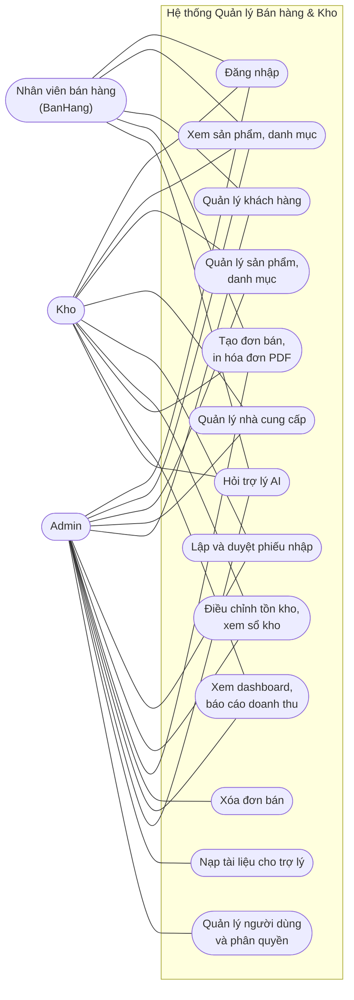

# CHƯƠNG 2. KHẢO SÁT VÀ PHÂN TÍCH YÊU CẦU

## 2.1. Khảo sát hiện trạng

`[điền: mô tả khảo sát thực tế đã làm, ví dụ cửa hàng được khảo sát, cách thu thập (phỏng vấn, quan sát, xem sổ sách), thời gian và kết quả. Nếu đồ án không có khảo sát thực địa, hãy ghi rõ như vậy thay vì mô tả một cuộc khảo sát không có.]`

Trong trường hợp không có khảo sát thực địa, yêu cầu của hệ thống được xác định từ phân tích nghiệp vụ bán lẻ phổ biến, gồm ba luồng chính:

1. **Nhập hàng:** nhà cung cấp giao hàng, cửa hàng đối chiếu rồi ghi nhận vào kho.
2. **Bán hàng:** nhân viên chọn sản phẩm cho khách, thu tiền, trừ hàng khỏi kho.
3. **Kiểm kê và điều chỉnh:** đếm hàng thực tế, sửa số tồn khi có sai lệch, và phải ghi được lý do.

Điểm yếu thường gặp của cách làm thủ công là số tồn chỉ có một nơi ghi và không có lịch sử thay đổi, nên khi lệch thì không truy ra được nguyên nhân (xem Chương 1, mục 1.2).

## 2.2. Tác nhân và vai trò

| Tác nhân | Vai trò hệ thống | Công việc chính |
|---|---|---|
| Quản trị viên | `Admin` | Toàn quyền; quản lý tài khoản và vai trò; nạp tài liệu cho trợ lý; xóa đơn bán |
| Nhân viên kho | `Kho` | Sản phẩm, danh mục, nhà cung cấp, đơn nhập, điều chỉnh tồn kho; xem dashboard và báo cáo |
| Nhân viên bán hàng | `BanHang` | Khách hàng, đơn bán, hóa đơn |
| Cả ba vai trò | | Hỏi trợ lý AI; xem sản phẩm và danh mục; tạo đơn bán (theo `SalesOrdersController`) |

Ma trận quyền chi tiết nằm ở Chương 3, mục 3.3.8.

*Hình 2.1. Sơ đồ use case tổng quát. Quyền lấy từ các thuộc tính `[Authorize]` trong `Api/Controllers`. Một số use case chỉ dùng được qua API chứ chưa có trên giao diện (xem Chương 8).*

## 2.3. Yêu cầu chức năng

Cột "Mức cài đặt" ghi nơi chức năng dùng được: **API** (có endpoint, có kiểm thử) hoặc **Giao diện** (có thao tác trên Blazor). Căn cứ là mã nguồn hiện tại.

| Mã | Yêu cầu | Mức cài đặt |
|---|---|---|
| FR-01 | Đăng nhập bằng email và mật khẩu, nhận JWT; tài khoản bị khóa thì bị từ chối | API, Giao diện |
| FR-02 | Phân quyền theo vai trò `Admin`, `Kho`, `BanHang`; sai quyền trả 403, chưa đăng nhập trả 401 | API; giao diện ẩn mục menu theo vai trò |
| FR-03 | Admin tạo tài khoản, đặt vai trò, khóa và mở khóa, đặt lại mật khẩu | API |
| FR-04 | Quản lý sản phẩm: SKU và barcode duy nhất, giá nhập và giá bán, ngưỡng tồn, đơn vị, danh mục, nhà cung cấp, ảnh | API; giao diện có danh sách, tạo, sửa, xóa (6 trường) |
| FR-05 | Tìm kiếm, lọc theo danh mục và giá, sắp xếp, phân trang sản phẩm; xem sản phẩm sắp hết và ngừng kinh doanh | API; giao diện có lọc, sắp xếp, phân trang |
| FR-06 | Quản lý danh mục, nhà cung cấp (mã duy nhất, xóa mềm), khách hàng (không xóa khách đã có đơn) | API |
| FR-07 | Lập phiếu nhập ở trạng thái nháp (không đổi tồn); duyệt thì cộng tồn và ghi sổ kho; hủy phiếu đã duyệt thì trừ lại tồn | API; giao diện chỉ lập phiếu và duyệt ngay |
| FR-08 | Tạo đơn bán: kiểm tra đủ tồn cho cả đơn, trừ kho, ghi sổ kho trong một giao dịch; thiếu hàng trả 409 nêu rõ sản phẩm | API; giao diện có quầy bán hàng `/pos` |
| FR-09 | Server tự tính tiền của dòng hàng và đơn; không tin số tiền từ máy khách | API |
| FR-10 | Điều chỉnh tồn kho theo độ lệch hoặc đặt về số kiểm kê, bắt buộc có lý do; ghi sổ kho | API |
| FR-11 | Xem sổ kho của một sản phẩm | API |
| FR-12 | Dashboard: doanh thu, số đơn, giá trị đơn trung bình, so với kỳ trước, giá trị tồn kho, số sản phẩm sắp hết | API; giao diện `/dashboard` |
| FR-13 | Báo cáo doanh thu theo ngày, tháng, quý, so sánh cùng kỳ năm trước | API; giao diện `/reports/revenue` |
| FR-14 | Xuất hóa đơn bán hàng PDF; xuất báo cáo doanh thu PDF và Excel | API |
| FR-15 | Trợ lý AI: tra cứu tồn kho, giá bán, trạng thái đơn bằng công cụ; trả lời chính sách từ tài liệu cửa hàng kèm nguồn; lưu lịch sử hội thoại | API; giao diện `/assistant` |
| FR-16 | Ảnh sản phẩm: tải lên, từ URL, từ barcode (Open Food Facts) | API |

## 2.4. Yêu cầu phi chức năng

| Mã | Yêu cầu | Cách đáp ứng và kiểm chứng |
|---|---|---|
| NFR-01 | **Toàn vẹn tồn kho:** tồn không âm | Kiểm tra trong service, `RowVersion`, ràng buộc CHECK; test đồng thời trên SQL Server thật (Chương 4, 5) |
| NFR-02 | **Truy vết biến động kho** | Bảng `StockMovements` cho nhập, bán, điều chỉnh (kể cả tồn đầu kỳ khi tạo sản phẩm; sửa sản phẩm không đổi tồn; dữ liệu có trước bản sửa xem Chương 8) |
| NFR-03 | **Xác thực và phân quyền** | JWT, ba vai trò, kiểm thử ma trận quyền |
| NFR-04 | **Bảo vệ bí mật** | Bí mật chỉ từ biến môi trường ở Production; che bí mật trong log và trong nội dung gửi tới mô hình AI |
| NFR-05 | **Kiểm soát chi phí trợ lý AI** | Giới hạn token, độ dài câu hỏi, số vòng công cụ, tần suất mỗi người dùng; ghi chi phí ước tính vào log |
| NFR-06 | **Hiệu năng truy vấn** | Giảm số câu SQL và lượng cột đọc (đo trên dữ liệu ít dòng, xem Chương 4, 5); chưa đo dưới tải |
| NFR-07 | **Khả năng triển khai** | Docker Compose ba dịch vụ; cấu hình bằng biến môi trường |
| NFR-08 | **Khả năng kiểm thử** | Tầng nghiệp vụ phụ thuộc interface; kiểm thử đơn vị và tích hợp tự động |
| NFR-09 | **Ghi log có cấu trúc** | Serilog ra console và file theo ngày; theo dõi 401, 403 |

## 2.5. Ràng buộc và giả định

- Một cửa hàng, một kho; tồn kho là số nguyên.
- Mỗi đơn bán phải có khách hàng.
- Trợ lý AI cần khóa API của Anthropic và Voyage; thiếu khóa thì phần còn lại của hệ thống vẫn chạy.
- Hệ thống giả định chạy một bản API duy nhất (bộ đếm giới hạn tần suất và theo dõi lỗi xác thực nằm trong bộ nhớ).
- Triển khai thật cần HTTPS qua một reverse proxy; Docker Compose của dự án không kèm TLS.

## 2.6. Ghi chú về tài liệu yêu cầu ban đầu

Thư mục `docs/` có `SRS.md` và `BACKLOG.md` soạn từ đầu dự án. Hai tài liệu này mô tả một số tính năng chưa được cài đặt (khóa tài khoản tạm sau nhiều lần đăng nhập sai, refresh token, thuế VAT, nhật ký kiểm toán, xóa mềm người dùng), và dùng tên vai trò khác với mã (`ADMIN`, `WAREHOUSE`, `SALES`). Báo cáo này chỉ dùng danh sách yêu cầu ở mục 2.3, đã đối chiếu với mã nguồn.
