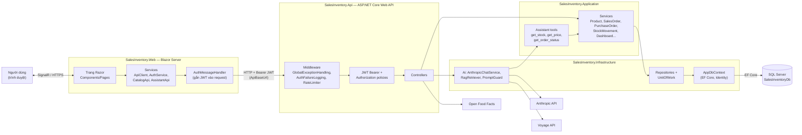
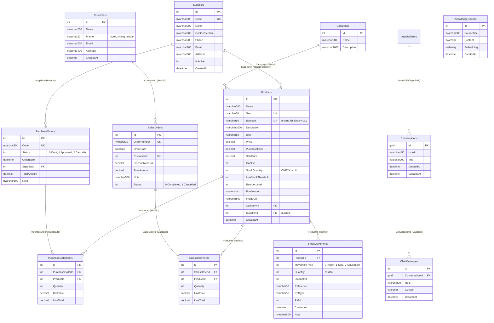
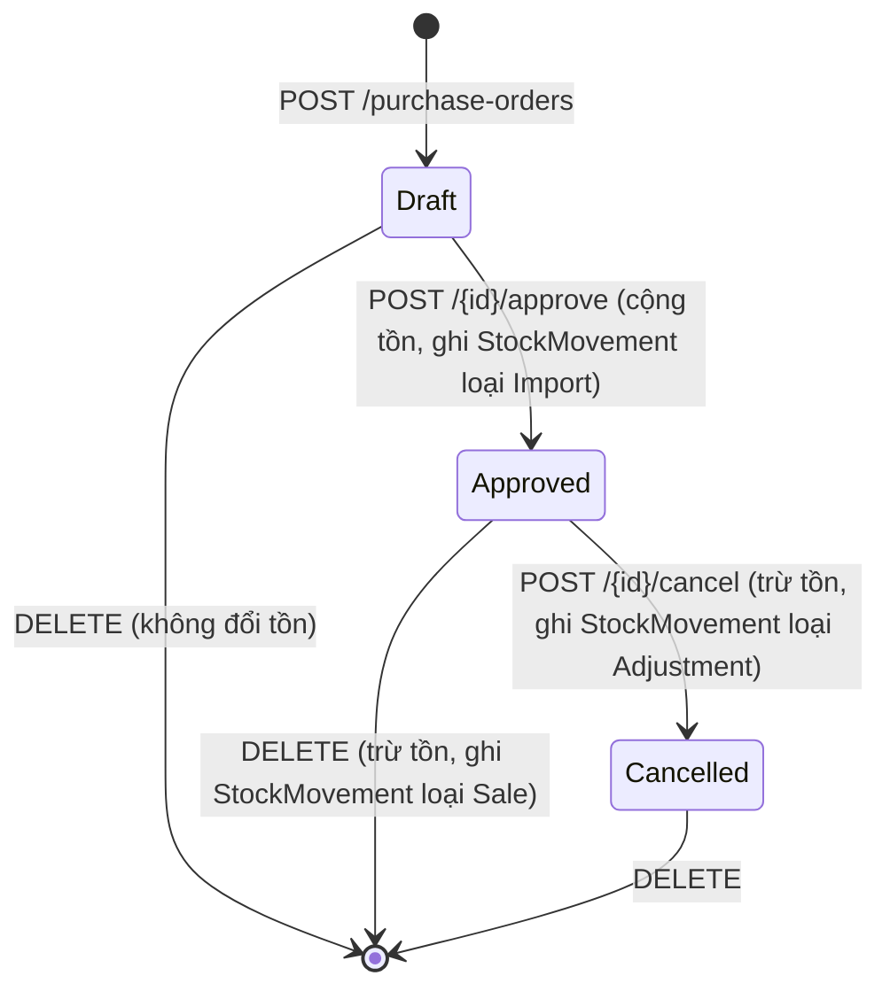
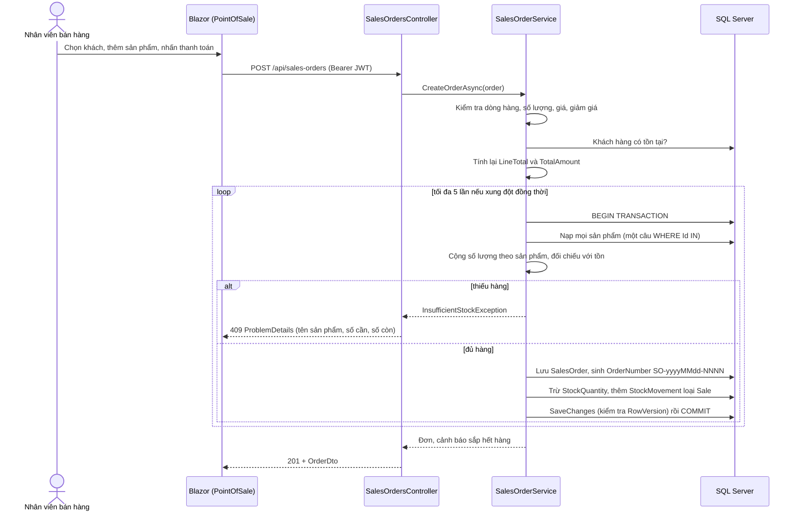
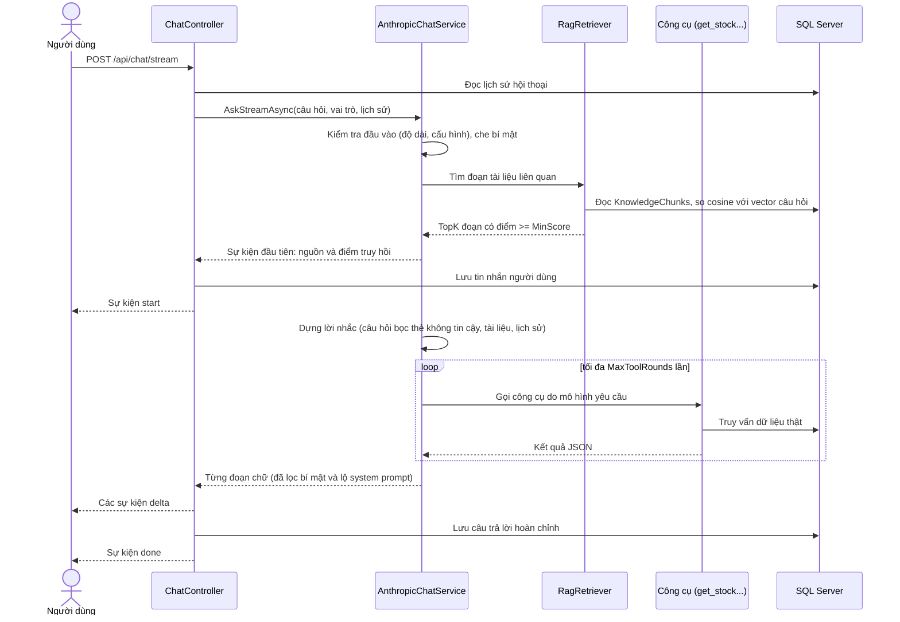

# CHƯƠNG 3. THIẾT KẾ HỆ THỐNG

> **Quy ước đối chiếu.** Mọi tên lớp, tên file và route trong chương này lấy từ mã nguồn của nhánh `feat/stock-ledger-and-race-safety`. Đường dẫn tính từ thư mục gốc của solution.

## 3.1. Kiến trúc tổng thể

### 3.1.1. Mô hình triển khai logic

Hệ thống gồm ba thành phần chạy độc lập, kết nối với nhau qua HTTP và TCP:

1. **Giao diện Blazor Server** (`src/SalesInventory.Web`). Các trang Razor chạy trên máy chủ ASP.NET Core. Trình duyệt giữ kết nối SignalR tới máy chủ này. Blazor **gọi API từ phía máy chủ**, không gọi từ trình duyệt. Vì vậy cấu hình CORS của API không bắt buộc (xem `CLAUDE.md`, mục `Cors__AllowedOrigins__0`).
2. **Web API** (`src/SalesInventory.Api`). Gồm các controller REST, xác thực JWT, phân quyền theo vai trò, middleware xử lý lỗi và ghi log. Nhận request từ Blazor và từ Swagger (chỉ ở môi trường Development).
3. **SQL Server**. API truy cập qua EF Core (`AppDbContext`). Chuỗi kết nối lấy từ biến môi trường hoặc user-secrets, không nằm trong file cấu hình.

Ngoài ra API còn gọi ba dịch vụ bên ngoài:

| Dịch vụ | Dùng để | Lớp cài đặt |
|---|---|---|
| Anthropic Messages API | Trợ lý AI trả lời, gọi công cụ | `Infrastructure/Ai/AnthropicChatService.cs` |
| Voyage (embeddings) | Tạo vector cho RAG | `Infrastructure/Ai/HttpEmbeddingService.cs` |
| Open Food Facts | Lấy ảnh sản phẩm theo barcode | `Infrastructure/Storage/OpenFoodFactsImageLookup.cs` |

*Hình 3.1. Kiến trúc tổng thể của hệ thống.*

### 3.1.2. Phân lớp trong solution

Solution theo hướng Clean Architecture, gồm bốn project backend và một project giao diện.

| Project | Vai trò | Thành phần tiêu biểu (đối chiếu) |
|---|---|---|
| `SalesInventory.Domain` | Entity và enum, không phụ thuộc project nào | `Entities/Product.cs`, `Entities/SalesOrder.cs`, `Enums/StockMovementType.cs` |
| `SalesInventory.Application` | Nghiệp vụ, DTO, validator, báo cáo PDF/Excel, công cụ của trợ lý | `Services/SalesOrderService.cs`, `Services/PurchaseOrderService.cs`, `Services/InvoicePdfService.cs`, `Assistant/Tools/*.cs` |
| `SalesInventory.Infrastructure` | EF Core, Identity, repository, client AI, lưu file | `Persistence/AppDbContext.cs`, `Persistence/UnitOfWork.cs`, `Repositories/*.cs`, `Ai/*.cs` |
| `SalesInventory.Api` | Controller, middleware, hardening, logging | `Controllers/*.cs`, `Program.cs`, `Hardening/`, `Middleware/` |
| `SalesInventory.Web` | Giao diện Blazor Server | `Components/Pages/*.razor`, `Services/ApiClient.cs` |

Các mẫu thiết kế có trong code:

- **Repository + Unit of Work.** Interface nằm ở `Application/Interfaces/` (`IRepository<T>`, `IProductRepository`, `ISalesOrderRepository`, `IUnitOfWork`...), cài đặt ở `Infrastructure/Repositories/`. `IUnitOfWork.BeginTransactionAsync()` cho phép các service gom nhiều thay đổi vào một giao dịch.
- **Dependency Injection.** Mỗi lớp có `DependencyInjection.cs` riêng: `AddApplication()` và `AddInfrastructure()`.
- **Options pattern.** `JwtSettings`, `AnthropicOptions`, `AiSafetyOptions` (kiểm tra khi khởi động bằng `AiSafetyOptionsValidator`), `KnowledgeOptions`, `InventorySettings`, `ShopSettings`.
- **DTO + AutoMapper + FluentValidation.** Thư mục `Application/Dtos`, `Application/Mapping/*Profile.cs`, `Application/Validators/`.

### 3.1.3. Xác thực và phân quyền

Xác thực dùng ASP.NET Core Identity (`ApplicationUser` kế thừa `IdentityUser`, thêm `FullName`) kết hợp JWT Bearer. Cấu hình ở `Program.cs` và `Infrastructure/Identity/TokenService.cs`. Token có thời hạn theo `Jwt:ExpiryMinutes` (60 phút trong `appsettings.json`). Hệ thống **chỉ có access token**, không có refresh token.

Ba vai trò nằm trong `Infrastructure/Identity/AppRoles.cs`: `Admin`, `Kho`, `BanHang`. Ba policy nằm trong `AuthPolicies.cs` và được đăng ký trong `Program.cs`:

| Policy | Vai trò được phép |
|---|---|
| `AdminOnly` | `Admin` |
| `CanManageInventory` | `Admin`, `Kho` |
| `SalesAccess` | `Admin`, `BanHang` |

> **Lưu ý đối chiếu.** `SalesAccess` được đăng ký nhưng không có controller nào dùng (`SalesOrdersController` và `CustomersController` dùng `[Authorize(Roles = ...)]` trực tiếp). Hai cách khai báo cho cùng một kết quả: trả 401 khi không có token và 403 khi sai vai trò.

Phía Blazor, token được giữ trong `ProtectedSessionStorage` (`Web/Services/TokenStore.cs`). `JwtAuthenticationStateProvider` đọc claims từ token. `AuthMessageHandler` gắn `Authorization: Bearer` vào mọi request tới API. Menu ẩn hoặc hiện theo vai trò trong `Components/Layout/NavMenu.razor`.

### 3.1.4. Pipeline xử lý một request

Thứ tự trong `Program.cs` (từ ngoài vào trong): hardening → ghi log request (Serilog) → `GlobalExceptionHandlingMiddleware` → Swagger (chỉ Development) → HSTS → chuyển hướng HTTPS → file tĩnh (`wwwroot`, chứa ảnh sản phẩm) → CORS (chỉ khi có cấu hình) → `AuthFailureLoggingMiddleware` → xác thực → phân quyền → rate limiter → controller.

---

## 3.2. Thiết kế cơ sở dữ liệu

### 3.2.1. Tổng quan

- Hệ quản trị: SQL Server. Lược đồ do EF Core Code First quản lý. Model khai báo trong `Infrastructure/Persistence/AppDbContext.cs`, kế thừa `IdentityDbContext<ApplicationUser>`.
- Lịch sử lược đồ: 29 migration trong `Infrastructure/Persistence/Migrations/`, từ `20260917125730_AddProductsTable` đến `20261007085614_AddChatConversations`. Ảnh chụp mô hình hiện tại: `AppDbContextModelSnapshot.cs`.
- Có 12 bảng nghiệp vụ và AI (kèm bảng Identity). Các bảng được tạo bằng migration và đặt tên theo `ToTable(...)` trong snapshot.

| Nhóm | Bảng |
|---|---|
| Danh mục dữ liệu chủ | `Categories`, `Products`, `Suppliers`, `Customers` |
| Nhập hàng | `PurchaseOrders`, `PurchaseOrderItems` |
| Bán hàng | `SalesOrders`, `SalesOrderItems` |
| Kho | `StockMovements` |
| Trợ lý AI | `Conversations`, `ChatMessages`, `KnowledgeChunks` |
| Identity | `AspNetUsers`, `AspNetRoles`, `AspNetUserRoles`, `AspNetUserClaims`, `AspNetRoleClaims`, `AspNetUserLogins`, `AspNetUserTokens` |

### 3.2.2. Sơ đồ quan hệ thực thể (ERD)

*Hình 3.2. ERD các bảng nghiệp vụ (nguồn: `Domain/Entities/*.cs` và `AppDbContext.OnModelCreating`). `KnowledgeChunks` đứng riêng, không có khóa ngoại. Các bảng Identity không vẽ để giữ sơ đồ gọn.*

### 3.2.3. Mô tả từng bảng

Kiểu dữ liệu cột ghi theo `MaxLength` và `HasColumnType` trong entity và `AppDbContext`. Kiểu SQL đầy đủ của từng cột nằm trong `AppDbContextModelSnapshot.cs`.

#### `Categories` (`Domain/Entities/Category.cs`)

| Cột | Ràng buộc |
|---|---|
| `Id` | PK |
| `Name` | Bắt buộc, tối đa 200 ký tự |
| `Description` | Tối đa 1000 ký tự |

Dữ liệu mẫu: 5 danh mục (Đồ điện tử, Văn phòng phẩm, Gia dụng, Thời trang, Thực phẩm), tạo bằng `HasData`. Tên danh mục **không có unique index** ở mức CSDL, và `CategoryService` chỉ kiểm tra tên không được rỗng (`IsNullOrWhiteSpace`), **không kiểm tra trùng tên**. Hai danh mục cùng tên là hợp lệ trong hệ thống hiện tại.

#### `Suppliers` (`Domain/Entities/Supplier.cs`)

| Cột | Ràng buộc |
|---|---|
| `Id` | PK |
| `Code` | Bắt buộc, tối đa 50, **unique index** |
| `Name` | Bắt buộc, tối đa 200 |
| `ContactPerson`, `Phone`, `Email`, `Address` | Tùy chọn, độ dài 200, 20, 200, 300 |
| `IsActive` | Mặc định `true`. Xóa nhà cung cấp là đặt `false` (`SupplierService.DeleteSupplierAsync`) |
| `CreatedAt` | Thời điểm tạo |

Có một nhà cung cấp mẫu `SUP-001` ("Nhà cung cấp mặc định") để các sản phẩm mẫu có `SupplierId` hợp lệ.

#### `Customers` (`Domain/Entities/Customer.cs`)

| Cột | Ràng buộc |
|---|---|
| `Id` | PK |
| `Name` | Bắt buộc, tối đa 200 |
| `Phone` | Tối đa 20, index thường (migration `AddCustomerPhoneIndex`), **không unique** |
| `Email`, `Address` | Tối đa 200 và 400 |
| `CreatedAt` | Mặc định `GETUTCDATE()` |

Không có trường loại khách (khách lẻ, khách sỉ...). Một đơn bán luôn gắn với một khách hàng (`SalesOrder.CustomerId` bắt buộc).

#### `Products` (`Domain/Entities/Product.cs`)

| Cột | Ràng buộc / ý nghĩa |
|---|---|
| `Id` | PK |
| `Name` | Bắt buộc, tối đa 200, có index |
| `Sku` | Bắt buộc, tối đa 50, **unique index** |
| `Barcode` | Tối đa 50, **unique index** (chỉ áp dụng với giá trị khác NULL) |
| `Unit` | Bắt buộc, mặc định `"cái"` |
| `PurchasePrice`, `SalePrice` | `decimal(18,2)`, mặc định 0 |
| `Price` | `decimal(18,2)`. Cột cũ (*legacy*) giữ song song với `SalePrice`: `ProductProfile` gán `Price = SalePrice` khi ánh xạ DTO sang entity (chú thích trong code: "legacy Price mirrors SalePrice"), và `ProductService` kiểm tra `Price > 0` |
| `StockQuantity` | Tồn hiện tại. Có **CHECK `CK_Products_StockQuantity_NonNegative`** (`[StockQuantity] >= 0`) |
| `LowStockThreshold` | Ngưỡng cảnh báo sắp hết, mặc định 5 |
| `ReorderLevel` | Mức đặt hàng lại, mặc định 0 |
| `RowVersion` | `[Timestamp]`. Cơ chế khóa lạc quan khi nhiều người cập nhật cùng một sản phẩm |
| `IsActive` | Cờ ngừng kinh doanh, mặc định `true` |
| `ImageUrl` | Tối đa 500, đường dẫn ảnh |
| `CategoryId` | FK → `Categories`, `Restrict` |
| `SupplierId` | FK → `Suppliers`, **nullable**, `Restrict` |
| `CreatedAt` | Thời điểm tạo |

Các index bổ sung: `CategoryId`, `Name`, `SalePrice`, và `StockQuantity` (kèm cột bao phủ `IsActive`, `LowStockThreshold`, `PurchasePrice`, `Name`) để dashboard đọc index hẹp thay vì quét cả bảng. Có 8 sản phẩm mẫu.

#### `PurchaseOrders` và `PurchaseOrderItems` (đơn nhập)

`PurchaseOrder` (`Domain/Entities/PurchaseOrder.cs`):

| Cột | Ràng buộc |
|---|---|
| `Id` | PK |
| `Code` | Bắt buộc, tối đa 30, **unique index**. Dạng `PO-yyyyMMdd-NNN` (`PurchaseOrderService.GenerateCodeAsync`) |
| `Status` | Enum `PurchaseOrderStatus`: `Draft = 0`, `Approved = 1`, `Cancelled = 2` |
| `OrderDate` | Bắt buộc, có index ghép `(OrderDate, Id)` |
| `SupplierId` | FK → `Suppliers`, `Restrict` |
| `TotalAmount` | `decimal(18,2)`, do server tính |
| `Note` | Tối đa 500 |

`PurchaseOrderItem` (`Domain/Entities/PurchaseOrderItem.cs`): `Id` (PK), `PurchaseOrderId` (FK, **Cascade**), `ProductId` (FK, `Restrict`), `Quantity`, `UnitPrice`, `LineTotal` (hai cột tiền `decimal(18,2)`).

#### `SalesOrders` và `SalesOrderItems` (đơn bán)

`SalesOrder` (`Domain/Entities/SalesOrder.cs`):

| Cột | Ràng buộc |
|---|---|
| `Id` | PK |
| `OrderNumber` | Bắt buộc, tối đa 30, **unique index**. Dạng `SO-yyyyMMdd-NNNN` (`SalesOrderService.GenerateOrderNumberAsync`) |
| `OrderDate` | Bắt buộc, index `(OrderDate, Id)` và `(Status, OrderDate)` kèm `TotalAmount` |
| `CustomerId` | FK → `Customers`, `Restrict` |
| `DiscountAmount` | `decimal(18,2)`, mặc định 0 |
| `TotalAmount` | `decimal(18,2)` = tổng `LineTotal` − `DiscountAmount` |
| `Status` | Enum `SalesOrderStatus`: `Completed = 0`, `Cancelled = 1` (lưu kiểu `int`) |
| `Note` | Tối đa 500 |

`SalesOrderItem` (`Domain/Entities/SalesOrderItem.cs`): `Id` (PK), `SalesOrderId` (FK, **Cascade**), `ProductId` (FK, `Restrict`), `Quantity`, `UnitPrice`, `LineTotal`. Có index trên `ProductId` (kèm `SalesOrderId`, `Quantity`, `LineTotal`) phục vụ báo cáo sản phẩm bán chạy.

#### `StockMovements` (sổ kho, `Domain/Entities/StockMovement.cs`)

Các lần nhập (duyệt phiếu), bán, điều chỉnh tay, đảo phiếu nhập và tồn đầu kỳ khi tạo sản phẩm (`RefType = "InitialStock"`) đều sinh một dòng. Sửa sản phẩm (`PUT /api/products/{id}`) **không** đổi tồn kho: trường `quantity` của yêu cầu được nhận nhưng bị bỏ qua, nên tồn chỉ đổi qua các chứng từ có ghi sổ. Nhờ vậy tổng `Quantity` của sổ kho một sản phẩm bằng `StockQuantity` của nó (có test đối soát). Dữ liệu có trước bản sửa thì khác, xem Chương 8, hạn chế 1.

| Cột | Ý nghĩa |
|---|---|
| `Id` | PK |
| `ProductId` | FK → `Products`, `Restrict` |
| `MovementType` | Enum `StockMovementType`: `Import = 0`, `Sale = 1`, `Adjustment = 2` |
| `Quantity` | Số lượng **có dấu** (nhập là dương, xuất là âm) |
| `StockAfter` | Tồn của sản phẩm ngay sau lần thay đổi này |
| `Reference` | Mã chứng từ hiển thị (ví dụ mã đơn), tối đa 50 |
| `RefType`, `RefId` | Loại và Id chứng từ nguồn: `"PurchaseOrder"`, `"SalesOrder"` hoặc `"ManualAdjustment"` (với điều chỉnh tay, `RefId = 0`) |
| `CreatedAt`, `Note` | Thời điểm và ghi chú (lý do) |

Index: `(ProductId, CreatedAt, Id)` cho "thẻ kho một sản phẩm", và `(RefType, RefId)` để tra theo chứng từ.

> **Lưu ý đối chiếu.** Khi hủy phiếu nhập đã duyệt, service ghi dòng loại `Adjustment`. Khi **xóa** phiếu nhập đã duyệt, service ghi dòng loại `Sale` (`PurchaseOrderService.DeletePurchaseOrderAsync` gọi `ReverseStockAsync(existing, StockMovementType.Sale, ...)`). Hai cách gán loại khác nhau; nên giải thích hoặc thống nhất trước khi bảo vệ.

#### Nhóm bảng trợ lý AI

| Bảng | Entity | Mô tả |
|---|---|---|
| `Conversations` | `Domain/Entities/Conversation.cs` | `Id` kiểu `Guid`. `UserId` (tối đa 450) lưu Id người dùng Identity **dưới dạng chuỗi, không có khóa ngoại**. `Title`, `CreatedAt`, `UpdatedAt`. Index `(UserId, UpdatedAt)` |
| `ChatMessages` | `Domain/Entities/ChatMessage.cs` | `Id`, `ConversationId` (FK, **Cascade**), `Role` (tối đa 20), `Content`, `CreatedAt`. Index `(ConversationId, Id)` |
| `KnowledgeChunks` | `Domain/Entities/KnowledgeChunk.cs` | `SourceTitle`, `Content` (đoạn tài liệu), `Embedding` (`byte[]`, vector từ Voyage), `CreatedAt`. Index theo `SourceTitle` |

Vector được lưu dạng `varbinary` và so khớp bằng cosine similarity trong ứng dụng (`Infrastructure/Ai/VectorMath.cs`, `RagRetriever.cs`), không dùng kiểu vector gốc của SQL Server.

#### Nhóm bảng Identity

`AppDbContext` kế thừa `IdentityDbContext<ApplicationUser>` nên có các bảng `AspNetUsers`, `AspNetRoles`, `AspNetUserRoles`... Bảng `AspNetUsers` có thêm cột `FullName` (migration `AddFullNameToApplicationUser`). Ba vai trò được tạo lúc khởi động bởi `RoleSeeder.SeedRolesAsync`. Tài khoản Admin đầu tiên chỉ tạo khi cấu hình `SeedAdmin:Email` và `SeedAdmin:Password` (`RoleSeeder.SeedAdminAsync`).

### 3.2.4. Tổng hợp quan hệ và ràng buộc

| Quan hệ (cha → con) | Khóa ngoại | Khi xóa cha |
|---|---|---|
| `Categories` → `Products` | `Products.CategoryId` | Restrict |
| `Suppliers` → `Products` | `Products.SupplierId` (nullable) | Restrict |
| `Suppliers` → `PurchaseOrders` | `PurchaseOrders.SupplierId` | Restrict |
| `Customers` → `SalesOrders` | `SalesOrders.CustomerId` | Restrict |
| `PurchaseOrders` → `PurchaseOrderItems` | `PurchaseOrderItems.PurchaseOrderId` | **Cascade** |
| `SalesOrders` → `SalesOrderItems` | `SalesOrderItems.SalesOrderId` | **Cascade** |
| `Products` → `PurchaseOrderItems`, `SalesOrderItems`, `StockMovements` | `ProductId` | Restrict |
| `Conversations` → `ChatMessages` | `ChatMessages.ConversationId` | **Cascade** |

Các ràng buộc toàn vẹn dữ liệu ở mức CSDL: unique (`Products.Sku`, `Products.Barcode`, `Suppliers.Code`, `SalesOrders.OrderNumber`, `PurchaseOrders.Code`), CHECK tồn kho không âm, `RowVersion` trên `Products`. Ràng buộc `Restrict` khiến SQL Server từ chối xóa một sản phẩm đã có chứng từ hoặc dòng sổ kho. Trước đây `DeleteProductAsync` không kiểm tra điều này nên khóa ngoại làm việc xóa thất bại và API không trả thông báo nghiệp vụ (đã có test tái hiện, xem Chương 5). Nay `ProductService.DeleteProductAsync` gọi `IProductRepository.HasDocumentsAsync` (ba truy vấn `EXISTS` trên `PurchaseOrderItems`, `SalesOrderItems`, `StockMovements`) và ném `ConflictException`, nên API trả **HTTP 409** kèm gợi ý chuyển sản phẩm sang ngừng kinh doanh (`IsActive = false`). Khóa ngoại `Restrict` vẫn là lớp chặn cuối cùng.

---

## 3.3. Thiết kế chức năng

### 3.3.1. Quy ước chung của API

- Mọi route bắt đầu bằng `api/`. Ký hiệu `[controller]` trong code được thay bằng tên controller viết thường (ví dụ `ProductsController` → `api/products`).
- Lỗi trả theo chuẩn **ProblemDetails** (`GlobalExceptionHandlingMiddleware`): 400 (dữ liệu sai), 401 (chưa đăng nhập), 403 (sai vai trò), 404 (không tìm thấy), 409 (xung đột nghiệp vụ như thiếu tồn kho hoặc sai trạng thái), 429 (vượt giới hạn gọi trợ lý), 503 (chưa cấu hình khóa AI).
- Danh sách đơn nhập và đơn bán nhận `page` và `pageSize` tùy chọn. Tổng số đơn nằm ở header `X-Total-Count` (có khi truyền `page`).
- Ba vai trò: `Admin`, `Kho`, `BanHang`. Cột "Quyền" bên dưới lấy từ thuộc tính `[Authorize]` ở mức controller và action.

### 3.3.2. Nền tảng: xác thực và người dùng

| Route | Phương thức | Quyền | Controller / ghi chú |
|---|---|---|---|
| `api/auth/login` | POST | Công khai | `AuthController`. Từ chối nếu tài khoản bị khóa |
| `api/auth/register` | POST | Công khai | `AuthController.Register`. Người lạ chỉ tạo được tài khoản vai trò mặc định `BanHang` (`DefaultRole`); chọn `Admin` hoặc `Kho` trả 403 trừ khi người gọi là `Admin` đã đăng nhập. Xem ghi chú bên dưới bảng |
| `api/auth/me` | GET | Đã đăng nhập | `AuthController` |
| `api/auth/assign-role` | POST | `Admin` | `AuthController` |
| `api/admin/users` | GET, POST | `Admin` | `UserAdminController` |
| `api/admin/users/{id}` | GET | `Admin` | `UserAdminController` |
| `api/admin/users/{id}/roles` | PUT | `Admin` | Đặt lại tập vai trò |
| `api/admin/users/{id}/lock`, `.../unlock` | POST | `Admin` | Khóa và mở khóa tài khoản |
| `api/admin/users/{id}/reset-password` | POST | `Admin` | Đặt lại mật khẩu |
| `api/admin/employees` | POST | `Admin` (policy `AdminOnly`) | `AdminEmployeesController`, tạo nhân viên |
| `api/users`, `api/users/{id}/roles` | GET, POST, DELETE | `Admin` | `UsersController`. Liệt kê người dùng, gán và gỡ vai trò. Chồng lấn một phần với `UserAdminController` (liệt kê, đặt vai trò) nhưng đơn giản hơn (không có khóa, đặt lại mật khẩu), nhiều khả năng là bản có trước. Giữ cả hai trong báo cáo và nói rõ có chồng lấn |
| `api/health`, `api/health/db` | GET | Công khai | `HealthController` |

> Giao diện Blazor **chưa có trang quản lý người dùng**. Các endpoint `api/admin/users` chỉ dùng qua Swagger hoặc client khác.

> **Ghi chú bảo mật.** Trước đây `POST /api/auth/register` không yêu cầu đăng nhập và nhận vai trò từ body, nên bất kỳ ai cũng tự tạo được tài khoản `Admin` (lỗi này đã được test tái hiện và sửa, xem Chương 5, `RegistrationSecurityTests`). Nay `AuthController.Register` chỉ cấp vai trò `BanHang` cho người lạ; vai trò khác cần token `Admin`. Tài khoản nhân viên thường được tạo bằng `POST /api/admin/users`. Đăng ký công khai vẫn tồn tại và vẫn tạo được tài khoản `BanHang`, đây là một lựa chọn thiết kế nên nêu ở Chương 8 nếu cửa hàng không muốn mở đăng ký.

### 3.3.3. Module Quản lý sản phẩm (kèm danh mục, nhà cung cấp, khách hàng)

Service chính: `ProductService`, `CategoryService`, `SupplierService`, `CustomerService` (thư mục `Application/Services`). Giao diện: chỉ sản phẩm có trang đầy đủ (`Pages/Products.razor`: danh sách, sửa, xóa; `Products/CreateProduct.razor`, `Products/EditProduct.razor`: form 6 trường). `Categories.razor`, `Suppliers.razor`, `Customers.razor` hiện **chỉ có tiêu đề, chưa có chức năng**; danh mục, nhà cung cấp và khách hàng quản lý qua API, riêng khách hàng còn thêm nhanh được từ quầy bán hàng (`/pos`).

**Sản phẩm** (`ProductsController`, route gốc `api/products`; mặc định `[Authorize]`, tức mọi người dùng đã đăng nhập đọc được):

| Route | Phương thức | Quyền | Chức năng |
|---|---|---|---|
| `api/products` | GET | Đã đăng nhập | Danh sách có lọc: `keyword`, `categoryId`, `minPrice`, `maxPrice`, `inStockOnly`, sắp xếp, phân trang (`ProductQueryParameters`, mặc định 20 dòng, tối đa 100) |
| `api/products/search` | GET | Đã đăng nhập | Tìm kiếm với `page`, `pageSize`, `search`, `categoryId`, `sortBy`, `sortDir` |
| `api/products/by-category/{categoryId}` | GET | Đã đăng nhập | Theo danh mục |
| `api/products/by-sku/{sku}` | GET | Đã đăng nhập | Tra theo SKU |
| `api/products/inactive` | GET | Đã đăng nhập | Sản phẩm ngừng kinh doanh |
| `api/products/low-stock` | GET | Đã đăng nhập | Sản phẩm sắp hết (`includeInactive`) |
| `api/products/{id}` | GET | Đã đăng nhập | Chi tiết |
| `api/products` | POST | `Admin`, `Kho` | Tạo. Kiểm tra trùng SKU, barcode (`DuplicateSkuException`, `DuplicateBarcodeException`) |
| `api/products/{id}` | PUT | `Admin`, `Kho` | Cập nhật |
| `api/products/{id}` | DELETE | `Admin`, `Kho` | Xóa (xóa cứng, `ProductService.DeleteProductAsync`) |
| `api/products/{id}/image` | POST | `Admin`, `Kho` | Tải ảnh lên (`IFormFile`). Quy tắc ở `ProductImageRules`, lưu qua `LocalFileStorage` |
| `api/products/{id}/image-from-url` | POST | `Admin`, `Kho` | Tải ảnh từ URL, qua `SafeImageDownloader` (chống SSRF) |
| `api/products/{id}/image-from-barcode` | POST | `Admin`, `Kho` | Lấy ảnh theo barcode từ Open Food Facts |

Các endpoint kho gắn với sản phẩm (`adjust-stock`, `set-stock`, `movements`) nằm ở mục 3.3.4.

**Danh mục** (`CategoriesController`, `api/categories`, mặc định `[Authorize]`):

| Route | Phương thức | Quyền |
|---|---|---|
| `api/categories`, `api/categories/{id}` | GET | Đã đăng nhập |
| `api/categories` | POST | `Admin`, `Kho` |
| `api/categories/{id}` | PUT, DELETE | `Admin`, `Kho` |

**Nhà cung cấp** (`SuppliersController`, `api/suppliers`, cả controller chỉ cho `Admin`, `Kho`):

| Route | Phương thức | Chức năng |
|---|---|---|
| `api/suppliers` | GET, POST | Danh sách, tạo |
| `api/suppliers/active` | GET | Chỉ nhà cung cấp còn hoạt động |
| `api/suppliers/{id}` | GET, PUT, DELETE | Xem, sửa, xóa (đặt `IsActive = false`) |

**Khách hàng** (`CustomersController`, `api/customers`, cả controller chỉ cho `Admin`, `BanHang`):

| Route | Phương thức | Chức năng |
|---|---|---|
| `api/customers` | GET, POST | Danh sách, tạo |
| `api/customers/{id}` | GET, PUT, DELETE | Xem, sửa, xóa. Xóa bị chặn (409) nếu khách đã có đơn (`CustomerService.DeleteCustomerAsync`) |
| `api/customers/{id}/orders` | GET | Lịch sử đơn của khách |

### 3.3.4. Module Nhập kho (đơn nhập và sổ kho)

Service: `PurchaseOrderService`, `StockMovementService`. Giao diện: `Pages/Purchases/CreatePurchase.razor` (`/purchases/create`) cho phép lập phiếu và chọn "Duyệt phiếu ngay" (mặc định đã chọn). `Pages/Purchases.razor` (`/purchases`) chỉ có tiêu đề và nút "Lập phiếu nhập": **giao diện chưa có danh sách phiếu, xem chi tiết, duyệt hay hủy riêng lẻ**; các thao tác đó chỉ có qua API.

**Đơn nhập** (`PurchaseOrdersController`, `api/purchase-orders`, policy `CanManageInventory`: `Admin`, `Kho`):

| Route | Phương thức | Chức năng |
|---|---|---|
| `api/purchase-orders` | GET | Danh sách (`page`, `pageSize`, header `X-Total-Count`) |
| `api/purchase-orders/{id}` | GET | Chi tiết |
| `api/purchase-orders` | POST | Tạo phiếu ở trạng thái `Draft`. **Không đổi tồn kho** |
| `api/purchase-orders/{id}/approve` | POST | Duyệt: cộng tồn, ghi sổ kho |
| `api/purchase-orders/{id}/cancel` | POST | Hủy phiếu đã duyệt: trừ lại tồn |
| `api/purchase-orders/{id}` | DELETE | Xóa phiếu; nếu đã duyệt thì trừ lại tồn |

Vòng đời trạng thái (từ `PurchaseOrderService`):

*Hình 3.3. Trạng thái đơn nhập. Duyệt chỉ áp dụng cho `Draft` và hủy chỉ áp dụng cho `Approved`, nếu sai trạng thái service ném `ConflictException` (HTTP 409).*

Quy tắc nghiệp vụ chính (`PurchaseOrderService.cs`):

- Tạo phiếu: phải có ít nhất một dòng, mọi `Quantity > 0`, nhà cung cấp và mọi sản phẩm phải tồn tại. `LineTotal` và `TotalAmount` **tính lại ở server**, không tin số liệu client gửi.
- Duyệt phiếu: mở một giao dịch (`IUnitOfWork.BeginTransactionAsync`), kiểm tra tồn sau khi cộng không vượt `int.MaxValue` (tính bằng `long`), cộng tồn, ghi một dòng `StockMovement` cho mỗi dòng hàng, đổi trạng thái. Tất cả cùng thành công hoặc cùng hoàn tác.
- Hủy hoặc xóa phiếu đã duyệt: `ReverseStockAsync` từ chối (`BusinessRuleException`) nếu tồn hiện tại nhỏ hơn số cần trừ lại, vì một phần hàng có thể đã bán.

**Tồn kho và sổ kho** (route nằm ở hai controller):

| Route | Phương thức | Quyền | Chức năng |
|---|---|---|---|
| `api/products/{id}/movements` | GET | `Admin`, `Kho` | Sổ kho của một sản phẩm |
| `api/stock-movements?productId=` | GET | `Admin`, `Kho` | Sổ kho theo sản phẩm (`StockMovementsController`, tham số `productId`) |
| `api/products/{id}/adjust-stock` | POST | `Admin`, `Kho` | Điều chỉnh theo độ lệch (`delta`) và lý do |
| `api/products/{id}/set-stock` | POST | `Admin`, `Kho` | Đặt tồn về một số cụ thể và lý do |

`StockMovementService.ApplyAsync`: yêu cầu có lý do, tính theo tồn hiện tại, từ chối nếu kết quả âm (409) hoặc không có thay đổi, ghi `StockMovement` loại `Adjustment` với `RefType = "ManualAdjustment"`, và dựa vào `Product.RowVersion` để báo xung đột khi hai người sửa cùng lúc.

### 3.3.5. Module Bán hàng

Service: `SalesOrderService`, `InvoicePdfService`. Giao diện: `Pages/Sales/PointOfSale.razor` (`/pos`, màn hình bán hàng, hiện thông báo mã đơn và cảnh báo sắp hết hàng), `Shared/CartTable.razor`. `Pages/Sales.razor` (`/sales`) chỉ có tiêu đề và nút "Mở quầy bán hàng": **giao diện chưa có danh sách đơn, chi tiết đơn hay nút tải hóa đơn PDF** (`GET /api/sales-orders/{id}/invoice-pdf` chỉ dùng qua API).

**Đơn bán** (`SalesOrdersController`, `api/sales-orders`, cho `Admin`, `BanHang`, `Kho`):

| Route | Phương thức | Quyền | Chức năng |
|---|---|---|---|
| `api/sales-orders` | GET | 3 vai trò | Danh sách (`page`, `pageSize`, header `X-Total-Count`) |
| `api/sales-orders/{id}` | GET | 3 vai trò | Chi tiết |
| `api/sales-orders/{id}/invoice-pdf` | GET | 3 vai trò | Hóa đơn PDF (`InvoicePdfService`, QuestPDF) |
| `api/sales-orders` | POST | 3 vai trò | Tạo đơn: trừ tồn và ghi sổ kho |
| `api/sales-orders/{id}` | DELETE | `Admin` | Xóa đơn (xóa cứng) |

Luồng tạo đơn (`SalesOrderService.CreateOrderAsync` và `PlaceOrderAsync`):

*Hình 3.4. Tạo đơn bán. Nếu hai đơn cùng bán một sản phẩm, đơn thua trên `RowVersion` bị hoàn tác và chạy lại với tồn mới, cuối cùng hoặc thành công hoặc thiếu hàng (409), nên tồn không thể âm.*

Quy tắc khác:

- Server tự tính `LineTotal` (làm tròn 2 chữ số) và `TotalAmount`. Từ chối nếu giảm giá lớn hơn tổng hàng.
- Sau khi bán, sản phẩm có tồn ≤ `LowStockThreshold` được liệt kê trong cảnh báo của kết quả trả về (`CreateSalesOrderResult`).
- `SalesOrderStatus.Cancelled` có trong enum và được báo cáo/dashboard lọc ra, nhưng **chưa có endpoint nào đổi đơn sang trạng thái này**. Tìm `SalesOrderStatus.Cancelled` trong `src` chỉ thấy chỗ đọc (`GetOrderStatusTool`, các truy vấn lọc của `DashboardRepository`), không có chỗ gán.
- `DeleteOrderAsync` xóa đơn và các dòng (cascade), **không hoàn tồn và không ghi sổ kho**. Đây là hạn chế cần nêu ở Chương 8.

### 3.3.6. Module Báo cáo

Service: `DashboardService`, `RevenueExcelService`, `RevenuePdfService`; truy vấn tổng hợp ở `Infrastructure/Repositories/DashboardRepository.cs` (chỉ tính đơn `Completed`). Giao diện: `Pages/Dashboard.razor` (`/dashboard`), `Pages/RevenueReport.razor` (`/reports/revenue`). `Pages/Reports.razor` (`/reports`) hiện **chỉ là trang rỗng** (6 dòng).

**Bảng điều khiển** (`DashboardController`, `api/dashboard`, policy `CanManageInventory`):

| Route | Phương thức | Chức năng |
|---|---|---|
| `api/dashboard/summary?from=&to=` | GET | KPI: `TotalRevenue`, `OrderCount`, `AverageOrderValue`, `PreviousPeriodRevenue`, `RevenueChangePercent`, `InventoryValue`, `LowStockCount` (`DashboardSummaryDto`) |
| `api/dashboard/low-stock-items?limit=10` | GET | Danh sách sản phẩm sắp hết |
| `api/dashboard/inventory-summary` | GET | `TotalProducts`, `ActiveProducts`, `LowStockProducts`, `InventoryValue` |

**Báo cáo doanh thu** (`ReportsController`, `api/reports`, policy `CanManageInventory`):

| Route | Phương thức | Chức năng |
|---|---|---|
| `api/reports/revenue` | GET | Doanh thu theo kỳ: `from`, `to`, `groupBy` (`Day`, `Month`, `Quarter`, mặc định `Month`), `compare` (so với cùng kỳ năm trước) |
| `api/reports/revenue/excel` | GET | Xuất Excel (`from`, `to`) |
| `api/reports/revenue/pdf` | GET | Xuất PDF (`from`, `to`) |

Báo cáo Excel và PDF gồm doanh thu theo ngày và sản phẩm bán chạy (`RevenueExcelService.Generate(days, topProducts)`). Trang `/reports/revenue` hiển thị báo cáo trên màn hình; **giao diện chưa có nút tải Excel hay PDF** (không có lời gọi tới `api/reports/revenue/excel` hoặc `/pdf` trong `SalesInventory.Web`), hai định dạng này chỉ dùng qua API.

> **Lưu ý đối chiếu.** `BanHang` **không** truy cập được dashboard và báo cáo, vì các controller này dùng policy `CanManageInventory` (`Admin`, `Kho`). Menu Blazor đã ẩn các mục này với `BanHang` (`NavMenu.razor`).

### 3.3.7. Module Trợ lý AI

Thành phần chính: `AssistantController`, `ChatController` (API); `AnthropicChatService`, `RagRetriever`, `DocumentIngestionService`, `PromptGuard`, `ConversationStore` (Infrastructure); `AssistantToolRegistry` và ba công cụ (Application). Giao diện: `Pages/Assistant.razor` (`/assistant` và `/assistant/{ConversationId}`), `Shared/ChatBox.razor`.

| Route | Phương thức | Quyền | Chức năng |
|---|---|---|---|
| `api/assistant/ask` | POST | `Admin`, `BanHang`, `Kho` | Hỏi một lần, trả JSON (`AskRequestDto` → `AskResponseDto`) |
| `api/assistant/ask/stream` | POST | `Admin`, `BanHang`, `Kho` | Như `ask` nhưng trả luồng Server-Sent Events (`start`, `delta`, `done`, `error`) |
| `api/assistant/knowledge/ingest` | POST | `Admin` | Nạp lại tài liệu chính sách vào `KnowledgeChunks` (thư mục `Knowledge/*.md`) |
| `api/chat/stream` | POST | 3 vai trò | Hội thoại có lưu lịch sử, trả SSE; nhận `message` và `conversationId` tùy chọn |
| `api/chat` | GET | 3 vai trò | Danh sách hội thoại của người đang đăng nhập |
| `api/chat/{conversationId}` | GET | 3 vai trò | Tin nhắn của một hội thoại (hội thoại của người khác trả 404) |

Ba endpoint `ask`, `ask/stream`, `chat/stream` dùng chung chính sách giới hạn tốc độ (`RateLimitingExtensions.AssistantPolicy`, mặc định 10 lượt mỗi 60 giây cho mỗi người dùng).

**Công cụ (function calling)**, đăng ký trong `Application/DependencyInjection.cs`, cùng cho cả 3 vai trò:

| Công cụ | Lớp | Trả về | Không trả |
|---|---|---|---|
| `get_stock` | `Assistant/Tools/GetStockTool.cs` | Tồn, đơn vị, tình trạng (hết hàng, sắp hết, còn hàng) | — |
| `get_price` | `GetPriceTool.cs` | Giá bán hiện tại | Giá nhập |
| `get_order_status` | `GetOrderStatusTool.cs` | Trạng thái, ngày, tổng tiền, số dòng của đơn theo mã | Thông tin khách, chi tiết dòng hàng |

Luồng xử lý một câu hỏi:

*Hình 3.5. Luồng một lượt hội thoại. Chi tiết cài đặt và các lớp an toàn (chống prompt injection, giới hạn token, chọn model theo độ dài câu hỏi) trình bày ở Chương 4.*

Ghi chú đối chiếu cho module này:

- Tham số: `Knowledge:ChunkSize = 500`, `ChunkOverlap = 100`, `TopK = 3`, `MinScore = 0.3`; `AiSafety:MaxToolRounds = 4` (`appsettings.json`).
- Tài liệu tri thức hiện có hai file: `chinh-sach-bao-hanh.md` và `chinh-sach-doi-tra.md` trong `src/SalesInventory.Api/Knowledge/`.
- Trong code, công cụ chỉ **đọc** dữ liệu. Trợ lý không tạo hay sửa đơn.
- Thứ tự trong `ChatController.Stream` đã được đối chiếu với mã: đọc lịch sử, `AskStreamAsync` kiểm tra đầu vào và truy hồi tài liệu rồi phát sự kiện đầu tiên, controller lưu tin nhắn người dùng trước khi gọi mô hình, và lưu câu trả lời hoàn chỉnh trước khi gửi sự kiện `done`; nếu máy khách hủy giữa chừng thì phần đã stream được giữ làm câu trả lời ngắn hơn.

### 3.3.8. Ma trận quyền theo vai trò

| Chức năng | `Admin` | `Kho` | `BanHang` |
|---|:-:|:-:|:-:|
| Xem sản phẩm, danh mục | ✔ | ✔ | ✔ |
| Thêm/sửa/xóa sản phẩm, danh mục, điều chỉnh kho | ✔ | ✔ | ✘ |
| Nhà cung cấp | ✔ | ✔ | ✘ |
| Khách hàng | ✔ | ✘ | ✔ |
| Đơn nhập (tạo, duyệt, hủy, xóa) | ✔ | ✔ | ✘ |
| Đơn bán: xem, tạo, in hóa đơn | ✔ | ✔ | ✔ |
| Đơn bán: xóa | ✔ | ✘ | ✘ |
| Dashboard, báo cáo doanh thu | ✔ | ✔ | ✘ |
| Trợ lý AI | ✔ | ✔ | ✔ |
| Nạp tài liệu cho trợ lý | ✔ | ✘ | ✘ |
| Quản trị người dùng | ✔ | ✘ | ✘ |

*Bảng 3.x. Nguồn: các thuộc tính `[Authorize]` trong `Api/Controllers/*.cs`. Nên đối chiếu thêm với `tests/SalesInventory.Api.Tests/RoleAccessMatrixTests.cs`.*

Lưu ý: `Kho` tạo được đơn bán qua API (`SalesOrdersController` cho cả 3 vai trò) nhưng không đọc được danh sách khách hàng (`CustomersController` chỉ cho `Admin`, `BanHang`). Quầy bán hàng `PointOfSale.razor` tải khách qua `CatalogApi.GetCustomersAsync` và đơn bán bắt buộc có khách, nên theo mã nguồn, người dùng `Kho` nhiều khả năng không chốt được đơn trên giao diện (suy ra từ mã, chưa chạy thử).

---

## 3.4. Ghi chú về phạm vi của thiết kế

Những điểm sau được suy ra từ mã nguồn và chưa được chạy thử trong một lần diễn tập đầy đủ, nên cần đọc kèm các mục đã nêu:

- Người dùng `Kho` trên quầy bán hàng (mục 3.3.8).
- Hành vi của giao diện khi duyệt phiếu nhập thất bại: thông báo gợi ý duyệt lại từ danh sách phiếu nhập, nhưng giao diện không có danh sách đó (mục 3.3.4).

Các điểm khác từng cần đối chiếu đã được giải quyết bằng cách đọc mã: cột `Price` là cột cũ phản chiếu `SalePrice` (mục 3.2.3); `api/users` chồng lấn một phần với `api/admin/users` (mục 3.3.2); `SalesOrderStatus.Cancelled` chỉ có nơi đọc, không có nơi đặt (mục 3.3.5); tên danh mục không được kiểm tra trùng (mục 3.2.3); đăng ký công khai và xóa sản phẩm đã có chứng từ đã được sửa, có test riêng (Chương 5, mục 5.3.3).

