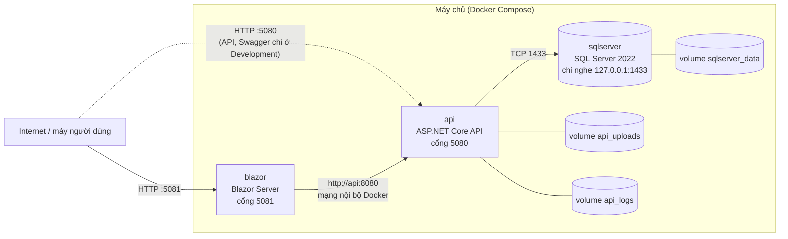

# CHƯƠNG 6. TRIỂN KHAI

> Chương này tóm tắt `README-deploy.md` và `docker-compose.yml`. Theo chính tài liệu đó, các lệnh đã được chạy thử trên **máy phát triển** bằng đúng file `docker-compose.yml`; những chỗ **chưa chạy thử trên một VPS thật** được ghi rõ bên dưới. `[điền: nếu đã triển khai lên VPS thật, bổ sung nhà cung cấp, cấu hình máy chủ và kết quả kiểm tra; nếu chưa, giữ nguyên câu này]`

## 6.1. Mô hình triển khai

Hệ thống chạy thành ba container trong một mạng Docker nội bộ:

*Hình 6.1. Mô hình triển khai (theo `docker-compose.yml`).*

| Dịch vụ | Ảnh nền | Cổng ngoài (mặc định) | Ghi chú |
|---|---|---|---|
| `sqlserver` | `mcr.microsoft.com/mssql/server:2022-latest` | `127.0.0.1:1433` | Có kiểm tra sức khỏe; dữ liệu trong volume `sqlserver_data` |
| `api` | Dựng từ `src/SalesInventory.Api/Dockerfile` (nhiều giai đoạn, ảnh `aspnet:8.0-jammy-chiseled-extra`, chạy bằng người dùng không phải root) | `5080` | Nhật ký ở `api_logs`, ảnh sản phẩm ở `api_uploads` |
| `blazor` | Dựng từ `src/SalesInventory.Web/Dockerfile` | `5081` | Gọi API qua `http://api:8080` |

Cả ba dịch vụ đặt `restart: unless-stopped`, nên tự chạy lại sau khi máy chủ khởi động lại. `api` chờ `sqlserver` khỏe nhưng không dựa vào đó: nếu SQL Server chậm hoặc khởi động lại sau đó, API thoát khi không kết nối được và Docker khởi động lại cho tới khi kết nối được (chú thích trong `docker-compose.yml`).

## 6.2. Yêu cầu máy chủ

| Mục | Yêu cầu |
|---|---|
| Hệ điều hành | Ubuntu 22.04 trở lên |
| Docker | Docker Engine và Compose v2 (`docker compose`) |
| RAM | Tối thiểu 2 GB, nên 4 GB (SQL Server đòi từ 2000 MB; máy "2 GB" thường chỉ có khoảng `1.9Gi` nên có thể không đủ) |
| Swap | 2 GB nếu RAM không quá 2 GB, tránh bị hệ điều hành dừng tiến trình khi build |

## 6.3. Cấu hình bằng biến môi trường

Biến đặt trong file `.env` cạnh `docker-compose.yml` (mẫu `.env.example`); file `.env` **không bao giờ được commit**. Các biến chính:

| Biến | Bắt buộc | Bí mật | Ý nghĩa |
|---|---|---|---|
| `ASPNETCORE_ENVIRONMENT` | Có (đặt `Production`) | Không | Quên đặt thì compose chạy `Development` (bật Swagger, lỗi chi tiết) |
| `MSSQL_SA_PASSWORD` | Có | Có | Mật khẩu tài khoản `sa` của SQL Server |
| `JWT__KEY` | Có | Có | Khóa ký token, từ 32 ký tự ngẫu nhiên trở lên |
| `SEEDADMIN__EMAIL`, `SEEDADMIN__PASSWORD` | Nên có | Mật khẩu: có | Tài khoản Admin đầu tiên, tạo lúc API khởi động nếu có đủ cả hai |
| `ANTHROPIC_API_KEY`, `VOYAGE_API_KEY` | Không | Có | Khóa cho trợ lý và tìm kiếm tài liệu; thiếu thì trợ lý báo lỗi, phần còn lại vẫn chạy |
| `HARDENING__TRUSTEDPROXIES__0` | Khi có reverse proxy | Không | Địa chỉ proxy kết thúc TLS |

Compose tự dựng `ConnectionStrings__DefaultConnection` từ `MSSQL_SA_PASSWORD`, đặt `Database__MigrateOnStartup=true` và `ApiBaseUrl=http://api:8080` cho Blazor. Dấu `__` trong tên biến là cách ASP.NET Core ánh xạ biến môi trường vào cấu hình lồng nhau (`Jwt__Key` thành `Jwt:Key`). Ở Production, API từ chối khởi động nếu một bí mật đến từ file cấu hình (`SecretSettingsGuard`, Chương 4, mục 4.5.2).

## 6.4. Các bước triển khai

1. Cài Docker và Compose, thêm swap nếu máy ít RAM.
2. Lấy mã nguồn: `git clone` nhánh của dự án.
3. Tạo `.env` ngay trên máy chủ với mật khẩu ngẫu nhiên sinh tại chỗ (không chép bí mật qua lại), đặt quyền `chmod 600`.
4. Chạy `docker compose up -d --build`; kiểm tra `docker compose ps` (`sqlserver` ở trạng thái healthy, `api` và `blazor` ở trạng thái Up).
5. Mở cổng cần thiết trên tường lửa và kiểm tra `GET /api/Health/db` (kỳ vọng `{"status":"ok","database":"connected"}`), rồi đăng nhập bằng tài khoản Admin vừa tạo.

## 6.5. Migration cơ sở dữ liệu

Mặc định, API tự áp các migration khi khởi động (`Database__MigrateOnStartup=true`), rồi mới nạp vai trò và Admin; chạy lại trên cơ sở dữ liệu đã migrate là an toàn. Tùy chọn khác: chạy `dotnet ef database update` từ máy phát triển qua một đường hầm SSH tới SQL Server (cổng 1433 không mở ra Internet). `README-deploy.md` ghi lệnh `dotnet ef` đã chạy thử với SQL Server trong container, còn phần SSH tunnel **chưa chạy thử trên VPS thật**.

Cần lưu ý: các migration của dự án chèn cả dữ liệu mẫu (danh mục, nhà cung cấp mặc định, sản phẩm mẫu), nên một cơ sở dữ liệu mới tạo bằng cách này cũng có dữ liệu mẫu (Chương 8, hạn chế 19).

## 6.6. Các điểm bảo mật khi triển khai

- **Cổng 1433 không mở ra Internet:** compose gắn vào `127.0.0.1`; mở ra ngoài là mời dò mật khẩu `sa`.
- **Docker bỏ qua `ufw`** với cổng đã publish: muốn khóa thật, gắn cổng vào localhost trong compose hoặc chặn ở tường lửa của nhà cung cấp VPS.
- **Chưa có TLS trong compose.** Truy cập qua `http://IP` thì mật khẩu và token đi dạng chữ rõ; chỉ nên dùng để thử. Triển khai thật cần tên miền và một reverse proxy (ví dụ Caddy) kết thúc TLS, kèm `HARDENING__TRUSTEDPROXIES__0`, rồi đóng cổng 5080 và 5081.
- **Swagger không có ở Production** (cố ý), nên cần `ASPNETCORE_ENVIRONMENT=Production`.

## 6.7. Những gì đã và chưa được kiểm chứng

| Nội dung | Tình trạng |
|---|---|
| Khởi động từ cơ sở dữ liệu trống, migrate, đăng nhập, tạo và đọc dữ liệu, tự phục hồi khi SQL Server chậm | Đã chạy thử trên máy phát triển, theo `README-deploy.md` |
| Lệnh `dotnet ef database update` tới SQL Server trong container | Đã chạy thử |
| Triển khai trên VPS thật, đường hầm SSH, tường lửa của nhà cung cấp, HTTPS bằng reverse proxy | **Chưa kiểm chứng** theo `README-deploy.md` |

## 6.8. Sự cố thường gặp

| Triệu chứng | Nguyên nhân thường gặp |
|---|---|
| `sqlserver` thoát, log nói cần ít nhất 2000 MB | RAM vật lý dưới 2000 MB |
| Build báo `exit code 137` | Hết RAM khi build; thêm swap |
| `api` khởi động lại liên tục | Thiếu `JWT__KEY`, sai mật khẩu `sa`, hoặc SQL Server chưa sẵn sàng; xem `docker compose logs api` |
| Gọi từ máy khác bị treo nhưng gọi trên chính máy chủ thì chạy | Tường lửa chưa mở cổng 5080, 5081 |

## 6.9. Cập nhật, sao lưu và gỡ

Cập nhật: `git pull` rồi `docker compose up -d --build`; dữ liệu nằm trong volume `sqlserver_data` nên được giữ nguyên. `docker compose down` tắt dịch vụ và giữ dữ liệu; `docker compose down -v` **xóa cả cơ sở dữ liệu** và không dùng trên môi trường thật.
