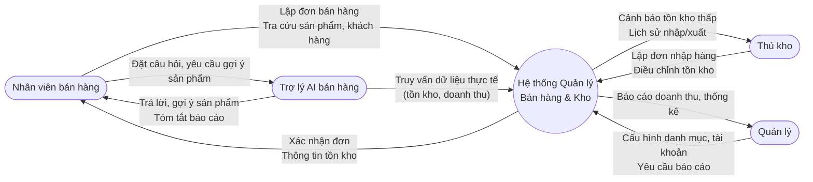

# Đặc tả Yêu cầu Phần mềm (SRS)
## Hệ thống Quản lý Bán hàng & Kho

**Phiên bản:** 1.0
**Ngày:** 2026-09-17
**Loại tài liệu:** Software Requirements Specification (SRS)

---

## 1. Giới thiệu và mục tiêu

### 1.1. Mục đích tài liệu
Tài liệu này đặc tả các yêu cầu chức năng và phi chức năng cho "Hệ thống Quản lý Bán hàng & Kho" (sau đây gọi tắt là "Hệ thống"), làm cơ sở cho việc thiết kế, phát triển, kiểm thử và nghiệm thu sản phẩm trong khuôn khổ đồ án tốt nghiệp ngành Công nghệ Thông tin.

### 1.2. Mục tiêu hệ thống
Hệ thống được xây dựng nhằm hỗ trợ một cửa hàng bán lẻ quy mô vừa và nhỏ:

- Quản lý tập trung thông tin sản phẩm, danh mục, nhà cung cấp và khách hàng.
- Theo dõi và kiểm soát tồn kho theo thời gian thực thông qua các nghiệp vụ nhập/xuất hàng.
- Ghi nhận và xử lý đơn bán hàng, đơn nhập hàng một cách chính xác, có kiểm soát.
- Cung cấp báo cáo doanh thu, tồn kho phục vụ ra quyết định quản lý.
- Cung cấp một trợ lý AI hỗ trợ nhân viên bán hàng trong các thao tác tra cứu, gợi ý và soạn thảo nhanh.

### 1.3. Công nghệ dự kiến
- Backend: ASP.NET Core Web API
- Frontend: Blazor
- Cơ sở dữ liệu: SQL Server
- ORM: Entity Framework Core (code-first)

Tài liệu này không đề cập đến thiết kế cơ sở dữ liệu chi tiết hay kiến trúc hệ thống; các nội dung đó sẽ được trình bày trong tài liệu Thiết kế hệ thống (SDD) riêng biệt.

### 1.4. Đối tượng đọc tài liệu
Giảng viên hướng dẫn/phản biện, nhóm phát triển đồ án, và các bên liên quan tham gia đánh giá đồ án.

---

## 2. Phạm vi

### 2.1. Trong phạm vi (In-scope)
- Quản lý danh mục sản phẩm (category) và sản phẩm (product).
- Quản lý nhà cung cấp (supplier).
- Quản lý khách hàng (customer).
- Quản lý đơn nhập hàng (purchase order) từ nhà cung cấp.
- Quản lý đơn bán hàng (sales order) cho khách hàng, bao gồm bán tại quầy.
- Quản lý tồn kho: cập nhật tự động khi có giao dịch nhập/xuất, tra cứu tồn kho hiện tại, cảnh báo tồn kho thấp.
- Báo cáo doanh thu theo ngày/tháng/khoảng thời gian, báo cáo tồn kho, báo cáo sản phẩm bán chạy.
- Trợ lý AI bán hàng: hỗ trợ tra cứu sản phẩm bằng ngôn ngữ tự nhiên, gợi ý sản phẩm, tóm tắt đơn hàng/báo cáo theo yêu cầu của nhân viên.
- Quản lý người dùng nội bộ và phân quyền theo vai trò (Quản trị viên, Quản lý kho, Nhân viên bán hàng).
- Đăng nhập/đăng xuất, quản lý phiên làm việc.

### 2.2. Ngoài phạm vi (Out-of-scope)
- Thanh toán trực tuyến qua cổng thanh toán (VNPay, Momo, thẻ tín dụng...).
- Bán hàng đa kênh trực tuyến (website thương mại điện tử công khai cho khách hàng tự đặt hàng).
- Quản lý nhiều chi nhánh/kho hàng phân tán và điều chuyển hàng liên kho.
- Tích hợp hóa đơn điện tử theo quy định thuế.
- Ứng dụng di động (mobile app) riêng biệt.
- Tích hợp phần cứng chuyên dụng (máy quét mã vạch, máy in hóa đơn nhiệt) — hệ thống chỉ dừng ở mức nhập/hiển thị mã vạch dạng văn bản.
- Đa ngôn ngữ (hệ thống chỉ hỗ trợ tiếng Việt).
- Đa tiền tệ (hệ thống chỉ dùng VNĐ).

---

## 3. Các bên liên quan và vai trò người dùng

### 3.1. Các bên liên quan
- **Chủ cửa hàng / Ban quản lý:** người ra quyết định kinh doanh, sử dụng báo cáo để theo dõi hiệu quả.
- **Quản lý kho:** chịu trách nhiệm về số liệu tồn kho, đơn nhập hàng.
- **Nhân viên bán hàng:** sử dụng hệ thống hàng ngày để lập đơn bán hàng, tra cứu sản phẩm.
- **Quản trị viên hệ thống:** quản lý tài khoản, phân quyền, cấu hình hệ thống.
- **Nhóm phát triển (sinh viên thực hiện đồ án):** xây dựng và bảo trì hệ thống.
- **Giảng viên hướng dẫn/phản biện:** đánh giá tính đầy đủ và khả thi của đặc tả và sản phẩm.

### 3.2. Bảng vai trò người dùng (User Roles)

| Mã vai trò | Tên vai trò | Mô tả quyền hạn chính |
|---|---|---|
| ADMIN | Quản trị viên | Toàn quyền: quản lý tài khoản người dùng, phân quyền, cấu hình danh mục/sản phẩm/nhà cung cấp, xem toàn bộ báo cáo, cấu hình trợ lý AI. |
| WAREHOUSE | Quản lý kho | Quản lý sản phẩm, danh mục, nhà cung cấp, lập và duyệt đơn nhập hàng, xem/điều chỉnh tồn kho, xem báo cáo tồn kho. Không có quyền quản lý tài khoản người dùng. |
| SALES | Nhân viên bán hàng | Tạo đơn bán hàng, tra cứu sản phẩm và tồn kho, quản lý thông tin khách hàng, sử dụng trợ lý AI bán hàng, xem báo cáo doanh thu cá nhân. Không có quyền chỉnh sửa sản phẩm, danh mục, đơn nhập hàng. |

Ghi chú: một tài khoản chỉ được gán đúng một vai trò tại một thời điểm.

---

## 4. Yêu cầu chức năng

Mỗi yêu cầu được đánh mã theo định dạng `FR-<số thứ tự>` và mô tả theo mẫu: điều kiện kích hoạt, hành vi hệ thống, kết quả mong đợi.

### 4.1. Module Xác thực & Phân quyền

- **FR-01:** Hệ thống phải cho phép người dùng đăng nhập bằng tên đăng nhập (hoặc email) và mật khẩu; nếu thông tin sai quá 5 lần liên tiếp trong vòng 15 phút, tài khoản bị khóa tạm thời 15 phút và hệ thống hiển thị thông báo "Tài khoản tạm khóa do đăng nhập sai nhiều lần".
- **FR-02:** Hệ thống phải phân quyền chức năng theo 3 vai trò (ADMIN, WAREHOUSE, SALES) như mô tả tại mục 3.2; khi người dùng truy cập chức năng ngoài quyền hạn, hệ thống trả về lỗi HTTP 403 và không thực hiện thao tác.
- **FR-03:** Hệ thống phải cho phép ADMIN tạo, khóa/mở khóa và xóa mềm (soft delete) tài khoản người dùng; tài khoản bị khóa không thể đăng nhập nhưng dữ liệu lịch sử giao dịch liên quan vẫn được giữ nguyên.
- **FR-04:** Hệ thống phải tự động đăng xuất người dùng sau 30 phút không có thao tác (phiên hết hạn) và yêu cầu đăng nhập lại.

### 4.2. Module Quản lý Danh mục sản phẩm

- **FR-05:** Hệ thống phải cho phép ADMIN/WAREHOUSE tạo danh mục sản phẩm với tên danh mục duy nhất (không phân biệt hoa/thường); nếu tên đã tồn tại, hệ thống từ chối tạo và hiển thị "Tên danh mục đã tồn tại".
- **FR-06:** Hệ thống phải cho phép ADMIN/WAREHOUSE sửa tên và mô tả danh mục; không cho phép xóa danh mục đang có ít nhất 1 sản phẩm thuộc danh mục đó (hiển thị "Không thể xóa danh mục đang có sản phẩm").
- **FR-07:** Hệ thống phải hiển thị danh sách danh mục dạng phân trang (tối đa 20 mục/trang) kèm số lượng sản phẩm thuộc mỗi danh mục.

### 4.3. Module Quản lý Sản phẩm

- **FR-08:** Hệ thống phải cho phép ADMIN/WAREHOUSE thêm sản phẩm với các trường bắt buộc: Tên, Danh mục, Giá bán, Số lượng tồn kho ban đầu; giá bán phải là số lớn hơn 0, nếu không hệ thống từ chối lưu và hiển thị "Giá bán phải lớn hơn 0".
- **FR-09:** Hệ thống phải cho phép tìm kiếm sản phẩm theo tên (tìm gần đúng, không phân biệt hoa/thường) và lọc theo danh mục, trả kết quả trong vòng 2 giây với tập dữ liệu tối đa 10.000 sản phẩm.
- **FR-10:** Hệ thống phải cho phép cập nhật thông tin sản phẩm (tên, giá, danh mục) nhưng không cho phép chỉnh sửa trực tiếp số lượng tồn kho từ màn hình sản phẩm — tồn kho chỉ được thay đổi thông qua đơn nhập/đơn bán hoặc phiếu điều chỉnh kho (FR-19).
- **FR-11:** Hệ thống phải ngăn không cho xóa sản phẩm đã từng xuất hiện trong ít nhất một đơn nhập hoặc đơn bán; thay vào đó hệ thống chuyển sản phẩm sang trạng thái "Ngừng kinh doanh" và ẩn khỏi danh sách bán hàng.

### 4.4. Module Quản lý Nhà cung cấp

- **FR-12:** Hệ thống phải cho phép ADMIN/WAREHOUSE thêm nhà cung cấp với các trường bắt buộc: Tên, Số điện thoại, Địa chỉ; số điện thoại phải đúng định dạng 10 chữ số, nếu sai hệ thống hiển thị "Số điện thoại không hợp lệ".
- **FR-13:** Hệ thống phải cho phép tra cứu nhà cung cấp theo tên hoặc số điện thoại.
- **FR-14:** Hệ thống phải hiển thị lịch sử toàn bộ đơn nhập hàng gắn với một nhà cung cấp cụ thể, sắp xếp theo ngày nhập giảm dần.

### 4.5. Module Quản lý Khách hàng

- **FR-15:** Hệ thống phải cho phép SALES/ADMIN thêm khách hàng mới với trường bắt buộc: Tên, Số điện thoại; số điện thoại phải duy nhất trong hệ thống, nếu trùng hệ thống hiển thị "Khách hàng với số điện thoại này đã tồn tại" và cho phép chọn khách hàng hiện có.
- **FR-16:** Hệ thống phải cho phép tra cứu nhanh khách hàng theo số điện thoại ngay tại màn hình lập đơn bán hàng, trả kết quả trong vòng 1 giây.
- **FR-17:** Hệ thống phải hiển thị lịch sử mua hàng (danh sách đơn bán) và tổng giá trị đã mua của một khách hàng cụ thể.

### 4.6. Module Quản lý Đơn nhập hàng

- **FR-18:** Hệ thống phải cho phép WAREHOUSE tạo đơn nhập hàng gồm: nhà cung cấp, danh sách sản phẩm kèm số lượng và đơn giá nhập; đơn nhập chỉ được lưu khi có ít nhất 1 dòng sản phẩm với số lượng lớn hơn 0.
- **FR-19:** Khi đơn nhập hàng được xác nhận (trạng thái "Đã hoàn tất"), hệ thống phải tự động cộng số lượng tồn kho tương ứng cho từng sản phẩm trong đơn, việc cộng kho phải là thao tác nguyên tử (atomic) — hoặc toàn bộ các dòng đều cập nhật thành công, hoặc không dòng nào được cập nhật.
- **FR-20:** Hệ thống phải cho phép hủy đơn nhập hàng ở trạng thái "Nháp" (chưa xác nhận); không cho phép hủy đơn đã ở trạng thái "Đã hoàn tất" — thay vào đó phải tạo phiếu điều chỉnh kho riêng.
- **FR-21:** Hệ thống phải hiển thị danh sách đơn nhập hàng kèm bộ lọc theo khoảng thời gian, nhà cung cấp và trạng thái.

### 4.7. Module Quản lý Đơn bán hàng

Các yêu cầu của module này được đánh mã riêng theo định dạng `FR-BAN-<số thứ tự>`. Mỗi yêu cầu kèm một tiêu chí chấp nhận (AC) đo được.

- **FR-BAN-01 — Tạo đơn bán hàng mới:** Hệ thống phải cho phép SALES tạo đơn bán hàng mới, gắn với khách hàng đã chọn hoặc khách hàng mặc định "Khách lẻ" nếu không nhập thông tin; đơn mới khởi tạo ở trạng thái "Đang tạo" và chưa trừ tồn kho.
  *AC:* Nhấn "Tạo đơn bán hàng mới" → hệ thống sinh đơn với mã đơn duy nhất tự động (định dạng `SO-yyyyMMdd-xxxx`), trạng thái "Đang tạo", danh sách dòng sản phẩm rỗng.

- **FR-BAN-02 — Thêm nhiều dòng sản phẩm:** Hệ thống phải cho phép thêm nhiều dòng sản phẩm khác nhau vào cùng một đơn bán hàng, mỗi dòng gồm sản phẩm, số lượng và đơn giá bán (mặc định lấy theo giá niêm yết).
  *AC:* Thêm liên tiếp 5 sản phẩm khác nhau vào cùng một đơn → đơn hiển thị đủ 5 dòng, đúng sản phẩm/số lượng/đơn giá đã chọn cho từng dòng, không có dòng nào bị ghi đè.

- **FR-BAN-03 — Gộp dòng trùng sản phẩm:** Khi thêm một sản phẩm đã có sẵn trong đơn, hệ thống phải cộng dồn số lượng vào dòng hiện có thay vì tạo thêm dòng mới trùng sản phẩm.
  *AC:* Thêm sản phẩm A số lượng 2, sau đó thêm tiếp sản phẩm A số lượng 3 vào cùng đơn → đơn chỉ còn 1 dòng sản phẩm A với số lượng 5.

- **FR-BAN-04 — Cảnh báo khi tồn kho không đủ:** Mỗi khi thêm dòng hoặc sửa số lượng một dòng sản phẩm, hệ thống phải kiểm tra tồn kho khả dụng; nếu số lượng yêu cầu (đã cộng dồn nếu trùng sản phẩm) vượt quá tồn kho hiện có, hệ thống phải từ chối lưu thay đổi và hiển thị "Số lượng tồn kho không đủ (còn lại: X)".
  *AC:* Sản phẩm còn 4 đơn vị tồn kho, nhập số lượng 10 vào dòng → hệ thống chặn lưu, thông báo đúng "còn lại: 4", số lượng của dòng trong đơn không thay đổi so với trước thao tác.

- **FR-BAN-05 — Tính tổng tiền hàng (subtotal):** Hệ thống phải tự động tính và cập nhật tổng tiền hàng của đơn bằng tổng (đơn giá × số lượng) của tất cả các dòng ngay khi có dòng được thêm, sửa hoặc xóa, không cần thao tác tính lại thủ công.
  *AC:* Đơn có 3 dòng với thành tiền lần lượt 100.000đ, 50.000đ, 30.000đ → ngay sau khi thêm xong dòng thứ 3, subtotal hiển thị đúng 180.000đ mà không cần tải lại trang.

- **FR-BAN-06 — Tính thuế GTGT (VAT):** Hệ thống phải tính tiền thuế GTGT trên tổng tiền hàng sau chiết khấu theo thuế suất cấu hình sẵn ở cấp hệ thống (mặc định 10%), làm tròn đến đơn vị VNĐ, và hiển thị tách riêng dòng thuế (không gộp ẩn vào đơn giá từng dòng).
  *AC:* Subtotal 180.000đ, chưa chiết khấu, thuế suất cấu hình 10% → hệ thống hiển thị dòng "Thuế GTGT (10%): 18.000đ".

- **FR-BAN-07 — Áp dụng chiết khấu và tính tổng thanh toán:** Hệ thống phải cho phép SALES nhập chiết khấu trên tổng đơn (mặc định 0%, đơn vị VNĐ) và tính tổng thanh toán theo công thức: Tổng thanh toán = (Subtotal − Chiết khấu) × (1 + Thuế suất).
  *AC:* Subtotal 180.000đ, chiết khấu 10.000đ, thuế suất 10% → tổng thanh toán hiển thị đúng bằng (180.000 − 10.000) × 1,1 = 187.000đ.

- **FR-BAN-08 — Tự động trừ tồn kho khi xác nhận bán:** Khi đơn được xác nhận thanh toán (chuyển trạng thái "Hoàn tất"), hệ thống phải tự động trừ tồn kho tương ứng cho từng dòng sản phẩm; thao tác trừ kho trên toàn bộ các dòng phải nguyên tử (atomic) — nếu bất kỳ dòng nào thất bại (ví dụ tồn kho vừa bị thay đổi bởi giao dịch khác), toàn bộ đơn không được xác nhận và tồn kho của tất cả các dòng phải giữ nguyên như trước khi xác nhận.
  *AC:* Xác nhận đơn có 3 dòng hợp lệ → tồn kho cả 3 sản phẩm giảm đúng số lượng đã bán; giả lập 1 trong 3 dòng hết hàng đúng lúc xác nhận → toàn bộ đơn báo lỗi và không đơn nào được chuyển "Hoàn tất", tồn kho cả 3 sản phẩm không đổi so với trước khi xác nhận.

- **FR-BAN-09 — Hủy đơn và hoàn kho:** Hệ thống phải cho phép hủy đơn bán hàng trong vòng 24 giờ kể từ khi xác nhận thanh toán, chỉ áp dụng cho đơn ở trạng thái "Hoàn tất" và chưa từng bị hủy trước đó; khi hủy, hệ thống phải hoàn trả đúng số lượng tồn kho đã trừ cho từng dòng sản phẩm.
  *AC:* Hủy một đơn đã hoàn tất cách đây 2 giờ, có dòng sản phẩm A số lượng 5 → tồn kho sản phẩm A tăng lại đúng 5 đơn vị so với ngay trước khi hủy.

- **FR-BAN-10 — Xuất phiếu bán hàng:** Hệ thống phải cho phép xuất phiếu bán hàng dạng PDF cho đơn đã hoàn tất, gồm: mã đơn, khách hàng, danh sách dòng sản phẩm (tên, đơn giá, số lượng, thành tiền), subtotal, chiết khấu, thuế GTGT, tổng thanh toán, ngày giờ lập đơn, nhân viên lập đơn.
  *AC:* Xuất PDF cho một đơn mẫu đã hoàn tất → file mở được, các giá trị trên PDF (subtotal, chiết khấu, thuế, tổng thanh toán) khớp chính xác với số liệu đơn gốc theo công thức tại FR-BAN-07.

### 4.8. Module Quản lý Tồn kho

- **FR-26:** Hệ thống phải hiển thị danh sách tồn kho hiện tại của tất cả sản phẩm, cập nhật theo thời gian thực (không trễ quá 5 giây sau mỗi giao dịch nhập/xuất).
- **FR-27:** Hệ thống phải tự động cảnh báo (hiển thị nhãn "Sắp hết hàng") đối với sản phẩm có số lượng tồn kho nhỏ hơn hoặc bằng ngưỡng tối thiểu do WAREHOUSE cấu hình cho từng sản phẩm (mặc định = 10).
- **FR-28:** Hệ thống phải cho phép WAREHOUSE tạo phiếu điều chỉnh kho thủ công (tăng/giảm) kèm lý do bắt buộc (ví dụ: hàng hỏng, kiểm kê lệch); mọi điều chỉnh phải được ghi log gồm người thực hiện, thời gian, số lượng trước/sau.

### 4.9. Module Báo cáo Doanh thu & Thống kê

- **FR-29:** Hệ thống phải cho phép xem báo cáo doanh thu theo khoảng thời gian tùy chọn (ngày bắt đầu – ngày kết thúc), hiển thị tổng doanh thu, tổng số đơn hàng và doanh thu trung bình/đơn.
- **FR-30:** Hệ thống phải cho phép xem báo cáo Top 10 sản phẩm bán chạy nhất theo số lượng và theo doanh thu trong khoảng thời gian được chọn.
- **FR-31:** Hệ thống phải cho phép xuất báo cáo doanh thu ra file Excel (.xlsx) chứa đầy đủ dữ liệu đang hiển thị trên màn hình báo cáo.
- **FR-32:** Hệ thống phải hiển thị biểu đồ doanh thu theo ngày trong 30 ngày gần nhất trên trang tổng quan (dashboard) dành cho ADMIN.

### 4.10. Module Trợ lý AI bán hàng

- **FR-33:** Hệ thống phải cung cấp giao diện chat cho phép nhân viên bán hàng đặt câu hỏi bằng tiếng Việt tự nhiên để tra cứu sản phẩm (ví dụ: "còn bao nhiêu áo thun size M màu đen") và trả về danh sách sản phẩm khớp cùng số lượng tồn kho.
- **FR-34:** Hệ thống phải cho phép trợ lý AI gợi ý tối đa 5 sản phẩm liên quan (cùng danh mục hoặc thường được mua kèm) khi nhân viên đang lập đơn bán hàng.
- **FR-35:** Hệ thống phải cho phép trợ lý AI tóm tắt báo cáo doanh thu theo yêu cầu bằng ngôn ngữ tự nhiên (ví dụ: "tóm tắt doanh thu tuần này") dựa trên dữ liệu thực tế truy vấn từ hệ thống, không được tự bịa số liệu.
- **FR-36:** Khi trợ lý AI không thể trả lời do thiếu dữ liệu hoặc lỗi kết nối dịch vụ AI, hệ thống phải hiển thị thông báo lỗi rõ ràng ("Trợ lý AI hiện không khả dụng, vui lòng thử lại sau") thay vì trả về câu trả lời sai hoặc để giao diện treo.

---

## 5. Yêu cầu phi chức năng

### 5.1. Bảo mật (Security)
- **NFR-01:** Mật khẩu người dùng phải được băm (hash) bằng thuật toán an toàn (tối thiểu BCrypt hoặc PBKDF2), không được lưu dạng plaintext dưới mọi hình thức.
- **NFR-02:** Mọi API endpoint (trừ đăng nhập) phải yêu cầu xác thực bằng token (JWT); token hết hạn sau tối đa 60 phút và phải có cơ chế refresh token.
- **NFR-03:** Hệ thống phải ghi log (audit log) cho các thao tác nhạy cảm: đăng nhập, tạo/hủy đơn hàng, điều chỉnh kho, thay đổi phân quyền — tối thiểu gồm người thực hiện, thời gian, hành động.
- **NFR-04:** Toàn bộ dữ liệu truyền giữa client và server phải qua HTTPS.

### 5.2. Hiệu năng (Performance)
- **NFR-05:** Thời gian phản hồi trung bình cho các API truy vấn danh sách (sản phẩm, đơn hàng, khách hàng) không vượt quá 2 giây với tập dữ liệu tối đa 10.000 bản ghi, đo tại môi trường kiểm thử với 50 người dùng đồng thời.
- **NFR-06:** Chức năng tạo đơn bán hàng (từ lúc bấm "Thanh toán" đến khi nhận phản hồi) không vượt quá 3 giây trong điều kiện tải bình thường (tối đa 20 giao dịch/phút).

### 5.3. Khả dụng (Availability)
- **NFR-07:** Hệ thống phải đạt tỷ lệ khả dụng tối thiểu 99% trong giờ hoạt động của cửa hàng (8:00–22:00 hàng ngày), không tính thời gian bảo trì đã thông báo trước.
- **NFR-08:** Khi mất kết nối tới dịch vụ AI bên ngoài, các chức năng nghiệp vụ cốt lõi (bán hàng, nhập hàng, tồn kho) vẫn phải hoạt động bình thường, không phụ thuộc vào trợ lý AI.

### 5.4. Khả năng bảo trì & mở rộng (Maintainability)
- **NFR-09:** Mã nguồn backend phải tuân theo kiến trúc phân lớp (Controller – Service – Repository) để dễ kiểm thử đơn vị (unit test) độc lập từng lớp.
- **NFR-10:** Cấu trúc cơ sở dữ liệu phải hỗ trợ mở rộng thêm chi nhánh/kho trong tương lai mà không phá vỡ các bảng dữ liệu hiện có (dự phòng qua thiết kế, không bắt buộc triển khai trong phạm vi đồ án).

### 5.5. Khả năng sử dụng (Usability)
- **NFR-11:** Các thao tác nghiệp vụ thường xuyên nhất (tạo đơn bán hàng, tra cứu sản phẩm) không được yêu cầu quá 3 bước thao tác (click/nhập liệu) kể từ màn hình chính.
- **NFR-12:** Toàn bộ thông báo lỗi hiển thị cho người dùng phải bằng tiếng Việt, mô tả rõ nguyên nhân và (nếu có thể) hướng xử lý — không hiển thị mã lỗi kỹ thuật thô (ví dụ: stack trace) ra giao diện người dùng cuối.

### 5.6. Khả năng tương thích (Compatibility)
- **NFR-13:** Giao diện Blazor phải hiển thị đúng bố cục trên độ phân giải màn hình tối thiểu 1366×768 và trên trình duyệt Chrome, Edge phiên bản hiện hành.

---

## 6. Ràng buộc và giả định

### 6.1. Ràng buộc (Constraints)
- Hệ thống chỉ triển khai cho một cửa hàng/một kho duy nhất trong phạm vi đồ án (không hỗ trợ đa chi nhánh).
- Hệ thống sử dụng SQL Server và Entity Framework Core (code-first); không sử dụng NoSQL hay ORM khác.
- Trợ lý AI bán hàng phụ thuộc vào một dịch vụ AI/LLM bên thứ ba thông qua API; hệ thống không tự huấn luyện mô hình AI riêng.
- Thời gian thực hiện đồ án có giới hạn theo học kỳ, do đó các yêu cầu ngoài phạm vi (mục 2.2) không được triển khai trong bản phát hành đầu tiên.
- Ngân sách đồ án không bao gồm chi phí mua license phần mềm thương mại; ưu tiên dùng SQL Server Express/Developer Edition (miễn phí) cho môi trường phát triển và bảo vệ đồ án.

### 6.2. Giả định (Assumptions)
- Người dùng cuối (nhân viên cửa hàng) có kỹ năng sử dụng máy tính cơ bản, không cần đào tạo chuyên sâu.
- Cửa hàng có kết nối Internet ổn định trong giờ hoạt động để sử dụng trợ lý AI và các chức năng phụ thuộc mạng.
- Số lượng người dùng đồng thời không vượt quá 50 trong giai đoạn vận hành thử nghiệm/bảo vệ đồ án.
- Dữ liệu sản phẩm, danh mục, nhà cung cấp ban đầu sẽ được nhập thủ công hoặc import từ file mẫu do nhóm đồ án chuẩn bị, không cần chức năng đồng bộ dữ liệu từ hệ thống cũ.
- Đơn vị tiền tệ mặc định là VNĐ, không có yêu cầu quy đổi ngoại tệ.

---

## 7. Tiêu chí chấp nhận cho các chức năng chính

| Chức năng | Tiêu chí chấp nhận |
|---|---|
| Đăng nhập/phân quyền (FR-01, FR-02) | Đăng nhập đúng thông tin → vào được hệ thống với giao diện tương ứng vai trò; đăng nhập sai 5 lần → tài khoản bị khóa 15 phút; truy cập chức năng ngoài quyền → nhận lỗi 403, không có thay đổi dữ liệu nào xảy ra. |
| Quản lý sản phẩm (FR-08 – FR-11) | Thêm sản phẩm hợp lệ → sản phẩm xuất hiện trong danh sách và có thể tìm kiếm ngay; thêm sản phẩm giá ≤ 0 → bị từ chối kèm thông báo lỗi cụ thể; xóa sản phẩm đã có giao dịch → hệ thống chuyển trạng thái "Ngừng kinh doanh" thay vì xóa cứng, dữ liệu đơn hàng liên quan không bị ảnh hưởng. |
| Đơn nhập hàng (FR-18 – FR-21) | Xác nhận đơn nhập với 3 dòng sản phẩm → tồn kho của cả 3 sản phẩm tăng đúng số lượng đã nhập; nếu một dòng cập nhật lỗi (ví dụ mất kết nối DB giữa chừng) → toàn bộ giao dịch rollback, tồn kho không thay đổi ở bất kỳ dòng nào. |
| Đơn bán hàng (FR-BAN-01 – FR-BAN-10) | Thêm nhiều dòng sản phẩm hợp lệ vào đơn → subtotal, thuế GTGT và tổng thanh toán tự động cập nhật đúng công thức (FR-BAN-05 – FR-BAN-07); cố bán vượt tồn kho → hệ thống chặn với thông báo còn lại bao nhiêu, dòng không được lưu (FR-BAN-04); xác nhận đơn hợp lệ → tồn kho giảm đúng số lượng cho mọi dòng, nếu một dòng thất bại thì toàn bộ đơn rollback (FR-BAN-08); hủy đơn trong 24 giờ → tồn kho được hoàn trả đúng số lượng đã trừ trước đó (FR-BAN-09); phiếu bán hàng PDF xuất ra khớp số liệu đơn gốc (FR-BAN-10). |
| Tồn kho & cảnh báo (FR-26 – FR-28) | Sau một giao dịch bán/nhập, số liệu tồn kho hiển thị cập nhật trong vòng 5 giây; sản phẩm có tồn kho ≤ ngưỡng cấu hình → hiển thị nhãn "Sắp hết hàng" trên danh sách; tạo phiếu điều chỉnh kho thiếu lý do → bị từ chối lưu. |
| Báo cáo doanh thu (FR-29 – FR-32) | Chọn khoảng thời gian bất kỳ → tổng doanh thu hiển thị khớp với tổng giá trị các đơn bán đã hoàn tất trong khoảng đó (đối chiếu thủ công trên tập dữ liệu mẫu); nút xuất Excel → tải về file .xlsx mở được và có đúng số dòng dữ liệu như trên màn hình. |
| Trợ lý AI bán hàng (FR-33 – FR-36) | Hỏi tồn kho một sản phẩm có thật bằng câu tự nhiên → trả lời đúng số lượng tồn kho hiện tại lấy từ hệ thống; ngắt kết nối dịch vụ AI → giao diện hiển thị thông báo lỗi rõ ràng, các chức năng bán hàng/nhập hàng/tồn kho khác vẫn hoạt động bình thường. |

---

## 8. Sơ đồ ngữ cảnh hệ thống (System Context Diagram)

Sơ đồ dưới đây thể hiện mức tổng quan các actor tương tác với Hệ thống Quản lý Bán hàng & Kho; chưa đi vào chi tiết bảng dữ liệu hay các module bên trong.

---

*Tài liệu này là bản đặc tả yêu cầu ban đầu (v1.0), có thể được cập nhật trong quá trình phát triển đồ án khi có thay đổi phạm vi hoặc phát sinh yêu cầu mới. Mọi thay đổi cần được ghi nhận kèm phiên bản và ngày cập nhật.*
