# Đặc tả Use Case & User Story
## Hệ thống Quản lý Bán hàng & Kho

**Phiên bản:** 1.0
**Ngày:** 2026-09-17
**Nguồn tham chiếu:** [`docs/SRS.md`](./SRS.md) — tài liệu này chỉ đặc tả lại các yêu cầu chức năng (FR-xx, FR-BAN-xx) đã có trong SRS dưới dạng use case và user story, không bổ sung chức năng ngoài phạm vi.

**Actor chính:**
- **Admin** — Quản trị viên (vai trò `ADMIN` trong SRS).
- **Quản lý kho** — vai trò `WAREHOUSE` trong SRS.
- **Nhân viên bán hàng** — vai trò `SALES` trong SRS.

---

## 1. Sơ đồ Use Case tổng quan

Sơ đồ dưới đây nhóm các use case theo module nghiệp vụ (tương ứng các mục 4.1–4.10 của SRS) và thể hiện actor nào được phép thực hiện use case nào.

```mermaid
flowchart LR
    ADMIN(["👤 Admin"])
    WH(["👤 Quản lý kho"])
    SALE(["👤 Nhân viên bán hàng"])

    subgraph SG1["Module: Xác thực & Tài khoản"]
        UC01(["UC-01 Đăng nhập hệ thống"])
        UC02(["UC-02 Quản lý tài khoản người dùng"])
    end

    subgraph SG2["Module: Danh mục sản phẩm"]
        UC03(["UC-03 Quản lý danh mục sản phẩm"])
    end

    subgraph SG3["Module: Sản phẩm"]
        UC04(["UC-04 Quản lý sản phẩm"])
        UC05(["UC-05 Tìm kiếm sản phẩm"])
    end

    subgraph SG4["Module: Nhà cung cấp"]
        UC06(["UC-06 Quản lý nhà cung cấp"])
        UC07(["UC-07 Xem lịch sử nhập theo NCC"])
    end

    subgraph SG5["Module: Khách hàng"]
        UC08(["UC-08 Quản lý khách hàng"])
        UC09(["UC-09 Xem lịch sử mua hàng"])
    end

    subgraph SG6["Module: Đơn nhập hàng"]
        UC10(["UC-10 Tạo đơn nhập hàng"])
        UC11(["UC-11 Xác nhận đơn nhập hàng"])
        UC12(["UC-12 Hủy đơn nhập hàng"])
    end

    subgraph SG7["Module: Đơn bán hàng"]
        UC13(["UC-13 Tạo đơn bán hàng"])
        UC14(["UC-14 Xác nhận thanh toán đơn bán hàng"])
        UC15(["UC-15 Hủy đơn bán hàng"])
        UC16(["UC-16 Xuất phiếu bán hàng"])
    end

    subgraph SG8["Module: Tồn kho"]
        UC17(["UC-17 Xem tồn kho & cảnh báo"])
        UC18(["UC-18 Tạo phiếu điều chỉnh kho"])
    end

    subgraph SG9["Module: Báo cáo doanh thu"]
        UC19(["UC-19 Xem báo cáo doanh thu"])
        UC20(["UC-20 Xuất báo cáo Excel"])
    end

    subgraph SG10["Module: Trợ lý AI bán hàng"]
        UC21(["UC-21 Tra cứu sản phẩm bằng AI"])
        UC22(["UC-22 Nhận gợi ý sản phẩm từ AI"])
        UC23(["UC-23 Tóm tắt báo cáo bằng AI"])
    end

    ADMIN --> UC01
    WH --> UC01
    SALE --> UC01
    ADMIN --> UC02

    ADMIN --> UC03
    WH --> UC03

    ADMIN --> UC04
    WH --> UC04
    WH --> UC05
    SALE --> UC05

    ADMIN --> UC06
    WH --> UC06
    WH --> UC07

    SALE --> UC08
    SALE --> UC09

    WH --> UC10
    WH --> UC11
    WH --> UC12

    SALE --> UC13
    SALE --> UC14
    SALE --> UC15
    SALE --> UC16

    WH --> UC17
    WH --> UC18

    ADMIN --> UC19
    ADMIN --> UC20

    SALE --> UC21
    SALE --> UC22
    SALE --> UC23
```

---

## 2. Bảng đặc tả Use Case

| Mã | Tên Use Case | Actor chính | Mô tả ngắn | Luồng chính | Tiền điều kiện | Hậu điều kiện |
|---|---|---|---|---|---|---|
| UC-01 | Đăng nhập hệ thống | Admin, Quản lý kho, Nhân viên bán hàng | Người dùng đăng nhập bằng tài khoản để vào hệ thống theo đúng vai trò được cấp (FR-01, FR-02). | 1) Nhập tên đăng nhập/email và mật khẩu. 2) Hệ thống xác thực thông tin. 3) Hệ thống điều hướng vào giao diện tương ứng vai trò. | Tài khoản đã tồn tại và chưa bị khóa. | Người dùng ở trạng thái đã đăng nhập, phiên làm việc được tạo. |
| UC-02 | Quản lý tài khoản người dùng | Admin | Admin tạo, khóa/mở khóa hoặc xóa mềm tài khoản nhân viên (FR-03). | 1) Admin mở màn hình quản lý tài khoản. 2) Chọn tạo mới/khóa/mở khóa một tài khoản. 3) Hệ thống lưu thay đổi và ghi log. | Admin đã đăng nhập với vai trò ADMIN. | Trạng thái tài khoản được cập nhật; tài khoản bị khóa không thể đăng nhập nhưng dữ liệu lịch sử vẫn được giữ. |
| UC-03 | Quản lý danh mục sản phẩm | Admin, Quản lý kho | Tạo, sửa, xóa danh mục sản phẩm dùng để phân loại hàng hóa (FR-05, FR-06, FR-07). | 1) Mở màn hình danh mục. 2) Nhập/sửa tên và mô tả danh mục. 3) Hệ thống kiểm tra trùng tên trước khi lưu. | Người dùng có vai trò ADMIN hoặc WAREHOUSE. | Danh sách danh mục được cập nhật; không thể xóa danh mục còn sản phẩm. |
| UC-04 | Quản lý sản phẩm | Admin, Quản lý kho | Thêm mới, cập nhật thông tin hoặc ngừng kinh doanh sản phẩm (FR-08, FR-10, FR-11). | 1) Mở màn hình sản phẩm. 2) Nhập/sửa Tên, Danh mục, Giá bán. 3) Hệ thống kiểm tra ràng buộc (giá > 0) trước khi lưu. | Danh mục sản phẩm liên quan đã tồn tại. | Sản phẩm mới xuất hiện trong danh sách tìm kiếm; sản phẩm đã có giao dịch chỉ được chuyển trạng thái "Ngừng kinh doanh", không bị xóa cứng. |
| UC-05 | Tìm kiếm sản phẩm | Nhân viên bán hàng, Quản lý kho | Tìm sản phẩm theo tên gần đúng và lọc theo danh mục (FR-09). | 1) Nhập từ khóa hoặc chọn danh mục lọc. 2) Hệ thống truy vấn và trả kết quả. | Có ít nhất một sản phẩm trong hệ thống. | Danh sách sản phẩm khớp điều kiện tìm kiếm được hiển thị trong vòng 2 giây. |
| UC-06 | Quản lý nhà cung cấp | Admin, Quản lý kho | Thêm mới và tra cứu thông tin nhà cung cấp (FR-12, FR-13). | 1) Mở màn hình nhà cung cấp. 2) Nhập Tên, Số điện thoại, Địa chỉ. 3) Hệ thống kiểm tra định dạng số điện thoại trước khi lưu. | — | Nhà cung cấp mới có thể được chọn khi tạo đơn nhập hàng. |
| UC-07 | Xem lịch sử nhập hàng theo nhà cung cấp | Quản lý kho | Xem toàn bộ đơn nhập hàng đã từng giao dịch với một nhà cung cấp (FR-14). | 1) Chọn một nhà cung cấp. 2) Hệ thống hiển thị danh sách đơn nhập liên quan, sắp xếp theo ngày giảm dần. | Nhà cung cấp đã có ít nhất một đơn nhập hàng. | Quản lý kho có đủ dữ liệu lịch sử để đánh giá nhà cung cấp. |
| UC-08 | Quản lý khách hàng | Nhân viên bán hàng | Thêm khách hàng mới hoặc tra cứu khách hàng theo số điện thoại (FR-15, FR-16). | 1) Nhập số điện thoại khách hàng. 2) Nếu chưa tồn tại, nhập thêm Tên và lưu. 3) Nếu đã tồn tại, hệ thống gợi ý chọn khách hàng có sẵn. | — | Thông tin khách hàng sẵn sàng để gắn vào đơn bán hàng. |
| UC-09 | Xem lịch sử mua hàng của khách hàng | Nhân viên bán hàng | Xem danh sách đơn bán và tổng giá trị đã mua của một khách hàng cụ thể (FR-17). | 1) Chọn khách hàng. 2) Hệ thống hiển thị danh sách đơn bán và tổng giá trị đã mua. | Khách hàng đã có ít nhất một đơn bán hàng. | Nhân viên có cơ sở tư vấn/chăm sóc khách hàng thân thiết. |
| UC-10 | Tạo đơn nhập hàng | Quản lý kho | Lập đơn nhập hàng từ một nhà cung cấp gồm nhiều dòng sản phẩm (FR-18). | 1) Chọn nhà cung cấp. 2) Thêm các dòng sản phẩm kèm số lượng, đơn giá nhập. 3) Lưu đơn ở trạng thái "Nháp". | Nhà cung cấp và sản phẩm liên quan đã tồn tại. | Đơn nhập hàng được lưu với ít nhất 1 dòng sản phẩm hợp lệ, chưa ảnh hưởng tồn kho. |
| UC-11 | Xác nhận đơn nhập hàng | Quản lý kho | Xác nhận đơn nhập ở trạng thái "Nháp" để cộng tồn kho tự động (FR-19). | 1) Mở đơn nhập ở trạng thái "Nháp". 2) Nhấn "Xác nhận". 3) Hệ thống cộng tồn kho cho toàn bộ dòng sản phẩm theo giao dịch nguyên tử. | Đơn nhập đang ở trạng thái "Nháp" và có ít nhất 1 dòng hợp lệ. | Đơn chuyển trạng thái "Đã hoàn tất"; tồn kho các sản phẩm liên quan tăng đúng số lượng đã nhập. |
| UC-12 | Hủy đơn nhập hàng | Quản lý kho | Hủy một đơn nhập hàng chưa được xác nhận (FR-20). | 1) Mở đơn nhập ở trạng thái "Nháp". 2) Nhấn "Hủy đơn". 3) Hệ thống chuyển trạng thái đơn thành "Đã hủy". | Đơn nhập đang ở trạng thái "Nháp" (chưa xác nhận). | Đơn không còn hiệu lực; tồn kho không bị ảnh hưởng vì chưa từng được cộng. |
| UC-13 | Tạo đơn bán hàng | Nhân viên bán hàng | Lập đơn bán hàng mới với nhiều dòng sản phẩm cho một khách hàng (FR-BAN-01, FR-BAN-02, FR-BAN-03). | 1) Chọn khách hàng (hoặc để mặc định "Khách lẻ"). 2) Thêm các dòng sản phẩm kèm số lượng. 3) Hệ thống gộp dòng nếu trùng sản phẩm. | Sản phẩm được chọn đang ở trạng thái kinh doanh. | Đơn bán ở trạng thái "Đang tạo" với đầy đủ các dòng sản phẩm, chưa trừ tồn kho. |
| UC-14 | Xác nhận thanh toán đơn bán hàng | Nhân viên bán hàng | Xác nhận thanh toán để tính tổng tiền, thuế và trừ tồn kho tự động (FR-BAN-05 – FR-BAN-08). | 1) Kiểm tra lại các dòng sản phẩm. 2) Nhập chiết khấu (nếu có). 3) Nhấn "Thanh toán"; hệ thống tính subtotal, thuế GTGT, tổng thanh toán và trừ tồn kho nguyên tử. | Đơn bán đang ở trạng thái "Đang tạo" với ít nhất 1 dòng sản phẩm còn đủ tồn kho. | Đơn chuyển trạng thái "Hoàn tất"; tồn kho các sản phẩm liên quan giảm đúng số lượng đã bán. |
| UC-15 | Hủy đơn bán hàng | Nhân viên bán hàng | Hủy một đơn bán đã hoàn tất trong vòng 24 giờ và hoàn trả tồn kho (FR-BAN-09). | 1) Mở đơn bán đã "Hoàn tất". 2) Nhấn "Hủy đơn". 3) Hệ thống hoàn trả tồn kho cho từng dòng sản phẩm. | Đơn đã hoàn tất cách thời điểm hiện tại không quá 24 giờ và chưa từng bị hủy. | Đơn chuyển trạng thái "Đã hủy"; tồn kho các sản phẩm liên quan được cộng trả lại đúng số lượng đã trừ. |
| UC-16 | Xuất phiếu bán hàng | Nhân viên bán hàng | Xuất phiếu bán hàng dạng PDF cho đơn đã hoàn tất (FR-BAN-10). | 1) Mở đơn bán đã "Hoàn tất". 2) Nhấn "Xuất phiếu". 3) Hệ thống sinh file PDF gồm đầy đủ thông tin đơn. | Đơn bán đang ở trạng thái "Hoàn tất". | File PDF được tải về với dữ liệu khớp đơn gốc. |
| UC-17 | Xem tồn kho & cảnh báo | Quản lý kho | Xem tồn kho hiện tại của tất cả sản phẩm và các sản phẩm sắp hết hàng (FR-26, FR-27). | 1) Mở màn hình tồn kho. 2) Hệ thống hiển thị số lượng tồn từng sản phẩm. 3) Sản phẩm dưới ngưỡng cấu hình được gắn nhãn "Sắp hết hàng". | Sản phẩm đã được thiết lập ngưỡng tồn kho tối thiểu (hoặc dùng mặc định). | Quản lý kho nắm được sản phẩm nào cần nhập bổ sung. |
| UC-18 | Tạo phiếu điều chỉnh kho | Quản lý kho | Điều chỉnh thủ công số lượng tồn kho khi có hàng hỏng hoặc lệch kiểm kê (FR-28). | 1) Chọn sản phẩm cần điều chỉnh. 2) Nhập số lượng tăng/giảm và lý do bắt buộc. 3) Hệ thống lưu phiếu và cập nhật tồn kho. | Sản phẩm cần điều chỉnh đã tồn tại trong hệ thống. | Tồn kho được cập nhật; log ghi nhận người thực hiện, thời gian, số lượng trước/sau. |
| UC-19 | Xem báo cáo doanh thu | Admin | Xem báo cáo doanh thu theo khoảng thời gian và top sản phẩm bán chạy (FR-29, FR-30, FR-32). | 1) Chọn khoảng thời gian. 2) Hệ thống tính tổng doanh thu, số đơn, top sản phẩm bán chạy. 3) Hiển thị biểu đồ doanh thu theo ngày. | Có ít nhất một đơn bán đã hoàn tất trong khoảng thời gian chọn. | Admin có số liệu doanh thu chính xác để ra quyết định. |
| UC-20 | Xuất báo cáo Excel | Admin | Xuất dữ liệu báo cáo doanh thu đang xem ra file Excel (FR-31). | 1) Mở màn hình báo cáo doanh thu. 2) Nhấn "Xuất Excel". 3) Hệ thống sinh file .xlsx từ dữ liệu đang hiển thị. | Màn hình báo cáo đang hiển thị dữ liệu hợp lệ. | File Excel được tải về, khớp với dữ liệu đang hiển thị. |
| UC-21 | Tra cứu sản phẩm bằng AI | Nhân viên bán hàng | Đặt câu hỏi tự nhiên để trợ lý AI tra cứu sản phẩm và tồn kho (FR-33). | 1) Mở khung chat trợ lý AI. 2) Gõ câu hỏi bằng tiếng Việt tự nhiên. 3) Trợ lý AI truy vấn hệ thống và trả lời. | Dịch vụ AI đang khả dụng. | Nhân viên nhận được danh sách sản phẩm khớp cùng số lượng tồn kho thực tế. |
| UC-22 | Nhận gợi ý sản phẩm từ AI | Nhân viên bán hàng | Trợ lý AI gợi ý sản phẩm liên quan trong lúc lập đơn bán hàng (FR-34). | 1) Nhân viên đang thêm dòng sản phẩm vào đơn bán. 2) Trợ lý AI phân tích sản phẩm đang chọn. 3) Hiển thị tối đa 5 sản phẩm gợi ý liên quan. | Đơn bán đang ở trạng thái "Đang tạo" với ít nhất 1 dòng sản phẩm. | Nhân viên có thêm gợi ý để tư vấn bán kèm cho khách hàng. |
| UC-23 | Tóm tắt báo cáo bằng AI | Nhân viên bán hàng | Yêu cầu trợ lý AI tóm tắt báo cáo doanh thu bằng ngôn ngữ tự nhiên (FR-35, FR-36). | 1) Gõ yêu cầu tóm tắt (vd: "tóm tắt doanh thu tuần này"). 2) Trợ lý AI truy vấn dữ liệu thực tế từ hệ thống. 3) Trả về đoạn tóm tắt dựa trên số liệu thật. | Có dữ liệu doanh thu trong khoảng thời gian được hỏi. | Nhân viên nắm nhanh tình hình doanh thu mà không cần mở màn hình báo cáo; nếu AI lỗi kết nối, hệ thống hiển thị thông báo lỗi rõ ràng thay vì bịa số liệu. |

---

## 3. Danh sách User Story theo Actor

Mỗi user story độc lập (Independent), có thể thương lượng phạm vi (Negotiable), mang lại giá trị rõ ràng (Valuable), ước lượng được (Estimable), đủ nhỏ để hoàn thành trong một sprint (Small), và có tiêu chí kiểm thử cụ thể (Testable).

### 3.1. Admin

**US-ADM-01** — Là một Admin, tôi muốn tạo và khóa/mở khóa tài khoản người dùng để kiểm soát ai được truy cập hệ thống. *(UC-02, FR-03)*
- Given một tài khoản mới với đầy đủ thông tin hợp lệ, When Admin nhấn "Tạo tài khoản" và chọn vai trò, Then tài khoản được tạo thành công và có thể đăng nhập ngay với vai trò đã chọn.
- Given một tài khoản đang hoạt động, When Admin chọn "Khóa tài khoản", Then tài khoản đó không thể đăng nhập nhưng lịch sử giao dịch liên quan vẫn hiển thị đầy đủ.

**US-ADM-02** — Là một Admin, tôi muốn cấu hình danh mục sản phẩm để chuẩn hóa cách phân loại hàng hóa trong cửa hàng. *(UC-03, FR-05, FR-06)*
- Given chưa có danh mục tên "Đồ uống", When Admin tạo danh mục "Đồ uống", Then danh mục xuất hiện trong danh sách và có thể gán cho sản phẩm.
- Given danh mục "Đồ uống" đang có sản phẩm, When Admin cố xóa danh mục này, Then hệ thống từ chối và hiển thị "Không thể xóa danh mục đang có sản phẩm".

**US-ADM-03** — Là một Admin, tôi muốn xem báo cáo doanh thu theo khoảng thời gian tùy chọn để đánh giá hiệu quả kinh doanh. *(UC-19, FR-29, FR-32)*
- Given có đơn bán hoàn tất trong một tháng cụ thể, When Admin chọn khoảng thời gian là tháng đó, Then tổng doanh thu và tổng số đơn hiển thị khớp với dữ liệu gốc.
- Given Admin đang ở trang tổng quan, When trang tải xong, Then biểu đồ doanh thu 30 ngày gần nhất hiển thị đúng dữ liệu theo từng ngày.

**US-ADM-04** — Là một Admin, tôi muốn xuất báo cáo doanh thu ra file Excel để lưu trữ và trình bày cho cấp trên. *(UC-20, FR-31)*
- Given màn hình báo cáo doanh thu đang hiển thị dữ liệu của một khoảng thời gian, When Admin nhấn "Xuất Excel", Then file .xlsx tải về mở được và có đúng số dòng, giá trị như trên màn hình.

**US-ADM-05** — Là một Admin, tôi muốn phân quyền chức năng theo vai trò để đảm bảo mỗi nhân sự chỉ thao tác đúng phạm vi công việc được giao. *(FR-02)*
- Given một tài khoản có vai trò SALES, When tài khoản đó cố truy cập chức năng quản lý đơn nhập hàng, Then hệ thống trả về lỗi 403 và không có thay đổi dữ liệu nào xảy ra.
- Given một tài khoản có vai trò WAREHOUSE, When tài khoản đó cố truy cập chức năng quản lý tài khoản người dùng, Then hệ thống trả về lỗi 403.

### 3.2. Quản lý kho

**US-WH-01** — Là một Quản lý kho, tôi muốn tạo đơn nhập hàng từ nhà cung cấp để bổ sung tồn kho khi hàng sắp hết. *(UC-10, FR-18)*
- Given đã chọn nhà cung cấp và thêm ít nhất 1 dòng sản phẩm với số lượng lớn hơn 0, When Quản lý kho lưu đơn nhập, Then đơn được tạo thành công ở trạng thái "Nháp".
- Given đơn nhập chưa có dòng sản phẩm nào, When Quản lý kho cố lưu đơn, Then hệ thống từ chối lưu và báo lỗi.

**US-WH-02** — Là một Quản lý kho, tôi muốn xác nhận đơn nhập hàng để tồn kho được cộng tự động, tránh phải cập nhật tay từng sản phẩm. *(UC-11, FR-19)*
- Given đơn nhập ở trạng thái "Nháp" với 3 dòng sản phẩm hợp lệ, When Quản lý kho xác nhận đơn, Then tồn kho của cả 3 sản phẩm tăng đúng số lượng đã nhập và đơn chuyển "Đã hoàn tất".
- Given một trong các dòng gặp lỗi khi cập nhật lúc xác nhận, When hệ thống xử lý đơn, Then toàn bộ giao dịch rollback, tồn kho không thay đổi ở bất kỳ dòng nào.

**US-WH-03** — Là một Quản lý kho, tôi muốn nhận cảnh báo khi sản phẩm sắp hết hàng để kịp thời đặt hàng bổ sung. *(UC-17, FR-27)*
- Given sản phẩm có tồn kho bằng đúng ngưỡng cấu hình, When Quản lý kho mở danh sách tồn kho, Then sản phẩm đó hiển thị nhãn "Sắp hết hàng".
- Given sản phẩm có tồn kho lớn hơn ngưỡng cấu hình, When Quản lý kho mở danh sách tồn kho, Then sản phẩm đó không bị gắn nhãn cảnh báo.

**US-WH-04** — Là một Quản lý kho, tôi muốn tạo phiếu điều chỉnh kho thủ công để phản ánh đúng thực tế khi có hàng hỏng hoặc lệch kiểm kê. *(UC-18, FR-28)*
- Given phát hiện 2 đơn vị sản phẩm bị hỏng, When Quản lý kho tạo phiếu điều chỉnh giảm 2 kèm lý do "Hàng hỏng", Then tồn kho giảm đúng 2 đơn vị và log ghi nhận người thực hiện, thời gian, số lượng trước/sau.
- Given Quản lý kho không nhập lý do điều chỉnh, When cố lưu phiếu, Then hệ thống từ chối lưu.

**US-WH-05** — Là một Quản lý kho, tôi muốn tra cứu nhà cung cấp theo tên hoặc số điện thoại để nhanh chóng tạo đơn nhập hàng. *(UC-06, FR-13)*
- Given đã có nhà cung cấp "Công ty ABC" trong hệ thống, When Quản lý kho nhập từ khóa "ABC" vào ô tìm kiếm, Then kết quả trả về đúng nhà cung cấp "Công ty ABC".

### 3.3. Nhân viên bán hàng

**US-SL-01** — Là một Nhân viên bán hàng, tôi muốn tạo đơn bán hàng với nhiều dòng sản phẩm để phục vụ khách mua nhiều mặt hàng cùng lúc. *(UC-13, FR-BAN-01, FR-BAN-02)*
- Given khách hàng chọn 3 sản phẩm khác nhau, When nhân viên thêm lần lượt cả 3 sản phẩm vào đơn, Then đơn hiển thị đủ 3 dòng đúng sản phẩm, số lượng đã chọn.
- Given đơn bán vừa được tạo, When chưa thêm dòng sản phẩm nào, Then đơn ở trạng thái "Đang tạo" với danh sách dòng rỗng.

**US-SL-02** — Là một Nhân viên bán hàng, tôi muốn được cảnh báo ngay khi số lượng đặt vượt tồn kho để tránh hứa bán hàng không có sẵn. *(UC-13, FR-BAN-04)*
- Given sản phẩm chỉ còn 4 đơn vị tồn kho, When nhân viên nhập số lượng 10 vào dòng sản phẩm đó, Then hệ thống chặn lưu và hiển thị "Số lượng tồn kho không đủ (còn lại: 4)".

**US-SL-03** — Là một Nhân viên bán hàng, tôi muốn hệ thống tự tính tổng tiền và thuế khi lập đơn để không phải tính tay và tránh sai sót. *(UC-14, FR-BAN-05, FR-BAN-06, FR-BAN-07)*
- Given đơn có subtotal 180.000đ, chưa chiết khấu, thuế suất cấu hình 10%, When nhân viên xem tổng thanh toán, Then hệ thống hiển thị đúng tiền thuế 18.000đ và tổng thanh toán 198.000đ.
- Given nhân viên nhập chiết khấu 10.000đ trên đơn subtotal 180.000đ, When xem lại tổng thanh toán, Then giá trị hiển thị đúng bằng (180.000 − 10.000) × 1,1 = 187.000đ.

**US-SL-04** — Là một Nhân viên bán hàng, tôi muốn tra cứu nhanh khách hàng theo số điện thoại khi lập đơn để không phải nhập lại thông tin khách quen. *(UC-08, FR-16)*
- Given khách hàng đã tồn tại với số điện thoại đã lưu trong hệ thống, When nhân viên nhập đúng số điện thoại vào ô tìm kiếm tại màn hình lập đơn, Then hệ thống trả về đúng thông tin khách hàng trong vòng 1 giây.

**US-SL-05** — Là một Nhân viên bán hàng, tôi muốn hỏi trợ lý AI về tồn kho sản phẩm bằng câu hỏi tự nhiên để tư vấn khách hàng nhanh hơn mà không cần thao tác tìm kiếm thủ công. *(UC-21, FR-33, FR-36)*
- Given sản phẩm "Áo thun size M màu đen" còn 12 đơn vị tồn kho, When nhân viên hỏi trợ lý AI "còn bao nhiêu áo thun size M màu đen", Then trợ lý trả lời đúng số lượng tồn kho hiện tại là 12.
- Given dịch vụ AI đang mất kết nối, When nhân viên đặt câu hỏi cho trợ lý, Then giao diện hiển thị "Trợ lý AI hiện không khả dụng, vui lòng thử lại sau" thay vì bị treo hoặc trả lời sai.

---

*Tài liệu này bổ sung cho `docs/SRS.md`, tập trung mô tả hành vi tương tác giữa actor và hệ thống ở mức use case/user story; không thay thế các yêu cầu phi chức năng, ràng buộc hay tiêu chí chấp nhận đã nêu trong SRS.*
