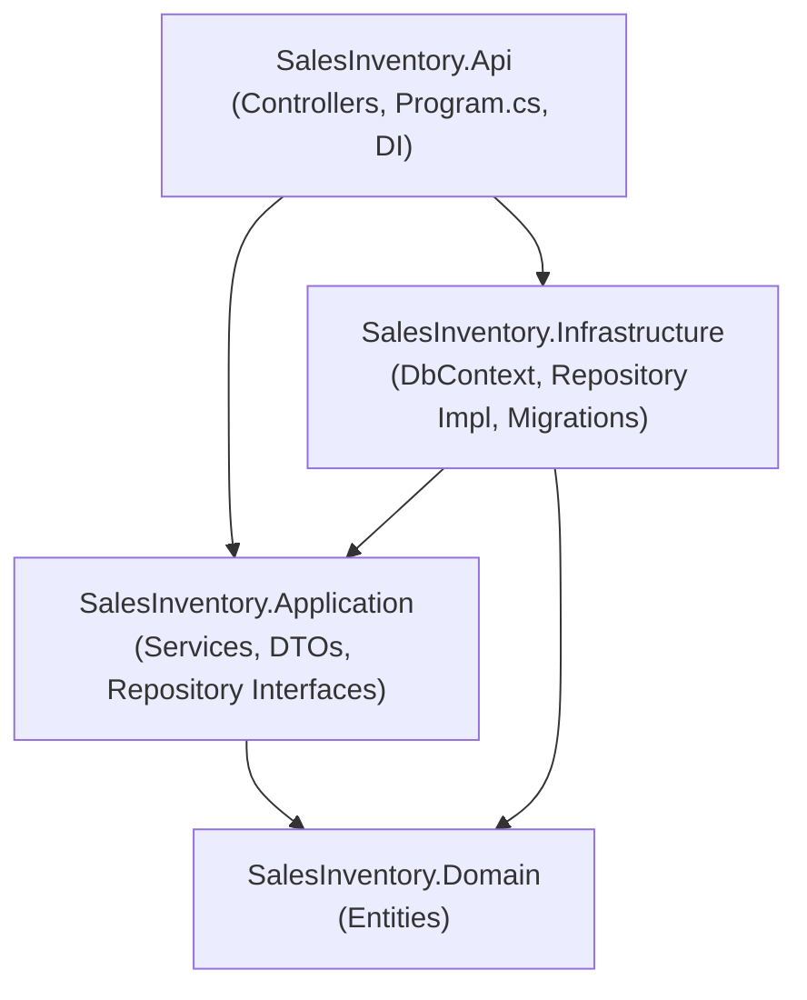

# Kiến trúc phần mềm (Architecture)
## Hệ thống Quản lý Bán hàng & Kho

**Phiên bản:** 1.0
**Ngày:** 2026-09-18
**Nguồn tham chiếu:** [`docs/SRS.md`](./SRS.md), [`docs/UseCases.md`](./UseCases.md), [`docs/database-design.md`](./database-design.md)
**Kiến trúc:** Layered Architecture rút gọn, áp dụng Dependency Inversion giữa Application và Infrastructure (không phải Clean Architecture đầy đủ — không dùng CQRS/MediatR vì nghiệp vụ của 8 module chủ yếu là CRUD + vài quy tắc tính tồn kho, không đủ phức tạp để cần toàn bộ pattern đó).

---

## 1. Cấu trúc solution

```
SalesInventory.sln
src/
  SalesInventory.Domain/          # Entities, không phụ thuộc project nào khác
  SalesInventory.Application/     # Business logic, DTOs, interface repository
  SalesInventory.Infrastructure/  # EF Core DbContext, Migrations, implement repository
  SalesInventory.Api/             # Controllers, Program.cs (đăng ký DI), Swagger
```

*(Blazor UI, nếu tách riêng, sẽ là một project khác nữa gọi API qua HTTP — không tham chiếu trực tiếp Application/Domain/Infrastructure, nên không đưa vào bảng dưới đây.)*

## 2. Bảng trách nhiệm từng lớp

| Lớp | Trách nhiệm | Ví dụ thành phần trong dự án này |
|---|---|---|
| **Domain** | Định nghĩa các đối tượng nghiệp vụ cốt lõi (entity), không chứa logic hạ tầng, không phụ thuộc EF Core/ASP.NET Core | `Product`, `Category`, `Supplier`, `Customer`, `PurchaseOrder`, `PurchaseOrderItem`, `SalesOrder`, `SalesOrderItem`, `InventoryTransaction` |
| **Application** | Chứa nghiệp vụ (use case): validate, tính toán, điều phối; định nghĩa **interface** cho repository/unit of work để Infrastructure implement; định nghĩa DTO ra/vào | `IProductService`, `ISalesOrderService`, `IInventoryService`, `IProductRepository`, `ISalesOrderRepository`, `IUnitOfWork`, `ProductDto`, `CreateSalesOrderRequest` |
| **Infrastructure** | Hiện thực hoá truy cập dữ liệu và các dịch vụ hạ tầng khác (email, file, AI provider...) theo interface do Application định nghĩa | `AppDbContext` (EF Core), `Migrations/`, `ProductRepository`, `SalesOrderRepository`, `UnitOfWork` |
| **Api (Presentation)** | Expose HTTP endpoint, nhận request, gọi Application service, trả response; cấu hình DI, middleware, Swagger | `ProductsController`, `SalesOrdersController`, `Program.cs` (đăng ký `AddScoped<IProductRepository, ProductRepository>()`) |

## 3. Sơ đồ phụ thuộc (Mermaid)



**Đọc sơ đồ:** mũi tên `A --> B` nghĩa là "A tham chiếu/phụ thuộc B" (A có project reference tới B).

- `Api` tham chiếu `Application` (để gọi Service) và `Infrastructure` (chỉ dùng ở `Program.cs` để đăng ký DI — Controller không được gọi trực tiếp class trong Infrastructure)
- `Infrastructure` tham chiếu `Application` (để implement các interface repository do Application định nghĩa) và `Domain` (để map entity ↔ bảng EF Core)
- `Application` chỉ tham chiếu `Domain`
- **`Domain` không tham chiếu bất kỳ project nào khác** — đây là ràng buộc bắt buộc (Dependency Rule): mọi mũi tên trong sơ đồ đều hướng *vào* Domain hoặc *vào* Application, không có mũi tên nào đi ra khỏi Domain hoặc đi từ Application/Domain ngược lại Infrastructure/Api.

## 4. EF Core DbContext và Repository nằm ở lớp nào, vì sao

| Thành phần | Nằm ở lớp | Vì sao |
|---|---|---|
| `AppDbContext` (kế thừa `DbContext`) | **Infrastructure** | `DbContext` là chi tiết công nghệ (EF Core, connection string, tracking...). Nếu đặt ở Domain hoặc Application, hai lớp này sẽ phải tham chiếu gói `Microsoft.EntityFrameworkCore`, phá vỡ nguyên tắc "business logic không phụ thuộc framework/ORM cụ thể" và khiến việc unit test Application phải khởi động DB thật |
| `IProductRepository`, `ISalesOrderRepository`, ... (interface) | **Application** | Đây là "hợp đồng" mà nghiệp vụ cần (VD: `GetByIdAsync`, `AddAsync`), do Application định nghĩa vì Application là nơi *tiêu thụ* dữ liệu. Đây chính là Dependency Inversion Principle: lớp cấp cao (nghiệp vụ) không phụ thuộc lớp cấp thấp (chi tiết lưu trữ), cả hai phụ thuộc vào abstraction |
| `ProductRepository`, `SalesOrderRepository`, ... (implementation, dùng `AppDbContext`) | **Infrastructure** | Đây là phần hiện thực hoá cụ thể bằng EF Core, có thể thay thế (VD: đổi sang Dapper) mà không cần sửa Application, miễn interface giữ nguyên |

**Hệ quả khi unit test:** vì `Application` chỉ biết `IProductRepository` (không biết `AppDbContext`), test cho `ProductService`/`SalesOrderService` chỉ cần mock interface (VD: bằng Moq), chạy nhanh, không cần SQL Server hay InMemory provider — đáp ứng đúng yêu cầu "test được lớp nghiệp vụ" đã đặt ra ban đầu.
