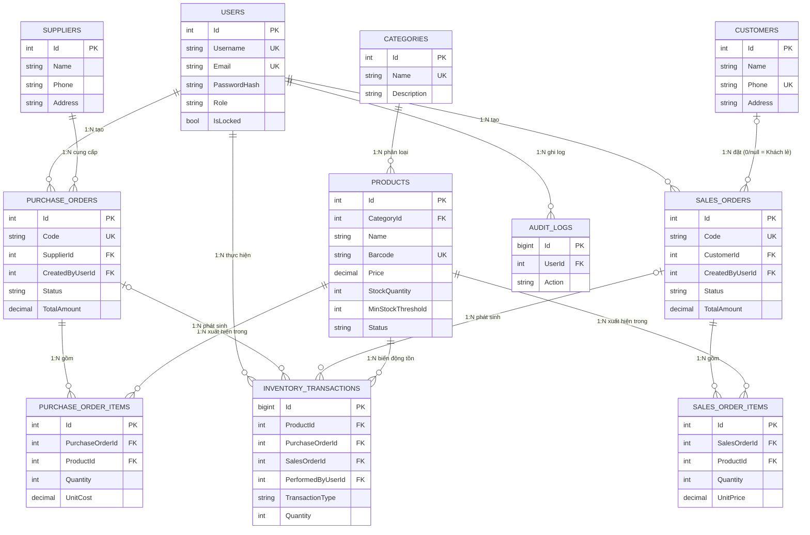
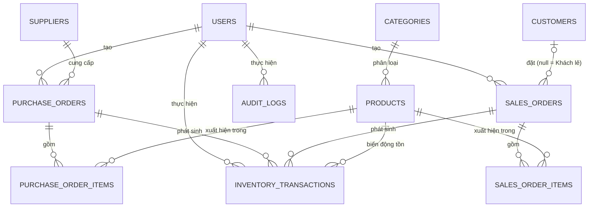

# Thiết kế Cơ sở dữ liệu (Database Design)
## Hệ thống Quản lý Bán hàng & Kho

**Phiên bản:** 1.0
**Ngày:** 2026-09-18
**Nguồn tham chiếu:** [`docs/SRS.md`](./SRS.md), [`docs/UseCases.md`](./UseCases.md)
**Công nghệ:** SQL Server, Entity Framework Core (code-first) — tài liệu này chỉ đặc tả lược đồ dữ liệu, **chưa** viết code C#/migration.

---

## 0. Sơ đồ ERD tổng quan (đầy đủ bảng, PK, FK)



> Ghi chú ký hiệu: `||--o{` = một-nhiều (1:N) bắt buộc ở đầu "một"; `|o--o{` = một-nhiều (1:N) nhưng đầu "một" tùy chọn (FK có thể NULL). Lược đồ này **không có cạnh N:M trực tiếp nào** — hai cặp quan hệ N:M ở mức khái niệm (Products↔PurchaseOrders, Products↔SalesOrders) đã được chuẩn hóa thành hai cạnh 1:N thông qua bảng trung gian `PURCHASE_ORDER_ITEMS` và `SALES_ORDER_ITEMS`, đúng ràng buộc "không quan hệ nhiều-nhiều trực tiếp" của đề bài.

### Giải thích quan hệ (dùng khi bảo vệ đồ án)

- **Categories 1—N Products:** một danh mục chứa nhiều sản phẩm, mỗi sản phẩm chỉ thuộc đúng một danh mục (`Products.CategoryId` NOT NULL). Không xóa được danh mục khi vẫn còn sản phẩm tham chiếu (FR-06).
- **Users 1—N (PurchaseOrders, SalesOrders, InventoryTransactions, AuditLogs):** một tài khoản nhân viên có thể tạo nhiều đơn nhập, nhiều đơn bán, thực hiện nhiều giao dịch kho và phát sinh nhiều dòng nhật ký thao tác; ngược lại mỗi đơn/giao dịch/log chỉ gắn với đúng một người thực hiện — phục vụ truy vết trách nhiệm (NFR-03).
- **Suppliers 1—N PurchaseOrders:** một nhà cung cấp có thể có nhiều đơn nhập hàng theo thời gian; mỗi đơn nhập chỉ đến từ một nhà cung cấp duy nhất (FR-14, xem lịch sử nhập theo NCC).
- **Products ↔ PurchaseOrders (N:M, chuẩn hóa qua PurchaseOrderItems):** một sản phẩm có thể xuất hiện trong nhiều đơn nhập khác nhau, và một đơn nhập có thể chứa nhiều sản phẩm khác nhau — đây là quan hệ N:M về bản chất nghiệp vụ. Vì SQL Server không hỗ trợ FK N:M trực tiếp, quan hệ được tách thành hai cạnh 1:N: `PurchaseOrders 1—N PurchaseOrderItems` và `Products 1—N PurchaseOrderItems`, mỗi dòng `PurchaseOrderItems` đại diện cho một cặp (đơn nhập, sản phẩm) cụ thể kèm số lượng và đơn giá.
- **PurchaseOrders 1—N InventoryTransactions (tùy chọn):** khi một đơn nhập được **xác nhận** (không phải khi tạo nháp), hệ thống phát sinh các dòng giao dịch kho tương ứng để cộng tồn — vì vậy FK này là NULL cho đến khi đơn được xác nhận, và đơn ở trạng thái "Nháp"/"Đã hủy" thì không có giao dịch kho nào liên kết (FR-19, FR-20).
- **Customers 1—N SalesOrders (FK tùy chọn):** một khách hàng có thể có nhiều đơn bán hàng; `SalesOrders.CustomerId` được phép NULL để biểu diễn khách vãng lai ("Khách lẻ") mà không cần tạo dòng khách hàng giả (FR-BAN-01).
- **Products ↔ SalesOrders (N:M, chuẩn hóa qua SalesOrderItems):** tương tự cặp Products–PurchaseOrders, một sản phẩm có thể nằm trong nhiều đơn bán, một đơn bán có nhiều sản phẩm — tách qua bảng trung gian `SalesOrderItems` với ràng buộc UNIQUE(SalesOrderId, ProductId) để đảm bảo mỗi sản phẩm chỉ xuất hiện một dòng trong một đơn (gộp số lượng thay vì tạo dòng trùng — FR-BAN-03).
- **SalesOrders 1—N InventoryTransactions (tùy chọn):** giao dịch kho phát sinh khi đơn bán được **thanh toán** (trừ kho, loại `SALE_OUT`) hoặc khi đơn bị **hủy trong 24h** (hoàn kho, loại `SALE_RETURN`); đơn ở trạng thái "Đang tạo" chưa có giao dịch kho nào (FR-BAN-08, FR-BAN-09).
- **Products 1—N InventoryTransactions:** mọi biến động tồn kho của một sản phẩm (nhập, bán, hoàn trả, điều chỉnh) đều được ghi thành một dòng nhật ký riêng biệt gắn với đúng sản phẩm đó; đây là bảng "nguồn sự thật" để tồn kho hiện tại (`Products.StockQuantity`) luôn có thể đối soát lại được (mục 5).

---

## 1. Quy ước chung

- **Khóa chính:** mỗi bảng dùng khóa thay thế (surrogate key) `Id` tự tăng (`INT IDENTITY(1,1)`), riêng `InventoryTransactions` và `AuditLogs` dùng `BIGINT IDENTITY(1,1)` vì là bảng nhật ký (ledger) tăng nhanh theo thời gian.
- **Kiểu tiền tệ:** `DECIMAL(18,2)` cho mọi trường tiền (VNĐ, không có số lẻ nhỏ hơn đồng — phù hợp giả định 6.2 SRS: chỉ dùng VNĐ).
- **Thời gian:** `DATETIME2` lưu theo giờ UTC, mặc định `SYSUTCDATETIME()`.
- **Xóa mềm:** không xóa cứng các bản ghi đã phát sinh giao dịch (Product, User) — dùng cột trạng thái (`Status`, `IsDeleted`) theo đúng FR-03, FR-11.
- **Tên cột:** PascalCase, khớp quy ước C# hiện có trong `Models/Product.cs` để EF Core code-first ánh xạ 1:1 không cần `[Column]` tùy biến.
- Bảng liệt kê theo mẫu: **Cột | Kiểu dữ liệu | Khóa | Ràng buộc | Ghi chú**.

### 1.1. Phạm vi bảng

Đề bài yêu cầu 9 bảng cốt lõi: `Categories`, `Products`, `Suppliers`, `Customers`, `PurchaseOrders`/`PurchaseOrderItems`, `SalesOrders`/`SalesOrderItems`, `InventoryTransactions`. Tài liệu bổ sung thêm **2 bảng phụ trợ bắt buộc** để có thể hiện thực đầy đủ mọi use case trong `UseCases.md` (tiêu chí chấp nhận của đề bài):

- **`Users`** — không thể thiếu vì UC-01 (đăng nhập), UC-02 (quản lý tài khoản), FR-01–FR-04, và vì mọi đơn hàng/giao dịch kho đều cần biết "nhân viên lập đơn" (bắt buộc trong phiếu bán hàng FR-BAN-10, log điều chỉnh kho FR-28).
- **`AuditLogs`** — cần cho NFR-03 (ghi log thao tác nhạy cảm: đăng nhập, tạo/hủy đơn, điều chỉnh kho, đổi phân quyền).

Không có bảng nào cho module Báo cáo (UC-19, UC-20) hay Trợ lý AI (UC-21–23) vì đây là các chức năng **chỉ đọc** (truy vấn tổng hợp từ `SalesOrders`/`SalesOrderItems`/`Products`), không cần lưu trữ thêm dữ liệu riêng.

---

## 2. Sơ đồ quan hệ tổng quan (ERD)



> Quan hệ nhiều-nhiều `Products` ↔ `PurchaseOrders` và `Products` ↔ `SalesOrders` được tách qua hai bảng trung gian `PurchaseOrderItems` và `SalesOrderItems` — không có FK nhiều-nhiều trực tiếp nào trong lược đồ.

---

## 3. Chi tiết từng bảng

### 3.1. Users *(bảng bổ sung)*

| Cột | Kiểu dữ liệu | Khóa | Ràng buộc | Ghi chú |
|---|---|---|---|---|
| Id | INT IDENTITY(1,1) | PK | NOT NULL | |
| Username | NVARCHAR(50) | | NOT NULL, UNIQUE | Đăng nhập (FR-01) |
| Email | NVARCHAR(100) | | NOT NULL, UNIQUE | Đăng nhập thay thế (FR-01) |
| PasswordHash | NVARCHAR(255) | | NOT NULL | Băm bằng BCrypt/PBKDF2 (NFR-01), không lưu plaintext |
| FullName | NVARCHAR(100) | | NOT NULL | |
| Role | NVARCHAR(20) | | NOT NULL, CHECK IN ('ADMIN','WAREHOUSE','SALES') | Một tài khoản = đúng 1 vai trò (mục 3.2 SRS) |
| IsLocked | BIT | | NOT NULL, DEFAULT 0 | Khóa thủ công bởi Admin (FR-03) |
| FailedLoginCount | INT | | NOT NULL, DEFAULT 0 | Đếm đăng nhập sai liên tiếp (FR-01) |
| LockoutEndAt | DATETIME2 | | NULL | Thời điểm hết khóa tạm 15 phút (FR-01) |
| IsDeleted | BIT | | NOT NULL, DEFAULT 0 | Xóa mềm (FR-03) |
| CreatedAt | DATETIME2 | | NOT NULL, DEFAULT SYSUTCDATETIME() | |
| UpdatedAt | DATETIME2 | | NULL | |

### 3.2. Categories

| Cột | Kiểu dữ liệu | Khóa | Ràng buộc | Ghi chú |
|---|---|---|---|---|
| Id | INT IDENTITY(1,1) | PK | NOT NULL | |
| Name | NVARCHAR(100) | | NOT NULL, UNIQUE | Không phân biệt hoa/thường (FR-05) — dùng collation mặc định `..._CI_AS` của SQL Server |
| Description | NVARCHAR(500) | | NULL | |
| CreatedAt | DATETIME2 | | NOT NULL, DEFAULT SYSUTCDATETIME() | |
| UpdatedAt | DATETIME2 | | NULL | |

### 3.3. Products

| Cột | Kiểu dữ liệu | Khóa | Ràng buộc | Ghi chú |
|---|---|---|---|---|
| Id | INT IDENTITY(1,1) | PK | NOT NULL | |
| Name | NVARCHAR(200) | | NOT NULL | Tìm kiếm gần đúng (FR-09) |
| Barcode | NVARCHAR(50) | | NULL, UNIQUE | Mã vạch dạng văn bản (SRS 2.2) |
| CategoryId | INT | FK → Categories.Id | NOT NULL | ON DELETE NO ACTION (không cho xóa danh mục còn sản phẩm — FR-06) |
| Price | DECIMAL(18,2) | | NOT NULL, CHECK (Price > 0) | FR-08 |
| StockQuantity | INT | | NOT NULL, DEFAULT 0 | Cột **cache** tồn kho hiện tại — chỉ được cập nhật gián tiếp qua `InventoryTransactions` (xem mục 5), không sửa trực tiếp từ màn hình sản phẩm (FR-10) |
| MinStockThreshold | INT | | NOT NULL, DEFAULT 10 | Ngưỡng cảnh báo "Sắp hết hàng" (FR-27) |
| Status | NVARCHAR(20) | | NOT NULL, DEFAULT 'ACTIVE', CHECK IN ('ACTIVE','DISCONTINUED') | Ngừng kinh doanh thay vì xóa cứng nếu đã có giao dịch (FR-11) |
| CreatedAt | DATETIME2 | | NOT NULL, DEFAULT SYSUTCDATETIME() | |
| UpdatedAt | DATETIME2 | | NULL | |

Index gợi ý: `IX_Products_Name` (tìm kiếm), `IX_Products_CategoryId`.

### 3.4. Suppliers

| Cột | Kiểu dữ liệu | Khóa | Ràng buộc | Ghi chú |
|---|---|---|---|---|
| Id | INT IDENTITY(1,1) | PK | NOT NULL | |
| Name | NVARCHAR(200) | | NOT NULL | FR-12 |
| Phone | CHAR(10) | | NOT NULL | Đúng 10 chữ số, kiểm tra ở tầng ứng dụng (FR-12) |
| Address | NVARCHAR(300) | | NOT NULL | FR-12 |
| CreatedAt | DATETIME2 | | NOT NULL, DEFAULT SYSUTCDATETIME() | |
| UpdatedAt | DATETIME2 | | NULL | |

Index gợi ý: `IX_Suppliers_Name`, `IX_Suppliers_Phone` (tra cứu FR-13).

### 3.5. Customers

| Cột | Kiểu dữ liệu | Khóa | Ràng buộc | Ghi chú |
|---|---|---|---|---|
| Id | INT IDENTITY(1,1) | PK | NOT NULL | |
| Name | NVARCHAR(200) | | NOT NULL | FR-15 |
| Phone | CHAR(10) | | NOT NULL, UNIQUE | Duy nhất toàn hệ thống (FR-15) |
| Address | NVARCHAR(300) | | NULL | |
| CreatedAt | DATETIME2 | | NOT NULL, DEFAULT SYSUTCDATETIME() | |
| UpdatedAt | DATETIME2 | | NULL | |

> Khách hàng mặc định "Khách lẻ" **không** phải một dòng dữ liệu cố định trong bảng này — được biểu diễn bằng `SalesOrders.CustomerId = NULL` (xem 3.7), tránh phải quản lý số điện thoại giả cho khách vãng lai.

Index gợi ý: `IX_Customers_Phone` (tra cứu ≤ 1s, FR-16).

### 3.6. PurchaseOrders (Đơn nhập hàng)

| Cột | Kiểu dữ liệu | Khóa | Ràng buộc | Ghi chú |
|---|---|---|---|---|
| Id | INT IDENTITY(1,1) | PK | NOT NULL | |
| Code | VARCHAR(20) | | NOT NULL, UNIQUE | Định dạng `PO-yyyyMMdd-xxxx` |
| SupplierId | INT | FK → Suppliers.Id | NOT NULL | ON DELETE NO ACTION |
| CreatedByUserId | INT | FK → Users.Id | NOT NULL | Nhân viên kho lập đơn (vai trò WAREHOUSE) |
| Status | NVARCHAR(20) | | NOT NULL, DEFAULT 'DRAFT', CHECK IN ('DRAFT','COMPLETED','CANCELLED') | UC-10/11/12 |
| OrderDate | DATETIME2 | | NOT NULL, DEFAULT SYSUTCDATETIME() | |
| ConfirmedAt | DATETIME2 | | NULL | Thời điểm chuyển "Đã hoàn tất" (FR-19) |
| CancelledAt | DATETIME2 | | NULL | Chỉ áp dụng khi đang "Nháp" (FR-20) |
| TotalAmount | DECIMAL(18,2) | | NOT NULL, DEFAULT 0 | Tổng = Σ `PurchaseOrderItems.LineTotal`, tính lại mỗi khi thêm/sửa/xóa dòng |
| CreatedAt | DATETIME2 | | NOT NULL, DEFAULT SYSUTCDATETIME() | |
| UpdatedAt | DATETIME2 | | NULL | |

Index gợi ý: `IX_PurchaseOrders_SupplierId_OrderDate` (lịch sử theo NCC, FR-14), `IX_PurchaseOrders_Status`.

### 3.7. PurchaseOrderItems (Chi tiết đơn nhập)

| Cột | Kiểu dữ liệu | Khóa | Ràng buộc | Ghi chú |
|---|---|---|---|---|
| Id | INT IDENTITY(1,1) | PK | NOT NULL | |
| PurchaseOrderId | INT | FK → PurchaseOrders.Id | NOT NULL | ON DELETE CASCADE (xóa dòng khi xóa đơn nháp) |
| ProductId | INT | FK → Products.Id | NOT NULL | ON DELETE NO ACTION |
| Quantity | INT | | NOT NULL, CHECK (Quantity > 0) | FR-18 |
| UnitCost | DECIMAL(18,2) | | NOT NULL, CHECK (UnitCost >= 0) | Đơn giá nhập |
| LineTotal | DECIMAL(18,2) | | NOT NULL (computed: `Quantity * UnitCost`) | Cột tính toán (persisted computed column) |

Bảng trung gian hiện thực quan hệ N:N giữa `Products` và `PurchaseOrders`; mỗi đơn nhập có nhiều dòng (1:N từ `PurchaseOrders`).

### 3.8. SalesOrders (Đơn bán hàng)

| Cột | Kiểu dữ liệu | Khóa | Ràng buộc | Ghi chú |
|---|---|---|---|---|
| Id | INT IDENTITY(1,1) | PK | NOT NULL | |
| Code | VARCHAR(20) | | NOT NULL, UNIQUE | `SO-yyyyMMdd-xxxx` (FR-BAN-01) |
| CustomerId | INT | FK → Customers.Id | NULL | `NULL` = "Khách lẻ" (FR-BAN-01) |
| CreatedByUserId | INT | FK → Users.Id | NOT NULL | Nhân viên bán hàng lập đơn (bắt buộc cho phiếu PDF, FR-BAN-10) |
| Status | NVARCHAR(20) | | NOT NULL, DEFAULT 'CREATING', CHECK IN ('CREATING','COMPLETED','CANCELLED') | UC-13/14/15 |
| SubTotal | DECIMAL(18,2) | | NOT NULL, DEFAULT 0 | Σ (đơn giá × số lượng) mọi dòng (FR-BAN-05) |
| DiscountAmount | DECIMAL(18,2) | | NOT NULL, DEFAULT 0, CHECK (DiscountAmount >= 0) | Chiết khấu VNĐ (FR-BAN-07) |
| TaxRate | DECIMAL(5,2) | | NOT NULL, DEFAULT 10.00 | % — chụp lại giá trị cấu hình hệ thống tại thời điểm thanh toán (FR-BAN-06) |
| TaxAmount | DECIMAL(18,2) | | NOT NULL, DEFAULT 0 | = (SubTotal − DiscountAmount) × TaxRate/100, làm tròn VNĐ |
| TotalAmount | DECIMAL(18,2) | | NOT NULL, DEFAULT 0 | = (SubTotal − DiscountAmount) × (1 + TaxRate/100) (FR-BAN-07) |
| OrderDate | DATETIME2 | | NOT NULL, DEFAULT SYSUTCDATETIME() | Thời điểm tạo đơn |
| CompletedAt | DATETIME2 | | NULL | Thời điểm xác nhận thanh toán — mốc tính cửa sổ hủy 24h (FR-BAN-09) |
| CancelledAt | DATETIME2 | | NULL | |
| CreatedAt | DATETIME2 | | NOT NULL, DEFAULT SYSUTCDATETIME() | |
| UpdatedAt | DATETIME2 | | NULL | |

Index gợi ý: `IX_SalesOrders_CustomerId` (lịch sử mua hàng, FR-17), `IX_SalesOrders_CompletedAt` (báo cáo doanh thu, FR-29/32).

### 3.9. SalesOrderItems (Chi tiết đơn bán)

| Cột | Kiểu dữ liệu | Khóa | Ràng buộc | Ghi chú |
|---|---|---|---|---|
| Id | INT IDENTITY(1,1) | PK | NOT NULL | |
| SalesOrderId | INT | FK → SalesOrders.Id | NOT NULL | ON DELETE CASCADE |
| ProductId | INT | FK → Products.Id | NOT NULL | ON DELETE NO ACTION |
| Quantity | INT | | NOT NULL, CHECK (Quantity > 0) | FR-BAN-02 |
| UnitPrice | DECIMAL(18,2) | | NOT NULL, CHECK (UnitPrice >= 0) | Mặc định lấy `Products.Price` tại thời điểm thêm dòng |
| LineTotal | DECIMAL(18,2) | | NOT NULL (computed: `Quantity * UnitPrice`) | |
| | | UNIQUE (SalesOrderId, ProductId) | | Ép buộc gộp dòng khi trùng sản phẩm ở tầng CSDL, hỗ trợ FR-BAN-03 |

Bảng trung gian hiện thực quan hệ N:N giữa `Products` và `SalesOrders`; mỗi đơn bán có nhiều dòng (1:N từ `SalesOrders`).

### 3.10. InventoryTransactions (Giao dịch tồn kho)

| Cột | Kiểu dữ liệu | Khóa | Ràng buộc | Ghi chú |
|---|---|---|---|---|
| Id | BIGINT IDENTITY(1,1) | PK | NOT NULL | |
| ProductId | INT | FK → Products.Id | NOT NULL | ON DELETE NO ACTION |
| TransactionType | NVARCHAR(20) | | NOT NULL, CHECK IN ('PURCHASE_IN','SALE_OUT','SALE_RETURN','ADJUSTMENT_IN','ADJUSTMENT_OUT') | Loại giao dịch |
| Quantity | INT | | NOT NULL, CHECK (Quantity > 0) | Số lượng tuyệt đối; chiều +/− suy ra từ `TransactionType` |
| QuantityBefore | INT | | NOT NULL | Tồn kho trước giao dịch (FR-28 yêu cầu log trước/sau) |
| QuantityAfter | INT | | NOT NULL | Tồn kho sau giao dịch |
| PurchaseOrderId | INT | FK → PurchaseOrders.Id | NULL | Set khi `TransactionType = 'PURCHASE_IN'` |
| SalesOrderId | INT | FK → SalesOrders.Id | NULL | Set khi `TransactionType IN ('SALE_OUT','SALE_RETURN')` |
| Reason | NVARCHAR(300) | | NULL, bắt buộc NOT NULL khi `TransactionType IN ('ADJUSTMENT_IN','ADJUSTMENT_OUT')` | Lý do điều chỉnh (FR-28); ràng buộc bằng CHECK hoặc trigger |
| PerformedByUserId | INT | FK → Users.Id | NOT NULL | Người thực hiện (FR-28, NFR-03) |
| CreatedAt | DATETIME2 | | NOT NULL, DEFAULT SYSUTCDATETIME() | |

Đây là **bảng nguồn sự thật (source of truth)** cho tồn kho — xem mục 5.

Index gợi ý: `IX_InventoryTransactions_ProductId_CreatedAt`.

### 3.11. AuditLogs *(bảng bổ sung)*

| Cột | Kiểu dữ liệu | Khóa | Ràng buộc | Ghi chú |
|---|---|---|---|---|
| Id | BIGINT IDENTITY(1,1) | PK | NOT NULL | |
| UserId | INT | FK → Users.Id | NOT NULL | Người thực hiện |
| Action | NVARCHAR(100) | | NOT NULL | Vd: `LOGIN`, `CREATE_SALES_ORDER`, `CANCEL_PURCHASE_ORDER`, `ADJUST_INVENTORY`, `CHANGE_USER_ROLE` |
| EntityType | NVARCHAR(50) | | NULL | Tên bảng/entity liên quan |
| EntityId | INT | | NULL | Id bản ghi liên quan |
| Detail | NVARCHAR(MAX) | | NULL | Snapshot dữ liệu (JSON) trước/sau nếu cần |
| CreatedAt | DATETIME2 | | NOT NULL, DEFAULT SYSUTCDATETIME() | |

Phục vụ NFR-03 (log đăng nhập, tạo/hủy đơn, điều chỉnh kho, đổi phân quyền).

---

## 4. Quan hệ giữa các bảng

| Quan hệ | Bản chất | Ghi chú |
|---|---|---|
| Categories 1 — N Products | 1:N | Một danh mục có nhiều sản phẩm; không xóa được danh mục còn sản phẩm (app-level, FR-06) |
| Suppliers 1 — N PurchaseOrders | 1:N | |
| Users 1 — N PurchaseOrders (CreatedByUserId) | 1:N | |
| PurchaseOrders 1 — N PurchaseOrderItems | 1:N | Mỗi đơn nhập ≥ 1 dòng khi lưu (FR-18) |
| Products 1 — N PurchaseOrderItems | 1:N | Cùng `PurchaseOrderItems` tạo thành **N:N** giữa Products và PurchaseOrders qua bảng trung gian |
| Customers 1 — N SalesOrders | 1:N (nullable) | `CustomerId = NULL` ⇒ Khách lẻ |
| Users 1 — N SalesOrders (CreatedByUserId) | 1:N | |
| SalesOrders 1 — N SalesOrderItems | 1:N | |
| Products 1 — N SalesOrderItems | 1:N | Cùng `SalesOrderItems` tạo thành **N:N** giữa Products và SalesOrders qua bảng trung gian |
| Products 1 — N InventoryTransactions | 1:N | |
| PurchaseOrders 1 — N InventoryTransactions | 1:N (optional) | Phát sinh khi xác nhận đơn nhập (FR-19) |
| SalesOrders 1 — N InventoryTransactions | 1:N (optional) | Phát sinh khi thanh toán (FR-BAN-08) và khi hủy/hoàn kho (FR-BAN-09) |
| Users 1 — N InventoryTransactions (PerformedByUserId) | 1:N | |
| Users 1 — N AuditLogs | 1:N | |

Không có FK nhiều-nhiều trực tiếp; toàn bộ quan hệ N:N (Products↔PurchaseOrders, Products↔SalesOrders) đều đi qua bảng trung gian có khóa chính riêng.

---

## 5. Nguyên tắc suy ra tồn kho từ giao dịch

`Products.StockQuantity` là **cột cache** để truy vấn nhanh (đáp ứng NFR-05: liệt kê ≤ 2s, FR-26: hiển thị theo thời gian thực). Giá trị đúng của nó luôn phải bằng:

```
Products.StockQuantity = Σ Quantity (PURCHASE_IN, SALE_RETURN, ADJUSTMENT_IN)
                        − Σ Quantity (SALE_OUT, ADJUSTMENT_OUT)
                        (tính trên InventoryTransactions của ProductId đó)
```

Quy tắc bắt buộc ở tầng ứng dụng (service layer), trong cùng một transaction CSDL nguyên tử (atomic — theo FR-19, FR-BAN-08):

1. **Xác nhận đơn nhập (UC-11):** với mỗi `PurchaseOrderItems`, ghi 1 dòng `InventoryTransactions` loại `PURCHASE_IN`, cộng `Products.StockQuantity`. Toàn bộ dòng thành công hoặc rollback toàn bộ.
2. **Thanh toán đơn bán (UC-14):** với mỗi `SalesOrderItems`, kiểm tra `StockQuantity >= Quantity`, ghi `InventoryTransactions` loại `SALE_OUT`, trừ `StockQuantity`. Nếu bất kỳ dòng nào không đủ tồn → rollback toàn bộ đơn (FR-BAN-04, FR-BAN-08).
3. **Hủy đơn bán trong 24h (UC-15):** ghi `InventoryTransactions` loại `SALE_RETURN`, cộng trả lại `StockQuantity` (FR-BAN-09).
4. **Phiếu điều chỉnh kho (UC-18):** ghi `InventoryTransactions` loại `ADJUSTMENT_IN`/`ADJUSTMENT_OUT` kèm `Reason` bắt buộc, cập nhật `StockQuantity` (FR-28).
5. **Hủy đơn nhập (UC-12):** chỉ cho phép khi đơn còn "Nháp" (chưa từng cộng kho) ⇒ **không** phát sinh `InventoryTransactions`, không ảnh hưởng tồn kho (FR-20).

`InventoryTransactions` là bảng bất biến (append-only, không UPDATE/DELETE) — dùng để đối soát (`SUM` lại) nếu `StockQuantity` bị lệch, và làm dữ liệu nguồn cho báo cáo tồn kho/lịch sử.

---

## 6. Truy vết Use Case → Bảng dữ liệu

| Use case | Bảng liên quan chính |
|---|---|
| UC-01 Đăng nhập | Users |
| UC-02 Quản lý tài khoản | Users, AuditLogs |
| UC-03 Quản lý danh mục | Categories, Products |
| UC-04 Quản lý sản phẩm | Products, Categories |
| UC-05 Tìm kiếm sản phẩm | Products, Categories |
| UC-06 Quản lý nhà cung cấp | Suppliers |
| UC-07 Lịch sử nhập theo NCC | Suppliers, PurchaseOrders, PurchaseOrderItems |
| UC-08 Quản lý khách hàng | Customers |
| UC-09 Lịch sử mua hàng KH | Customers, SalesOrders, SalesOrderItems |
| UC-10 Tạo đơn nhập | PurchaseOrders, PurchaseOrderItems, Suppliers, Products, Users |
| UC-11 Xác nhận đơn nhập | PurchaseOrders, PurchaseOrderItems, InventoryTransactions, Products |
| UC-12 Hủy đơn nhập | PurchaseOrders |
| UC-13 Tạo đơn bán | SalesOrders, SalesOrderItems, Customers, Products, Users |
| UC-14 Xác nhận thanh toán | SalesOrders, SalesOrderItems, InventoryTransactions, Products |
| UC-15 Hủy đơn bán | SalesOrders, InventoryTransactions, Products |
| UC-16 Xuất phiếu bán hàng | SalesOrders, SalesOrderItems, Customers, Users *(kết xuất PDF, không cần bảng mới)* |
| UC-17 Xem tồn kho & cảnh báo | Products, InventoryTransactions |
| UC-18 Phiếu điều chỉnh kho | InventoryTransactions, Products, Users |
| UC-19 Báo cáo doanh thu | SalesOrders, SalesOrderItems, Products *(truy vấn tổng hợp)* |
| UC-20 Xuất báo cáo Excel | SalesOrders, SalesOrderItems, Products *(kết xuất, không cần bảng mới)* |
| UC-21/22/23 Trợ lý AI | Products, InventoryTransactions, SalesOrders *(chỉ đọc, dịch vụ AI ngoài phạm vi CSDL)* |

---

*Tài liệu này đặc tả lược đồ dữ liệu mức thiết kế (logical/physical schema), làm cơ sở để hiện thực các entity class và `DbContext` (EF Core code-first) ở bước tiếp theo. Chưa bao gồm code C#/migration.*
