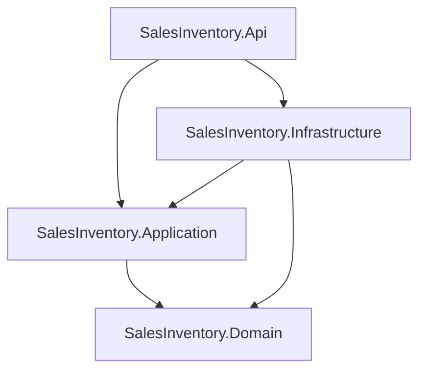

# Cấu trúc Solution (Solution Structure)
## Hệ thống Quản lý Bán hàng & Kho

**Phiên bản:** 1.0
**Ngày:** 2026-09-18
**Nguồn tham chiếu:** [`docs/architecture.md`](./architecture.md), [`docs/adr/0001-kien-truc-du-an.md`](./adr/0001-kien-truc-du-an.md)
**Trạng thái:** Đã dựng khung 4 project + project reference, `dotnet build` thành công, chưa có code nghiệp vụ (trừ `SalesInventory.Api` vẫn giữ `Product`/`AppDbContext` cũ, sẽ di dời ở bước sau).

---

## 1. Danh sách project và trách nhiệm

| Project | Loại | Trách nhiệm | Ví dụ nội dung sẽ chứa |
|---|---|---|---|
| **SalesInventory.Domain** | Class Library | Entity và quy tắc lõi của nghiệp vụ, không phụ thuộc bất kỳ project hay package hạ tầng nào (không EF Core, không ASP.NET Core) | `Product`, `Category`, `Supplier`, `Customer`, `PurchaseOrder`, `SalesOrder`, `InventoryTransaction` |
| **SalesInventory.Application** | Class Library | Nghiệp vụ/use case: service xử lý logic, DTO, và **interface** cho repository/unit of work để Infrastructure implement | `IProductService`, `ISalesOrderService`, `IProductRepository`, `IUnitOfWork`, `ProductDto` |
| **SalesInventory.Infrastructure** | Class Library | Hiện thực truy cập dữ liệu bằng EF Core (implement interface do Application định nghĩa) và các dịch vụ hạ tầng khác | `AppDbContext`, `Migrations/`, `ProductRepository`, `UnitOfWork` |
| **SalesInventory.Api** | ASP.NET Core Web API | Presentation layer: expose HTTP endpoint, nhận request, gọi Application service, cấu hình DI/Swagger | `ProductsController`, `Program.cs` |

## 2. Sơ đồ phụ thuộc giữa các project (Mermaid)

Mũi tên `A --> B` nghĩa là **project ngoài (A) tham chiếu project trong (B)**: `Api` là lớp ngoài cùng nên tham chiếu cả `Application` và `Infrastructure`; `Infrastructure` tham chiếu vào `Application` và `Domain`; `Application` chỉ tham chiếu `Domain`; `Domain` là lớp trong cùng, không tham chiếu project nào khác — đúng theo Dependency Rule đã chọn tại [ADR 0001](./adr/0001-kien-truc-du-an.md).

## 3. Xác nhận đã dựng đúng (đã kiểm tra bằng `dotnet build`)

| Project | ProjectReference |
|---|---|
| `SalesInventory.Domain` | (không có) |
| `SalesInventory.Application` | `SalesInventory.Domain` |
| `SalesInventory.Infrastructure` | `SalesInventory.Application`, `SalesInventory.Domain` |
| `SalesInventory.Api` | `SalesInventory.Application`, `SalesInventory.Infrastructure` |

`dotnet build SalesInventory.sln` chạy thành công, 0 lỗi/cảnh báo, không có tham chiếu vòng.
